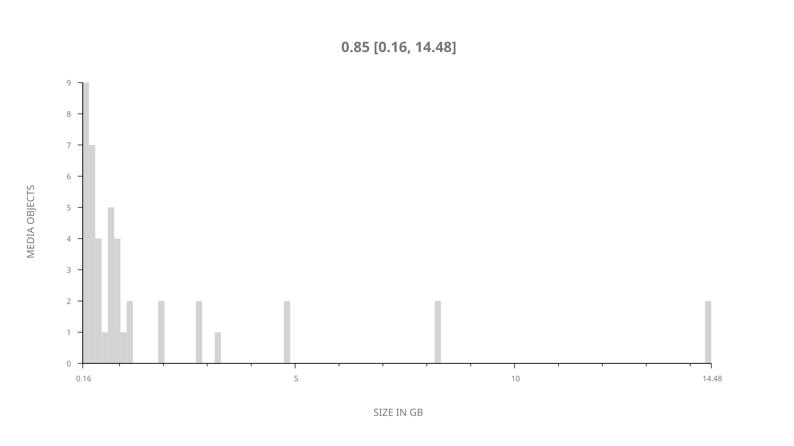
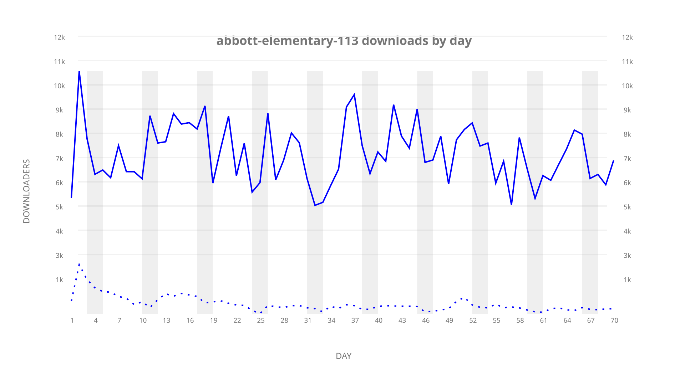
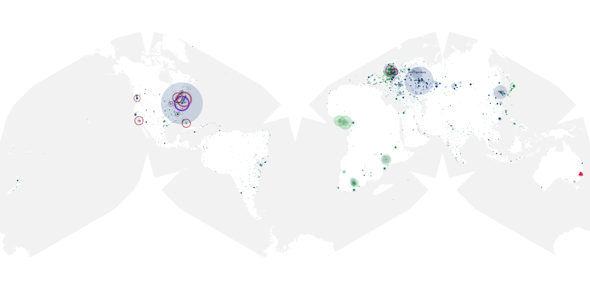
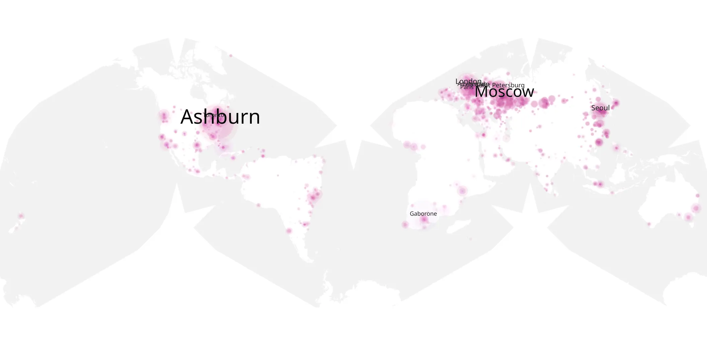
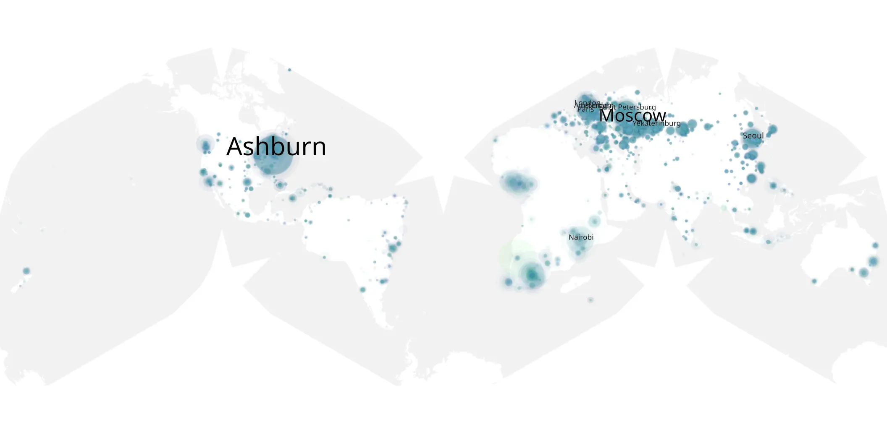

# abbott-elementary-113 sample cache audit

## 1. Media object

| Field | Value |
| --- | --- |
| Media object | Abbott Elementary |
| Collection key | `abbott-elementary-113` |
| imdb_id | [tt14218830](https://www.imdb.com/title/tt14218830/) |
| wikipedia_url | [Abbott Elementary](https://en.wikipedia.org/wiki/Abbott_Elementary) |
| Sample dates | 2022-04-13-to-2022-06-21 |
| Sample days | 70 |
| BTIH count | 57 |
| Unique BTIH count | 44 |
| Downloaders total | 460,101 |
| Uploaders total | 84,104 |
| Data version | `2026-08-05` |
| IP geolocation version | `6:1777968300` |

## 2. Coverage report

- Generated: 2026-09-02T04:14:10Z
- Sample archive directory: `/run/media/bkoz/gold/src/alpha60-samples-raw.gold/abbott-elementary-113.xz`
- Hour directories: 1677
- Zero-length sample files: 0
- Other unparsable sample files: 0
- Hourly discontinuities: 0 (0 missing hours)
- Missing days: 0

### Sample archive discontinuities

None detected.

## 3. File sizes histogram *median[lowest, highest]*

## 4. Graphs

### Downloads by week cumulative (normalized start)



### Downloads by day, Saturday and Sunday in gray

## 5. Cumulative Maps

<!-- https://raw.githubusercontent.com/alpha60-devops/alpha60-results-2022/refs/heads/main/data/ -->

### <a href="https://raw.githubusercontent.com/alpha60-devops/alpha60-results-2022/refs/heads/main/data/geojson.cumulative/abbott-elementary-113-cumulative-aggregate.geojson.gz" data-map-title="Abbott Elementary — abbott-elementary-113" onclick="leaflet_map_open_window(this.href, this.dataset.mapTitle); return false;" class="table-link" aria-label="Open Abbott Elementary (abbott-elementary-113) cumulative data map in new window" title="Opens interactive map for Abbott Elementary (abbott-elementary-113) data">Swarm Detail</a>

### Geographic Regions

| Africa | Americas | Asia | Europe | Oceania | Unknown |
| --- | --- | --- | --- | --- | --- |
| 7.17 | 23.25 | 15.32 | 46.09 | 1.45 | 1.02 |

### Network infrastructure

{:target="_blank" rel="noopener"}

### Resolution >= 1080p

{:target="_blank" rel="noopener"}

### Resolution < 1080p

{:target="_blank" rel="noopener"}
