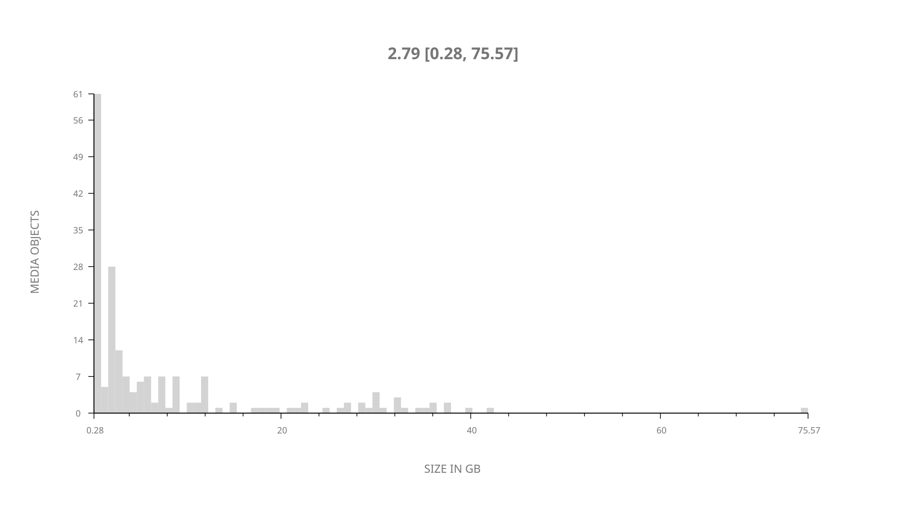
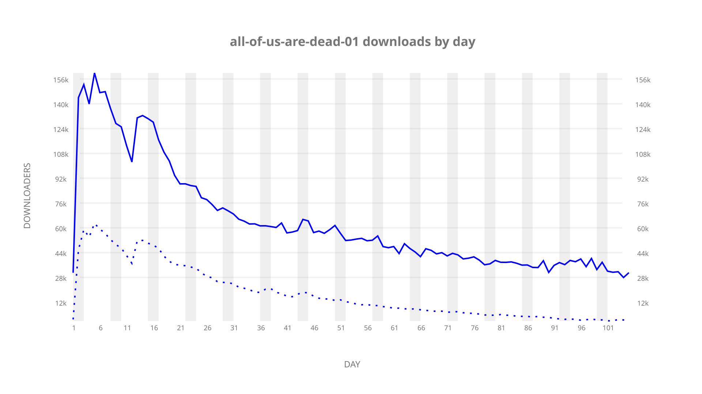
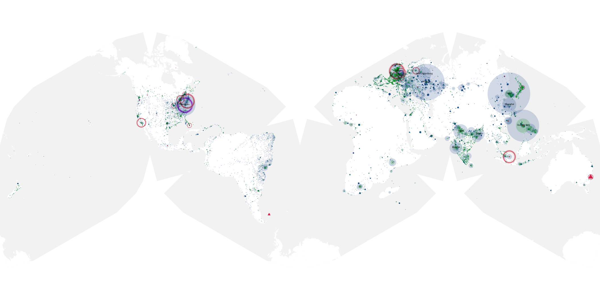
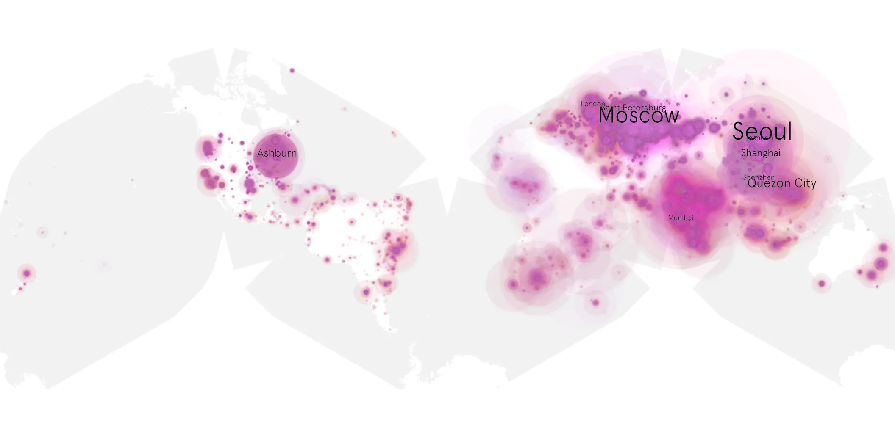
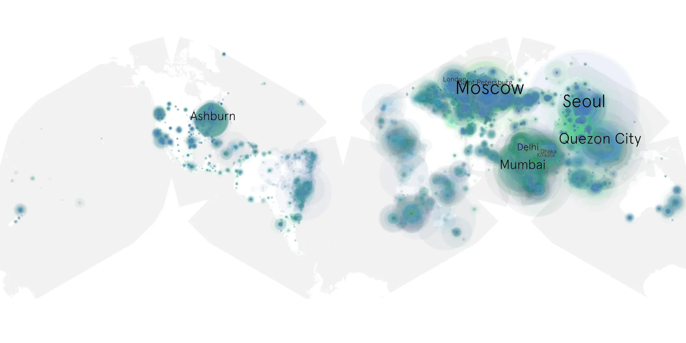

# all-of-us-are-dead-01 sample cache audit

## 1. Media object

| Field | Value |
| --- | --- |
| Media object | All of Us Are Dead |
| Collection key | `all-of-us-are-dead-01` |
| imdb_id | [tt14169960](https://www.imdb.com/title/tt14169960/) |
| wikipedia_url | [All of Us Are Dead](https://en.wikipedia.org/wiki/All_of_Us_Are_Dead) |
| Sample dates | 2022-01-28-to-2022-05-12 |
| Sample days | 105 |
| BTIH count | 230 |
| Unique BTIH count | 194 |
| Downloaders total | 6,486,828 |
| Uploaders total | 2,199,133 |
| Data version | `2026-08-05` |
| IP geolocation version | `6:1777968300` |

## 2. Coverage report

- Generated: 2026-09-02T04:14:10Z
- Sample archive directory: `/run/media/bkoz/gold/src/alpha60-samples-raw.gold/all-of-us-are-dead-01.xz`
- Hour directories: 2502
- Zero-length sample files: 0
- Other unparsable sample files: 0
- Hourly discontinuities: 1 (1 missing hours)
- Missing days: 0

### Sample archive discontinuities

- hourly gap: last `2022-03-27 01:03`, resumed `2022-03-27 03:03` — missing 1 hour(s)

## 3. File sizes histogram *median[lowest, highest]*

## 4. Graphs

### Downloads by week cumulative (normalized start)



### Downloads by day, Saturday and Sunday in gray

## 5. Cumulative Maps

<!-- https://raw.githubusercontent.com/alpha60-devops/alpha60-results-2022/refs/heads/main/data/ -->

### <a href="https://raw.githubusercontent.com/alpha60-devops/alpha60-results-2022/refs/heads/main/data/geojson.cumulative/all-of-us-are-dead-01-cumulative-aggregate.geojson.gz" data-map-title="All of Us Are Dead — all-of-us-are-dead-01" onclick="leaflet_map_open_window(this.href, this.dataset.mapTitle); return false;" class="table-link" aria-label="Open All of Us Are Dead (all-of-us-are-dead-01) cumulative data map in new window" title="Opens interactive map for All of Us Are Dead (all-of-us-are-dead-01) data">Swarm Detail</a>

### Geographic Regions

| Africa | Americas | Asia | Europe | Oceania | Unknown |
| --- | --- | --- | --- | --- | --- |
| 6.67 | 11.18 | 43.32 | 32.57 | 0.98 | 0.94 |

### Network infrastructure

{:target="_blank" rel="noopener"}

### Resolution >= 1080p

{:target="_blank" rel="noopener"}

### Resolution < 1080p

{:target="_blank" rel="noopener"}
