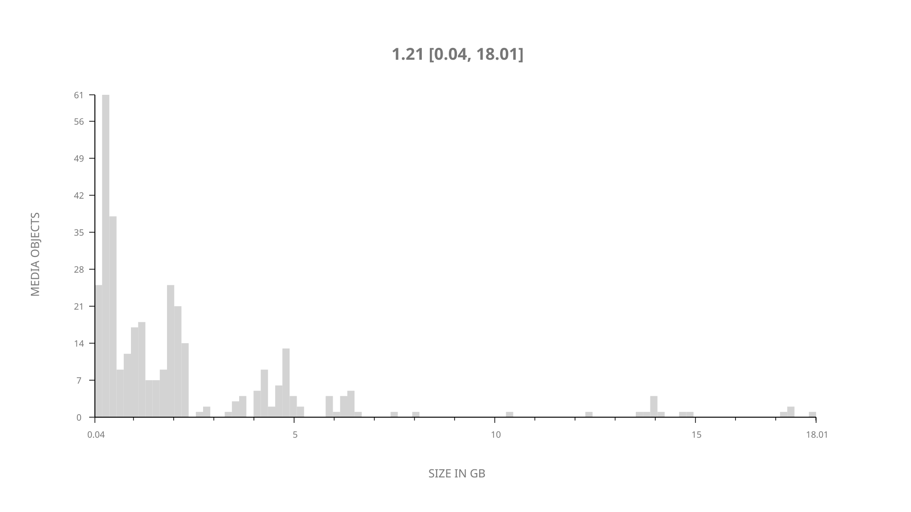
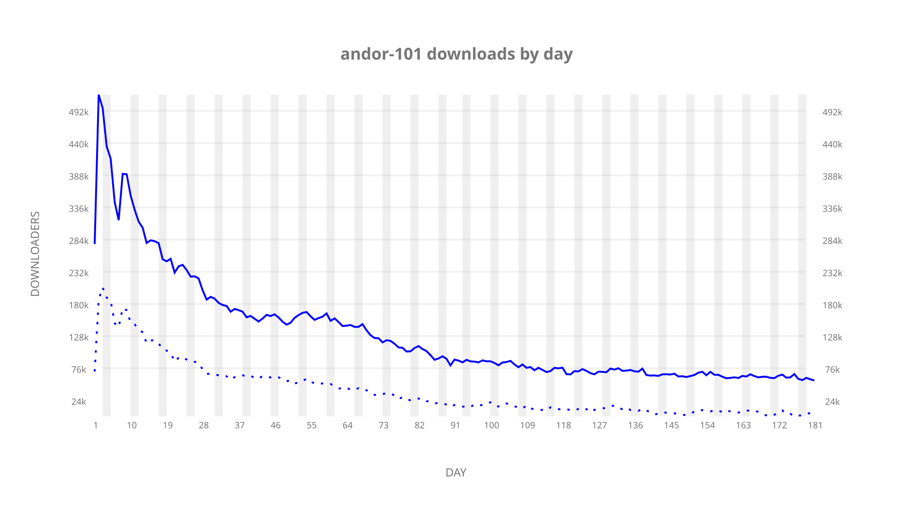
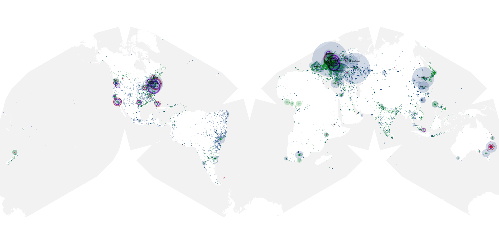
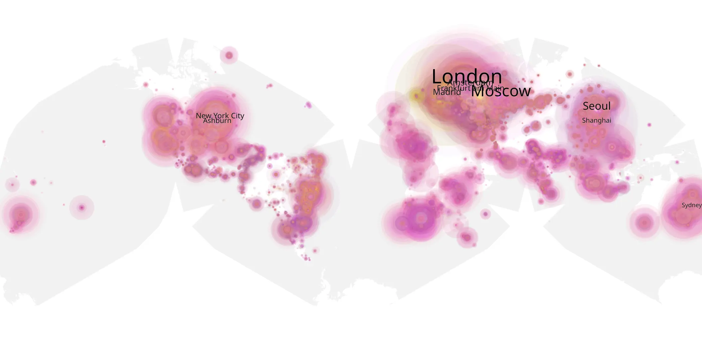
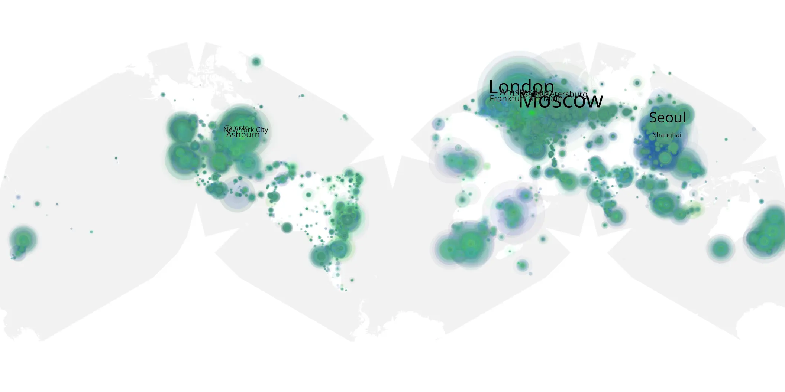

# andor-101 sample cache audit

## 1. Media object

| Field | Value |
| --- | --- |
| Media object | Andor |
| Collection key | `andor-101` |
| imdb_id | [tt9253284](https://www.imdb.com/title/tt9253284/) |
| wikipedia_url | [Andor](https://en.wikipedia.org/wiki/Andor) |
| Sample dates | 2022-09-21-to-2023-03-21 |
| Sample days | 182 |
| BTIH count | 405 |
| Unique BTIH count | 347 |
| Downloaders total | 15,259,681 |
| Uploaders total | 5,064,577 |
| Data version | `2026-08-05` |
| IP geolocation version | `6:1777968300` |

## 2. Sample coverage report

- Generated: 2026-09-02T04:14:11Z
- Sample archive directory: `/run/media/bkoz/gold/src/alpha60-samples-raw.gold/andor-101.xz`
- Hour directories: 4156
- Zero-length sample files: 0
- Other unparsable sample files: 0
- Hourly discontinuities: 2 (196 missing hours)
- Missing days: 8

### Sample archive discontinuities

- hourly gap: last `2022-12-18 22:00`, resumed `2022-12-20 03:18` — missing 28 hour(s)
- hourly gap: last `2023-02-14 23:00`, resumed `2023-02-22 00:00` — missing 168 hour(s)
- missing day: `2022-12-19`
- missing day: `2023-02-15`
- missing day: `2023-02-16`
- missing day: `2023-02-17`
- missing day: `2023-02-18`
- missing day: `2023-02-19`
- missing day: `2023-02-20`
- missing day: `2023-02-21`

## 3. Media objects file size histogram

## 4. Visualization pass — graphs

### Downloads by week cumulative (normalized start)



### Downloads by day, Saturday and Sunday in gray

## 5. Visualization pass — maps

### Cumulative geographic slices

| Africa | Americas | Asia | Europe | Oceania | Unknown |
| --- | --- | --- | --- | --- | --- |
| 4.96 | 21.67 | 19.76 | 47.26 | 3.04 | 0.66 |

### Cumulative network infrastructure

{:target="_blank" rel="noopener"}

### Cumulative data maps

**Cumulative >= 1080p**

{:target="_blank" rel="noopener"}

**Cumulative < 1080p**

{:target="_blank" rel="noopener"}
