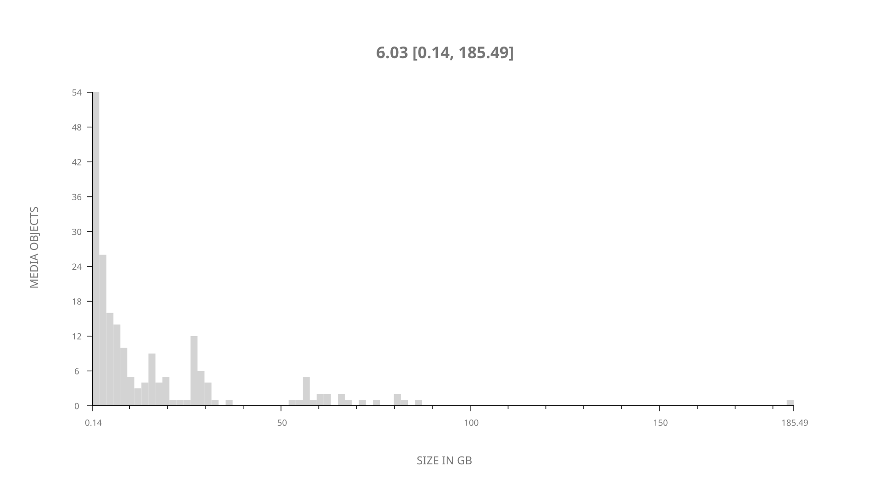
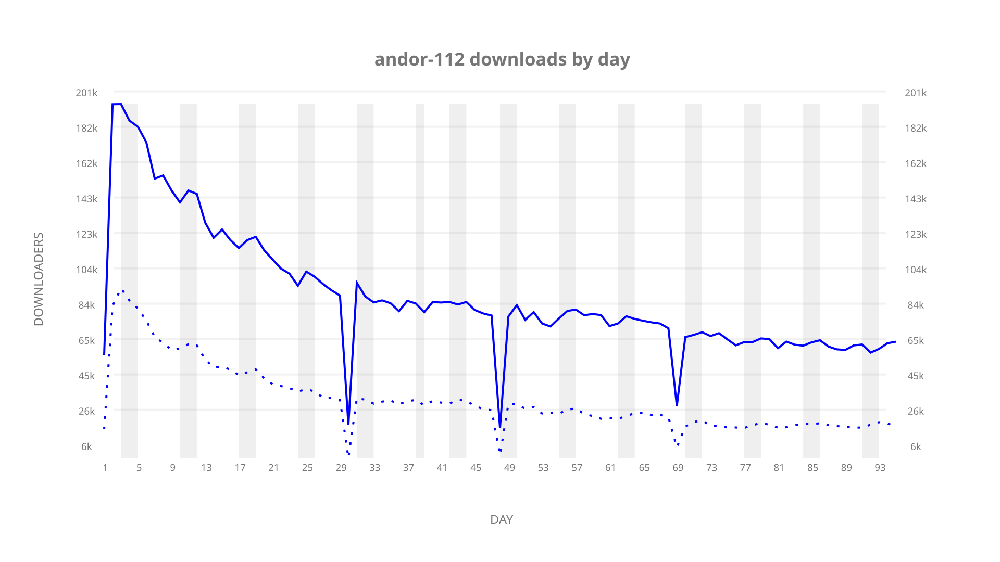
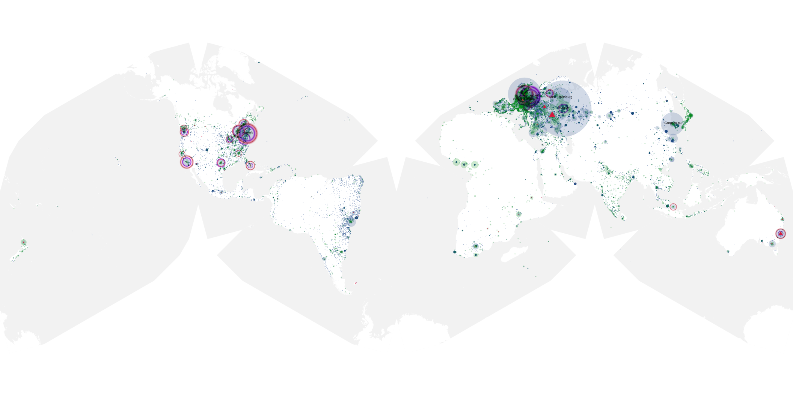
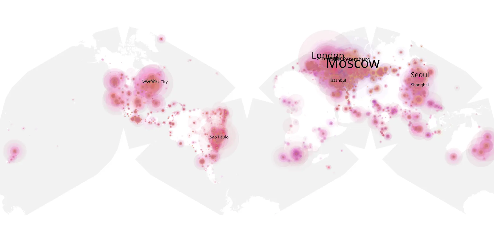
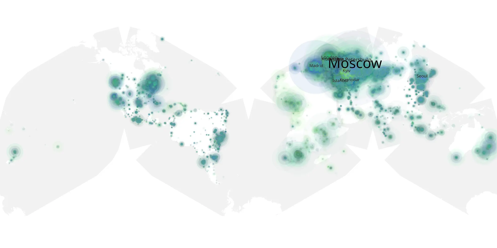

# andor-112 sample cache audit

## 1. Media object

| Field | Value |
| --- | --- |
| Media object | Andor |
| Collection key | `andor-112` |
| imdb_id | [tt9253284](https://www.imdb.com/title/tt9253284/) |
| wikipedia_url | [Andor](https://en.wikipedia.org/wiki/Andor) |
| Sample dates | 2022-11-23-to-2023-03-07 |
| Sample days | 105 |
| BTIH count | 242 |
| Unique BTIH count | 199 |
| Downloaders total | 5,685,945 |
| Uploaders total | 1,901,804 |
| Data version | `2026-08-05` |
| IP geolocation version | `6:1777968300` |

## 2. Coverage report

- Generated: 2026-09-09T22:54:26Z
- Sample archive directory: `/mnt/gold/src/alpha60-samples-raw.gold/andor-112.xz/2022`
- Hour directories: 2199
- Zero-length sample files: 0
- Other unparsable sample files: 0
- Hourly discontinuities: 4 (304 missing hours)
- Missing days: 10

### Sample archive discontinuities

- hourly gap: last `2022-12-21 22:03`, resumed `2022-12-22 23:35` — missing 24 hour(s)
- hourly gap: last `2022-12-31 22:03`, resumed `2023-01-04 00:03` — missing 73 hour(s)
- hourly gap: last `2023-01-11 22:03`, resumed `2023-01-13 23:19` — missing 48 hour(s)
- hourly gap: last `2023-02-03 08:03`, resumed `2023-02-10 00:03` — missing 159 hour(s)
- missing day: `2023-01-01`
- missing day: `2023-01-02`
- missing day: `2023-01-03`
- missing day: `2023-01-12`
- missing day: `2023-02-04`
- missing day: `2023-02-05`
- missing day: `2023-02-06`
- missing day: `2023-02-07`
- missing day: `2023-02-08`
- missing day: `2023-02-09`

## 3. File sizes histogram *median[lowest, highest]*

## 4. Graphs

### Downloads by week cumulative (normalized start)



### Downloads by day, Saturday and Sunday in gray

## 5. Cumulative Maps

<!-- https://raw.githubusercontent.com/alpha60-devops/alpha60-results-2022/refs/heads/main/data/ -->

### <a href="https://raw.githubusercontent.com/alpha60-devops/alpha60-results-2022/refs/heads/main/data/geojson.cumulative/andor-112-cumulative-aggregate.geojson.gz" data-map-title="Andor — andor-112" onclick="leaflet_map_open_window(this.href, this.dataset.mapTitle); return false;" class="table-link" aria-label="Open Andor (andor-112) cumulative data map in new window" title="Opens interactive map for Andor (andor-112) data">Swarm Detail</a>

### Geographic Regions

| Africa | Americas | Asia | Europe | Oceania | Unknown |
| --- | --- | --- | --- | --- | --- |
| 3.19 | 18.23 | 17.56 | 54.44 | 2.10 | 0.61 |

### Network infrastructure

{:target="_blank" rel="noopener"}

### Resolution >= 1080p

{:target="_blank" rel="noopener"}

### Resolution < 1080p

{:target="_blank" rel="noopener"}
