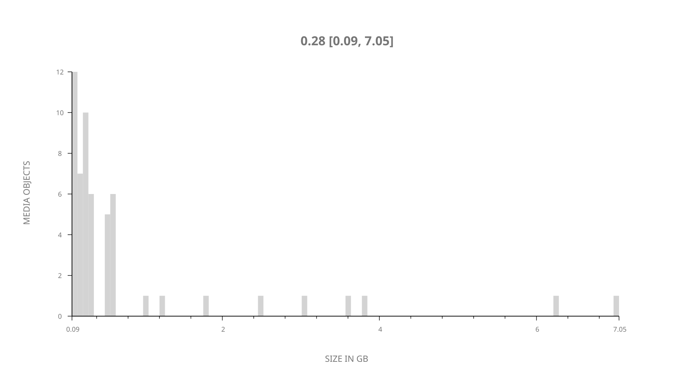
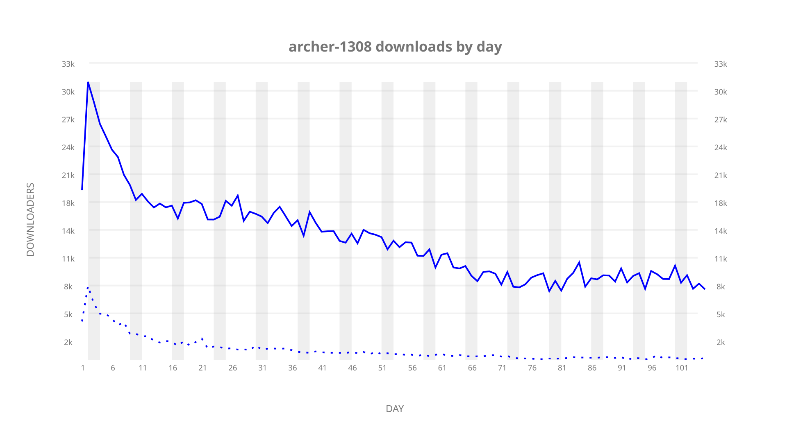
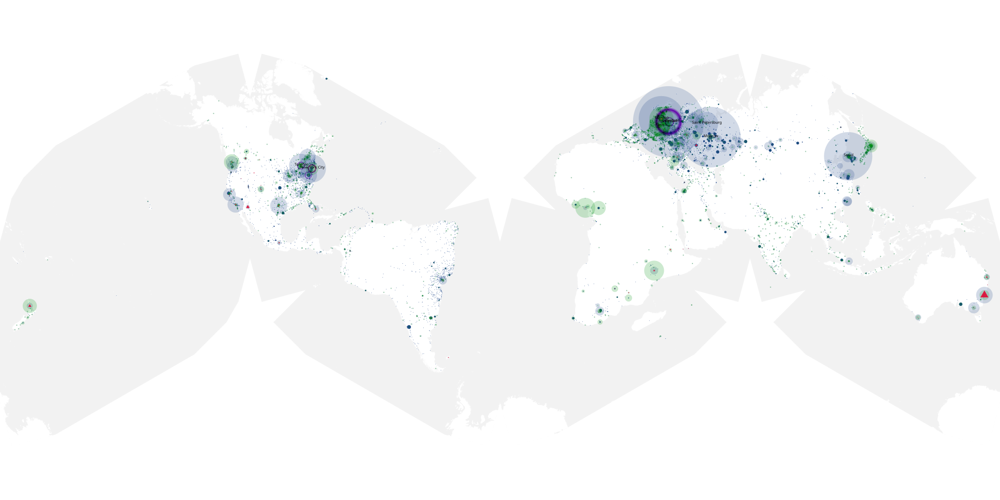
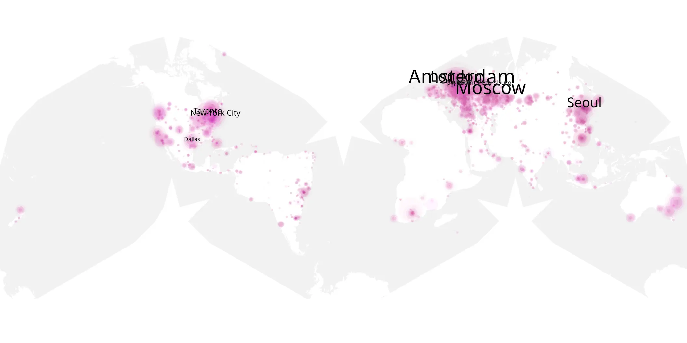
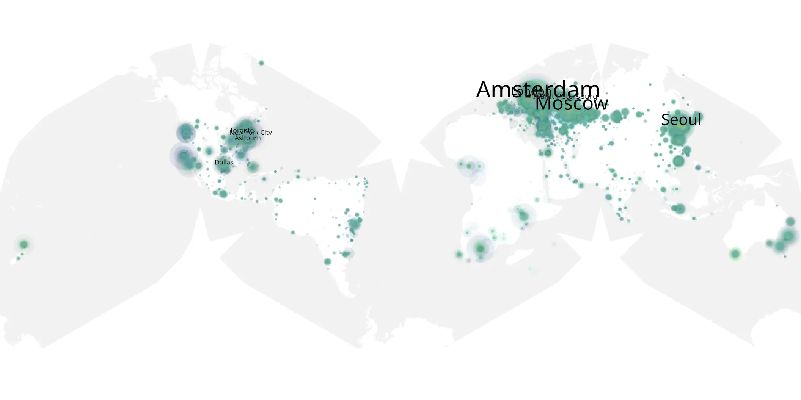

# archer-1308 sample cache audit

## 1. Media object

| Field | Value |
| --- | --- |
| Media object | Archer |
| Collection key | `archer-1308` |
| imdb_id | [tt1486217](https://www.imdb.com/title/tt1486217/) |
| wikipedia_url | [Archer (2009 TV series)](https://en.wikipedia.org/wiki/Archer_(2009_TV_series)) |
| Sample dates | 2022-10-13-to-2023-01-25 |
| Sample days | 105 |
| BTIH count | 68 |
| Unique BTIH count | 55 |
| Downloaders total | 885,053 |
| Uploaders total | 106,462 |
| Data version | `2026-08-05` |
| IP geolocation version | `6:1777968300` |

## 2. Coverage report

- Generated: 2026-09-02T04:14:11Z
- Sample archive directory: `/run/media/bkoz/gold/src/alpha60-samples-raw.gold/archer-1308.xz`
- Hour directories: 2502
- Zero-length sample files: 0
- Other unparsable sample files: 0
- Hourly discontinuities: 0 (0 missing hours)
- Missing days: 0

### Sample archive discontinuities

None detected.

## 3. File sizes histogram *median[lowest, highest]*

## 4. Graphs

### Downloads by week cumulative (normalized start)



### Downloads by day, Saturday and Sunday in gray

## 5. Cumulative Maps

<!-- https://raw.githubusercontent.com/alpha60-devops/alpha60-results-2022/refs/heads/main/data/ -->

### <a href="https://raw.githubusercontent.com/alpha60-devops/alpha60-results-2022/refs/heads/main/data/geojson.cumulative/archer-1308-cumulative-aggregate.geojson.gz" data-map-title="Archer — archer-1308" onclick="leaflet_map_open_window(this.href, this.dataset.mapTitle); return false;" class="table-link" aria-label="Open Archer (archer-1308) cumulative data map in new window" title="Opens interactive map for Archer (archer-1308) data">Swarm Detail</a>

### Geographic Regions

| Africa | Americas | Asia | Europe | Oceania | Unknown |
| --- | --- | --- | --- | --- | --- |
| 2.93 | 21.83 | 17.04 | 44.85 | 2.71 | 5.32 |

### Network infrastructure

{:target="_blank" rel="noopener"}

### Resolution >= 1080p

{:target="_blank" rel="noopener"}

### Resolution < 1080p

{:target="_blank" rel="noopener"}
