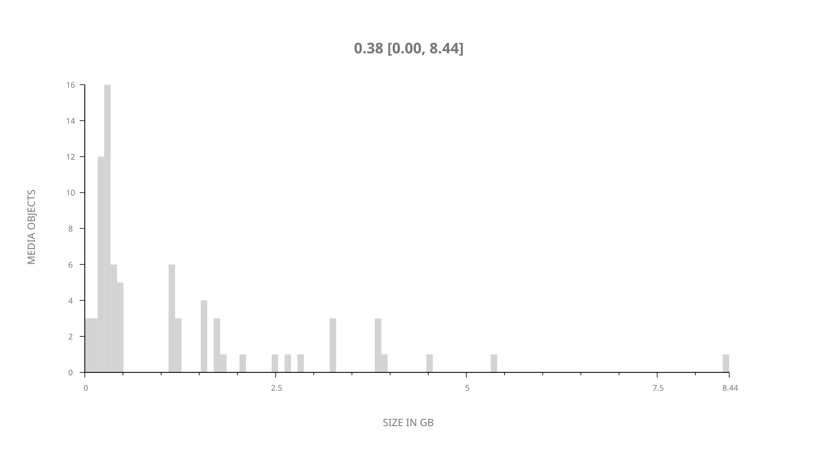
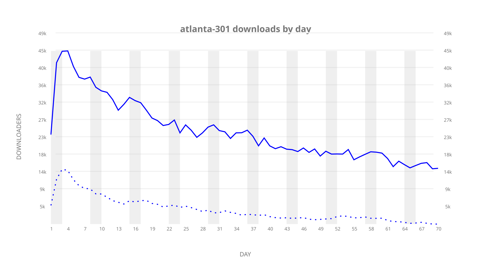
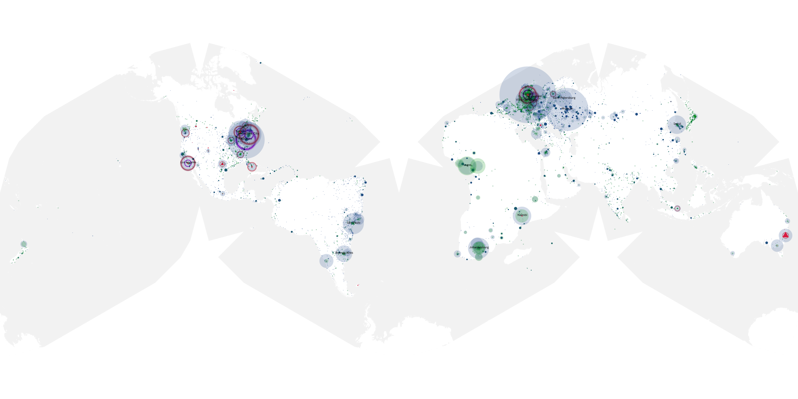
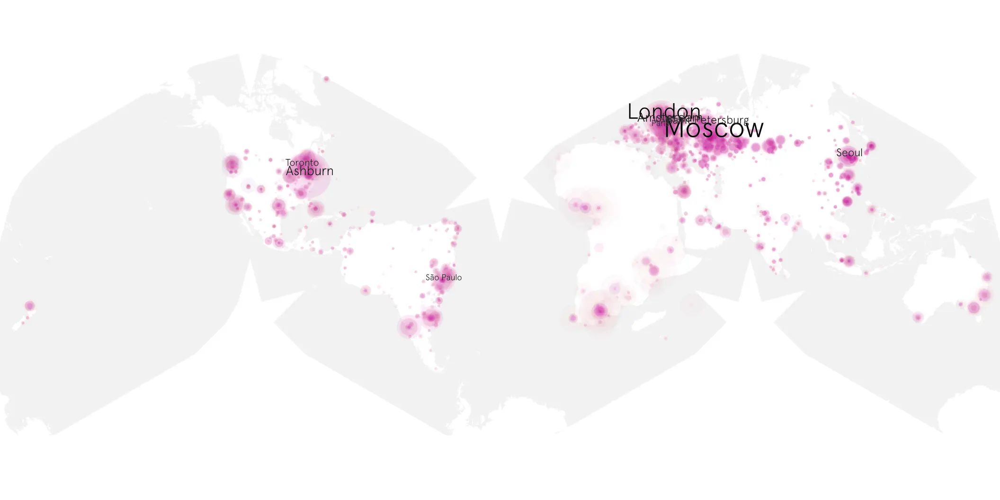
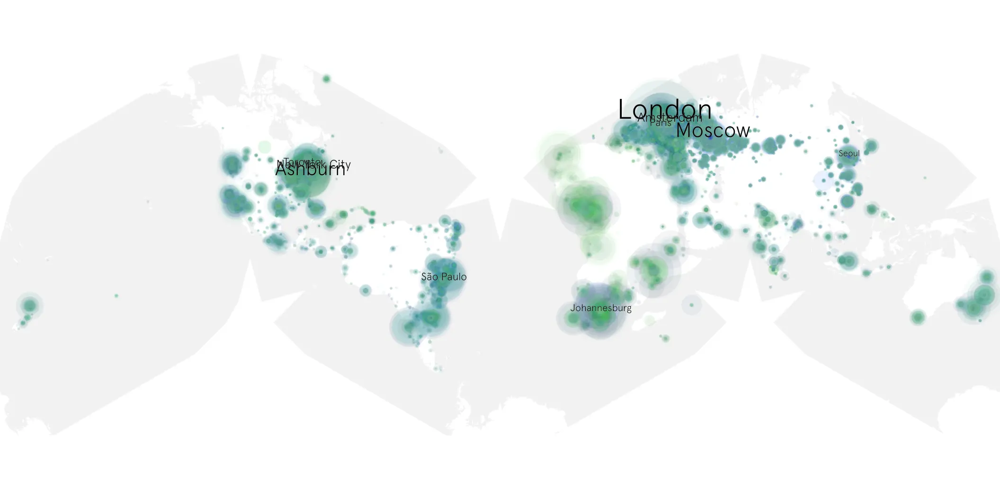

# atlanta-301 sample cache audit

## 1. Media object

| Field | Value |
| --- | --- |
| Media object | Atlanta |
| Collection key | `atlanta-301` |
| imdb_id | [tt4288182](https://www.imdb.com/title/tt4288182/) |
| wikipedia_url | [Atlanta (TV series)](https://en.wikipedia.org/wiki/Atlanta_(TV_series)) |
| Sample dates | 2022-03-25-to-2022-06-02 |
| Sample days | 70 |
| BTIH count | 90 |
| Unique BTIH count | 76 |
| Downloaders total | 1,199,444 |
| Uploaders total | 287,118 |
| Data version | `2026-08-05` |
| IP geolocation version | `6:1777968300` |

## 2. Sample coverage report

- Generated: 2026-09-02T04:14:11Z
- Sample archive directory: `/run/media/bkoz/gold/src/alpha60-samples-raw.gold/atlanta-301.xz`
- Hour directories: 1665
- Zero-length sample files: 0
- Other unparsable sample files: 0
- Hourly discontinuities: 1 (1 missing hours)
- Missing days: 0

### Sample archive discontinuities

- hourly gap: last `2022-03-27 01:03`, resumed `2022-03-27 03:03` — missing 1 hour(s)

## 3. Media objects file size histogram

## 4. Visualization pass — graphs

### Downloads by week cumulative (normalized start)



### Downloads by day, Saturday and Sunday in gray

## 5. Visualization pass — maps

### Cumulative geographic slices

| Africa | Americas | Asia | Europe | Oceania | Unknown |
| --- | --- | --- | --- | --- | --- |
| 11.26 | 28.01 | 11.92 | 38.42 | 2.66 | 0.60 |

### Cumulative network infrastructure

{:target="_blank" rel="noopener"}

### Cumulative data maps

**Cumulative >= 1080p**

{:target="_blank" rel="noopener"}

**Cumulative < 1080p**

{:target="_blank" rel="noopener"}
