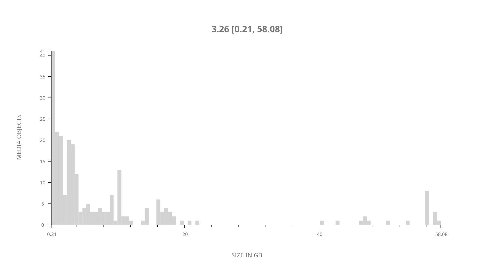
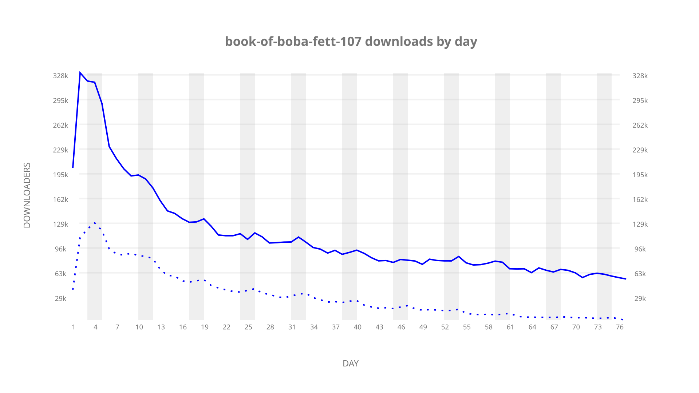
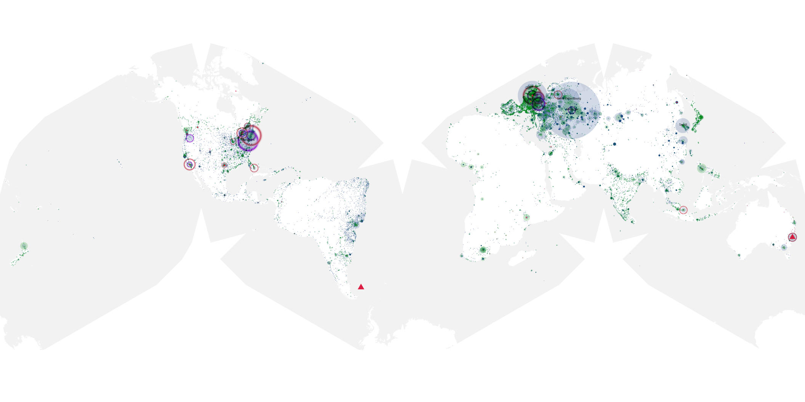
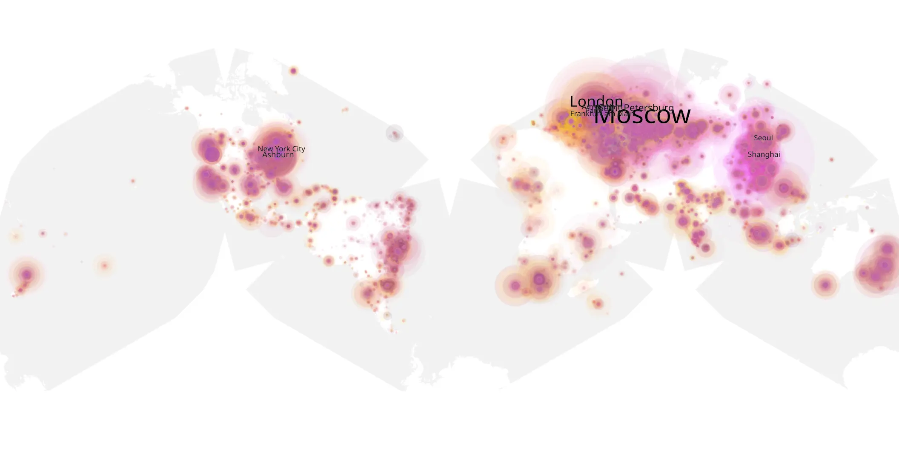
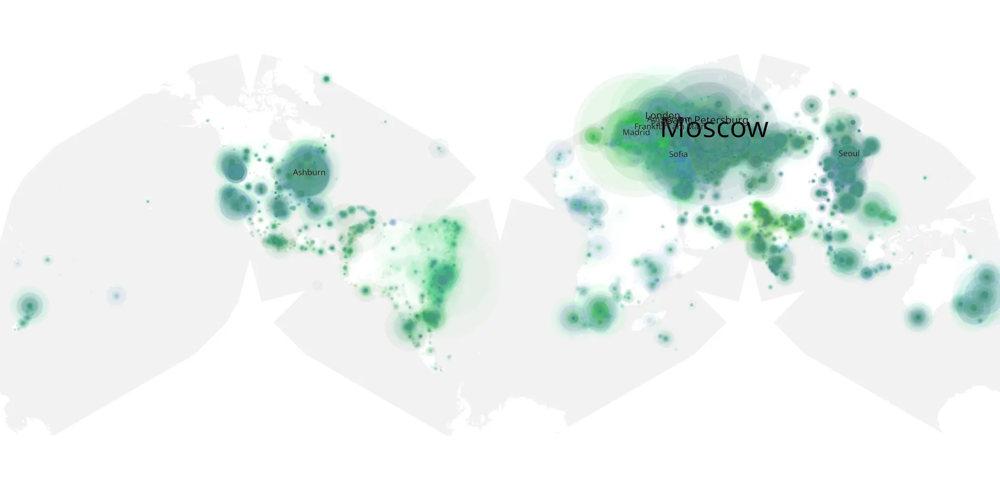

# book-of-boba-fett-107 sample cache audit

## 1. Media object

| Field | Value |
| --- | --- |
| Media object | The Book of Boba Fett |
| Collection key | `book-of-boba-fett-107` |
| imdb_id | [tt13668894](https://www.imdb.com/title/tt13668894/) |
| wikipedia_url | [The Book of Boba Fett](https://en.wikipedia.org/wiki/The_Book_of_Boba_Fett) |
| Sample dates | 2022-02-09-to-2022-04-26 |
| Sample days | 77 |
| BTIH count | 311 |
| Unique BTIH count | 242 |
| Downloaders total | 7,352,868 |
| Uploaders total | 2,659,284 |
| Data version | `2026-08-05` |
| IP geolocation version | `6:1777968300` |

## 2. Coverage report

- Generated: 2026-09-02T04:14:12Z
- Sample archive directory: `/run/media/bkoz/gold/src/alpha60-samples-raw.gold/book-of-boba-fett-107.xz`
- Hour directories: 1832
- Zero-length sample files: 0
- Other unparsable sample files: 0
- Hourly discontinuities: 1 (1 missing hours)
- Missing days: 0

### Sample archive discontinuities

- hourly gap: last `2022-03-27 01:06`, resumed `2022-03-27 03:06` — missing 1 hour(s)

## 3. File sizes histogram *median[lowest, highest]*

## 4. Graphs

### Downloads by week cumulative (normalized start)



### Downloads by day, Saturday and Sunday in gray

## 5. Cumulative Maps

<!-- https://raw.githubusercontent.com/alpha60-devops/alpha60-results-2022/refs/heads/main/data/ -->

### <a href="https://raw.githubusercontent.com/alpha60-devops/alpha60-results-2022/refs/heads/main/data/geojson.cumulative/book-of-boba-fett-107-cumulative-aggregate.geojson.gz" data-map-title="The Book of Boba Fett — book-of-boba-fett-107" onclick="leaflet_map_open_window(this.href, this.dataset.mapTitle); return false;" class="table-link" aria-label="Open The Book of Boba Fett (book-of-boba-fett-107) cumulative data map in new window" title="Opens interactive map for The Book of Boba Fett (book-of-boba-fett-107) data">Swarm Detail</a>

### Geographic Regions

| Africa | Americas | Asia | Europe | Oceania | Unknown |
| --- | --- | --- | --- | --- | --- |
| 3.53 | 17.86 | 16.44 | 55.51 | 2.53 | 0.77 |

### Network infrastructure

{:target="_blank" rel="noopener"}

### Resolution >= 1080p

{:target="_blank" rel="noopener"}

### Resolution < 1080p

{:target="_blank" rel="noopener"}
