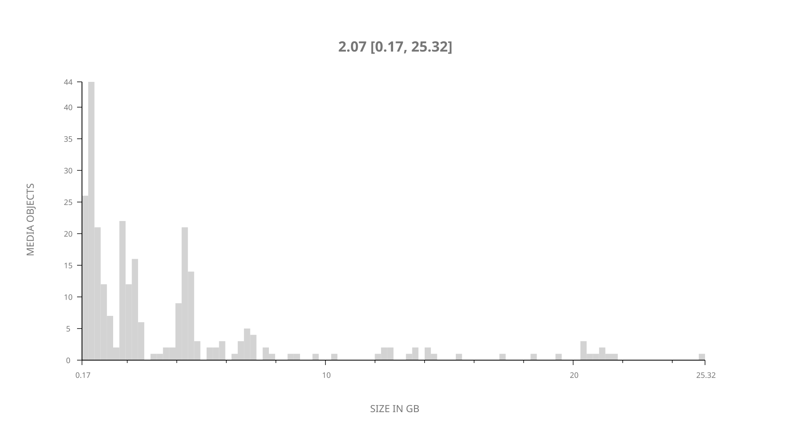
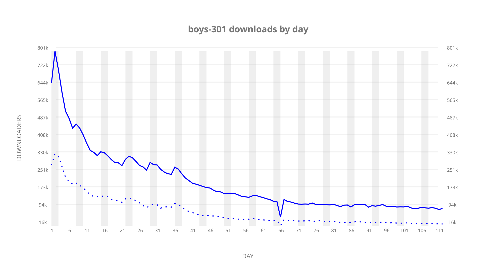
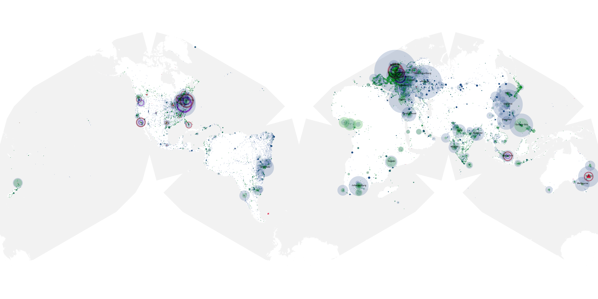
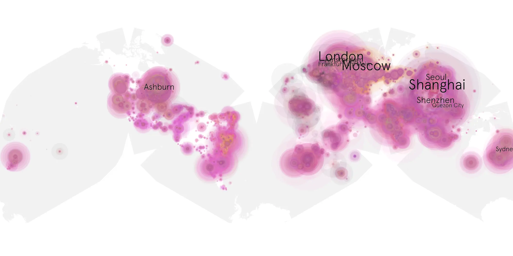
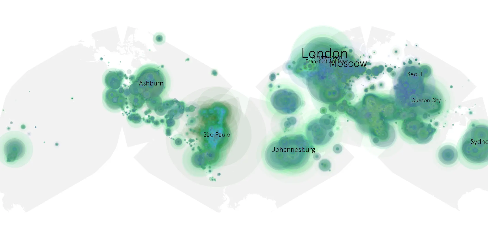

# boys-301 sample cache audit

## 1. Media object

| Field | Value |
| --- | --- |
| Media object | The Boys |
| Collection key | `boys-301` |
| imdb_id | [tt1190634](https://www.imdb.com/title/tt1190634/) |
| wikipedia_url | [The Boys (TV series)](https://en.wikipedia.org/wiki/The_Boys_(TV_series)) |
| Sample dates | 2022-06-03-to-2022-09-22 |
| Sample days | 112 |
| BTIH count | 318 |
| Unique BTIH count | 273 |
| Downloaders total | 15,936,745 |
| Uploaders total | 5,539,530 |
| Data version | `2026-08-05` |
| IP geolocation version | `6:1777968300` |

## 2. Sample coverage report

- Generated: 2026-09-02T04:14:12Z
- Sample archive directory: `/run/media/bkoz/gold/src/alpha60-samples-raw.gold/boys-301.xz`
- Hour directories: 2664
- Zero-length sample files: 0
- Other unparsable sample files: 0
- Hourly discontinuities: 1 (21 missing hours)
- Missing days: 0

### Sample archive discontinuities

- hourly gap: last `2022-08-06 23:00`, resumed `2022-08-07 21:00` — missing 21 hour(s)

## 3. Media objects file size histogram

## 4. Visualization pass — graphs

### Downloads by week cumulative (normalized start)



### Downloads by day, Saturday and Sunday in gray

## 5. Visualization pass — maps

### Cumulative geographic slices

| Africa | Americas | Asia | Europe | Oceania | Unknown |
| --- | --- | --- | --- | --- | --- |
| 7.28 | 21.13 | 29.12 | 34.91 | 3.53 | 0.60 |

### Cumulative network infrastructure

{:target="_blank" rel="noopener"}

### Cumulative data maps

**Cumulative >= 1080p**

{:target="_blank" rel="noopener"}

**Cumulative < 1080p**

{:target="_blank" rel="noopener"}
