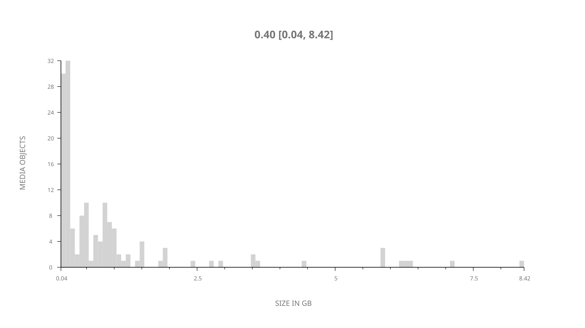
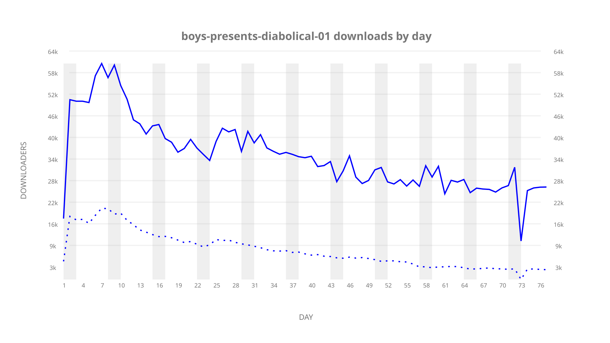
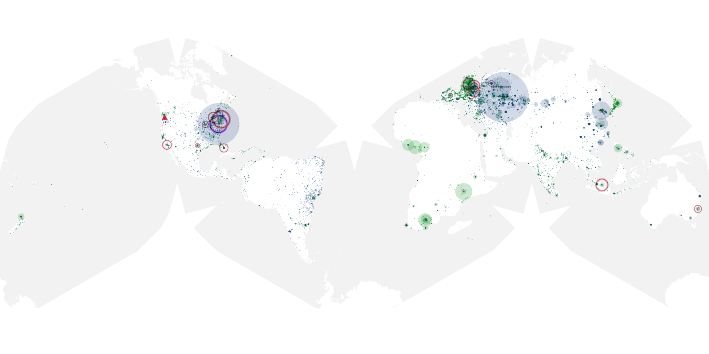
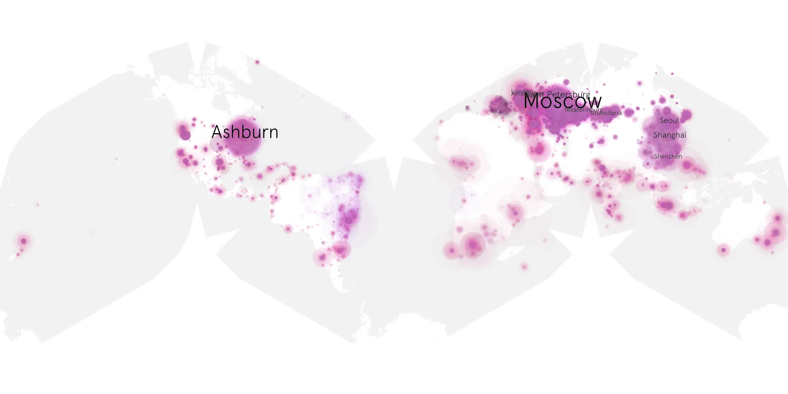
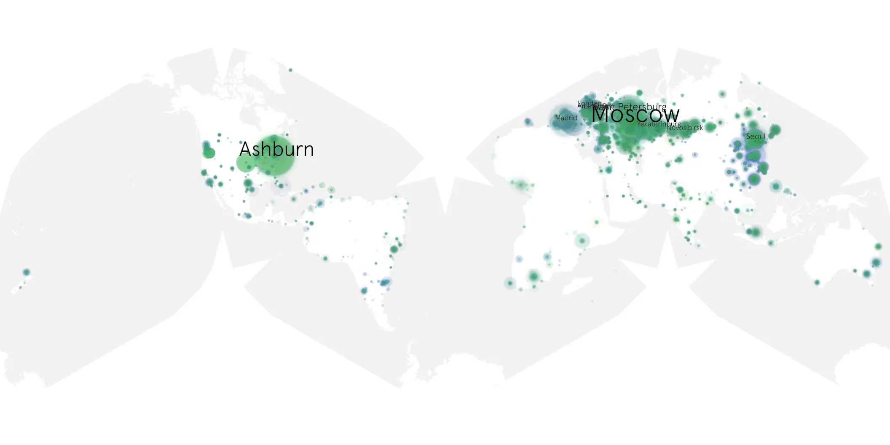

# boys-presents-diabolical-01 sample cache audit

## 1. Media object

| Field | Value |
| --- | --- |
| Media object | The Boys Presents Diabolical |
| Collection key | `boys-presents-diabolical-01` |
| imdb_id | [tt16350094](https://www.imdb.com/title/tt16350094/) |
| wikipedia_url | [The Boys Presents: Diabolical](https://en.wikipedia.org/wiki/The_Boys_Presents:_Diabolical) |
| Sample dates | 2022-03-04-to-2022-05-19 |
| Sample days | 77 |
| BTIH count | 176 |
| Unique BTIH count | 150 |
| Downloaders total | 2,084,039 |
| Uploaders total | 466,025 |
| Data version | `2026-08-05` |
| IP geolocation version | `6:1777968300` |

## 2. Sample coverage report

- Generated: 2026-09-02T04:14:12Z
- Sample archive directory: `/run/media/bkoz/gold/src/alpha60-samples-raw.gold/boys-presents-diabolical-01.xz`
- Hour directories: 1815
- Zero-length sample files: 0
- Other unparsable sample files: 0
- Hourly discontinuities: 2 (16 missing hours)
- Missing days: 0

### Sample archive discontinuities

- hourly gap: last `2022-03-27 01:03`, resumed `2022-03-27 03:03` — missing 1 hour(s)
- hourly gap: last `2022-05-15 08:03`, resumed `2022-05-16 00:03` — missing 15 hour(s)

## 3. Media objects file size histogram

## 4. Visualization pass — graphs

### Downloads by week cumulative (normalized start)



### Downloads by day, Saturday and Sunday in gray

## 5. Visualization pass — maps

### Cumulative geographic slices

| Africa | Americas | Asia | Europe | Oceania | Unknown |
| --- | --- | --- | --- | --- | --- |
| 2.22 | 18.17 | 19.81 | 50.37 | 1.39 | 1.09 |

### Cumulative network infrastructure

{:target="_blank" rel="noopener"}

### Cumulative data maps

**Cumulative >= 1080p**

{:target="_blank" rel="noopener"}

**Cumulative < 1080p**

{:target="_blank" rel="noopener"}
