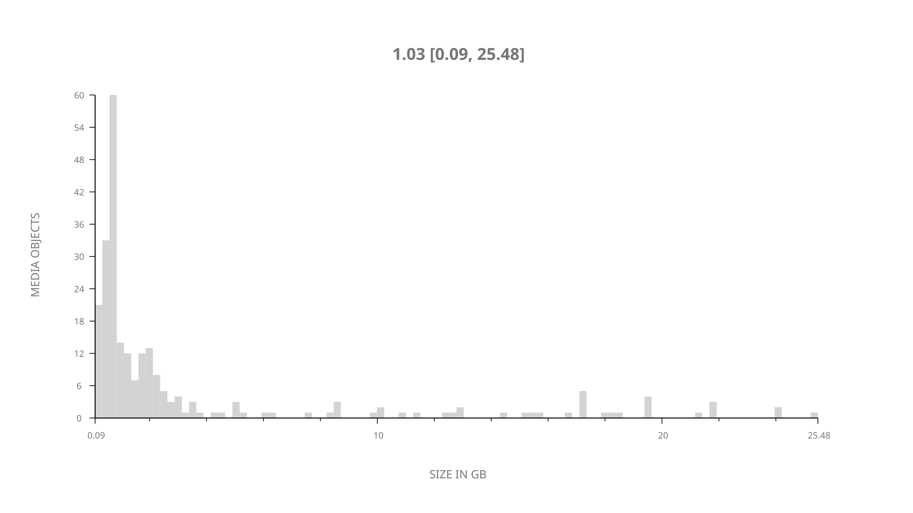
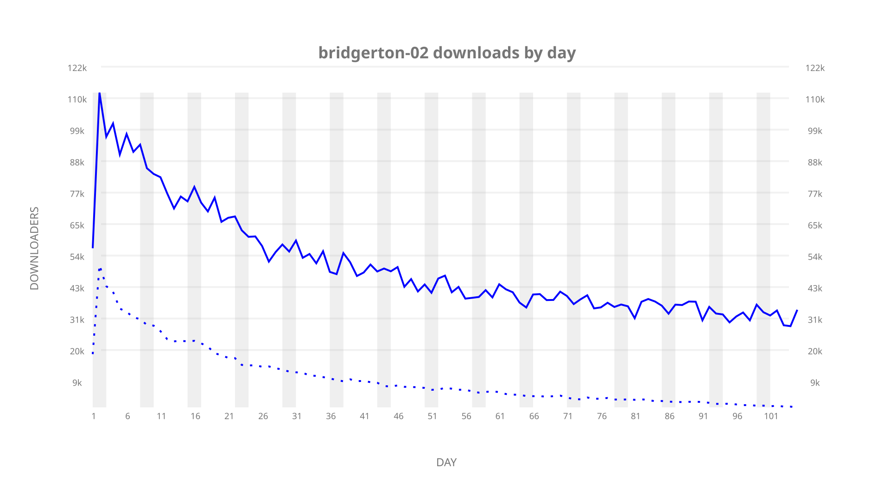
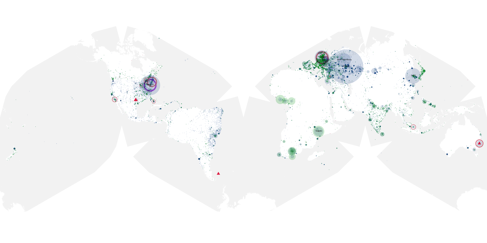
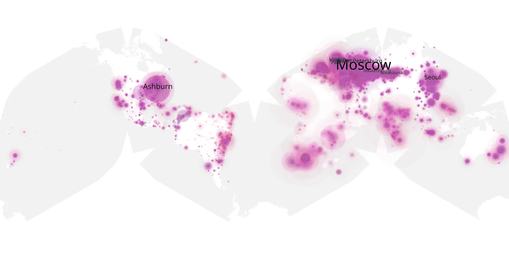
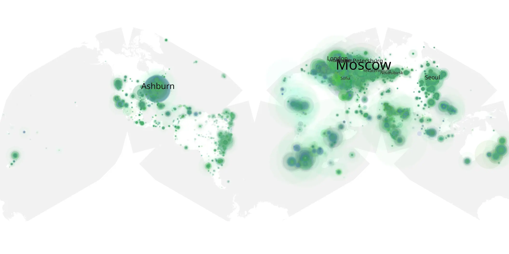

# bridgerton-02 sample cache audit

## 1. Media object

| Field | Value |
| --- | --- |
| Media object | Bridgerton |
| Collection key | `bridgerton-02` |
| imdb_id | [tt8740790](https://www.imdb.com/title/tt8740790/) |
| wikipedia_url | [Bridgerton](https://en.wikipedia.org/wiki/Bridgerton) |
| Sample dates | 2022-03-25-to-2022-07-07 |
| Sample days | 105 |
| BTIH count | 280 |
| Unique BTIH count | 243 |
| Downloaders total | 4,856,513 |
| Uploaders total | 1,293,553 |
| Data version | `2026-08-05` |
| IP geolocation version | `6:1777968300` |

## 2. Coverage report

- Generated: 2026-09-02T04:14:13Z
- Sample archive directory: `/run/media/bkoz/gold/src/alpha60-samples-raw.gold/bridgerton-02.xz`
- Hour directories: 2492
- Zero-length sample files: 0
- Other unparsable sample files: 0
- Hourly discontinuities: 14 (14 missing hours)
- Missing days: 0

### Sample archive discontinuities

- hourly gap: last `2022-03-29 03:03`, resumed `2022-03-29 06:00` — missing 1 hour(s)
- hourly gap: last `2022-06-13 22:00`, resumed `2022-06-14 00:00` — missing 1 hour(s)
- hourly gap: last `2022-06-25 22:00`, resumed `2022-06-26 00:00` — missing 1 hour(s)
- hourly gap: last `2022-06-26 22:00`, resumed `2022-06-27 00:00` — missing 1 hour(s)
- hourly gap: last `2022-06-27 22:00`, resumed `2022-06-28 00:00` — missing 1 hour(s)
- hourly gap: last `2022-06-28 22:00`, resumed `2022-06-29 00:00` — missing 1 hour(s)
- hourly gap: last `2022-06-29 22:00`, resumed `2022-06-30 00:00` — missing 1 hour(s)
- hourly gap: last `2022-06-30 22:00`, resumed `2022-07-01 00:00` — missing 1 hour(s)
- hourly gap: last `2022-07-01 22:00`, resumed `2022-07-02 00:00` — missing 1 hour(s)
- hourly gap: last `2022-07-02 22:00`, resumed `2022-07-03 00:00` — missing 1 hour(s)
- hourly gap: last `2022-07-03 22:00`, resumed `2022-07-04 00:00` — missing 1 hour(s)
- hourly gap: last `2022-07-04 22:00`, resumed `2022-07-05 00:00` — missing 1 hour(s)
- hourly gap: last `2022-07-05 22:00`, resumed `2022-07-06 00:00` — missing 1 hour(s)
- hourly gap: last `2022-07-06 22:00`, resumed `2022-07-07 00:00` — missing 1 hour(s)

## 3. File sizes histogram *median[lowest, highest]*

## 4. Graphs

### Downloads by week cumulative (normalized start)



### Downloads by day, Saturday and Sunday in gray

## 5. Cumulative Maps

<!-- https://raw.githubusercontent.com/alpha60-devops/alpha60-results-2022/refs/heads/main/data/ -->

### <a href="https://raw.githubusercontent.com/alpha60-devops/alpha60-results-2022/refs/heads/main/data/geojson.cumulative/bridgerton-02-cumulative-aggregate.geojson.gz" data-map-title="Bridgerton — bridgerton-02" onclick="leaflet_map_open_window(this.href, this.dataset.mapTitle); return false;" class="table-link" aria-label="Open Bridgerton (bridgerton-02) cumulative data map in new window" title="Opens interactive map for Bridgerton (bridgerton-02) data">Swarm Detail</a>

### Geographic Regions

| Africa | Americas | Asia | Europe | Oceania | Unknown |
| --- | --- | --- | --- | --- | --- |
| 8.34 | 16.52 | 18.17 | 46.95 | 2.04 | 0.83 |

### Network infrastructure

{:target="_blank" rel="noopener"}

### Resolution >= 1080p

{:target="_blank" rel="noopener"}

### Resolution < 1080p

{:target="_blank" rel="noopener"}
