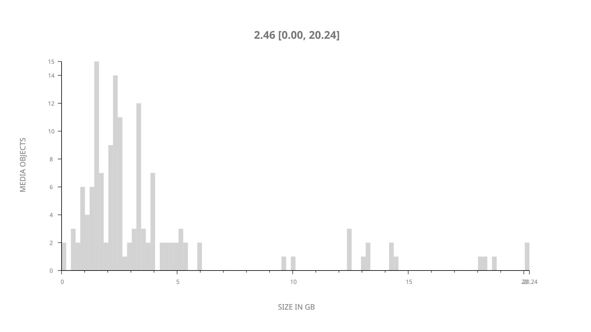
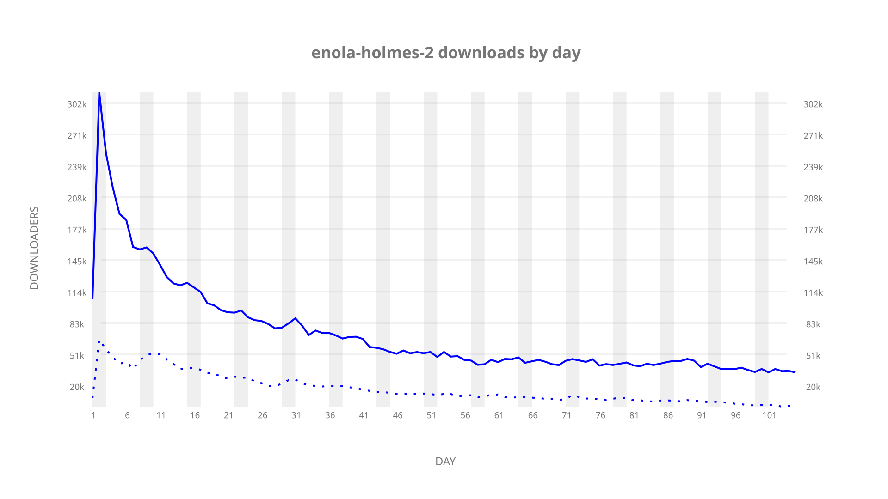
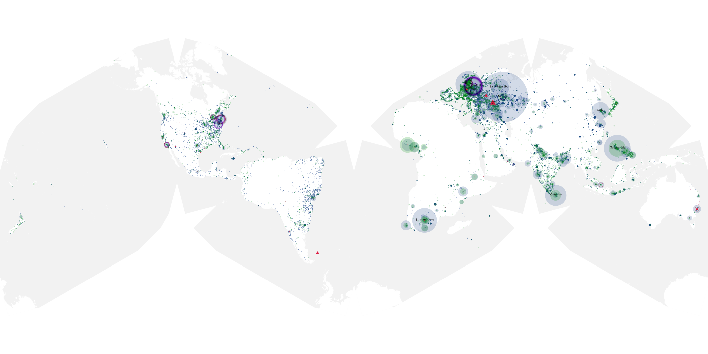
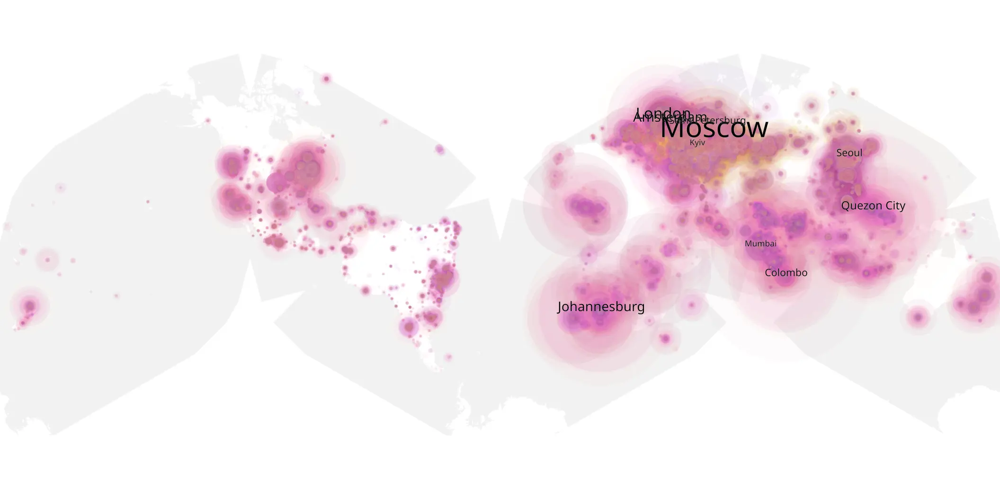
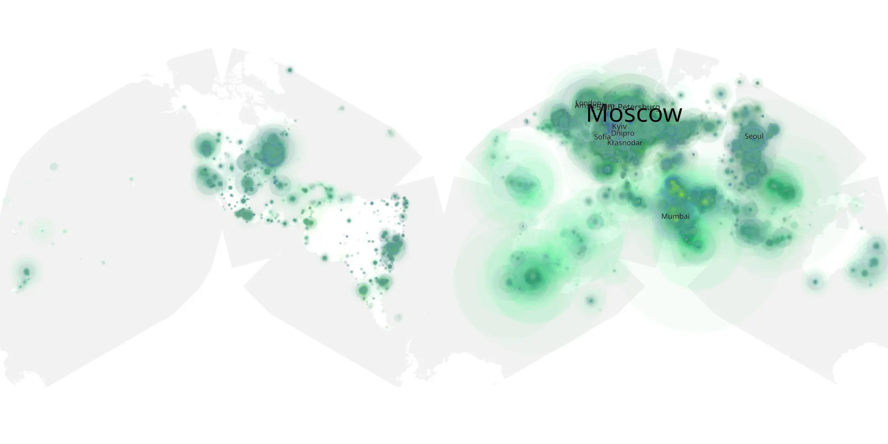

# enola-holmes-2 sample cache audit

## 1. Media object

| Field | Value |
| --- | --- |
| Media object | Enola Holmes |
| Collection key | `enola-holmes-2` |
| imdb_id | [tt14641788](https://www.imdb.com/title/tt14641788/) |
| wikipedia_url | [Enola Holmes 2](https://en.wikipedia.org/wiki/Enola_Holmes_2) |
| Sample dates | 2022-11-04-to-2023-02-16 |
| Sample days | 105 |
| BTIH count | 180 |
| Unique BTIH count | 142 |
| Downloaders total | 6,559,195 |
| Uploaders total | 2,359,986 |
| Data version | `2026-08-05` |
| IP geolocation version | `6:1777968300` |

## 2. Sample coverage report

- Generated: 2026-09-02T04:14:13Z
- Sample archive directory: `/run/media/bkoz/gold/src/alpha60-samples-raw.gold/enola-holmes-2.xz`
- Hour directories: 2504
- Zero-length sample files: 0
- Other unparsable sample files: 0
- Hourly discontinuities: 0 (0 missing hours)
- Missing days: 0

### Sample archive discontinuities

None detected.

## 3. Media objects file size histogram

## 4. Visualization pass — graphs

### Downloads by week cumulative (normalized start)



### Downloads by day, Saturday and Sunday in gray

## 5. Visualization pass — maps

### Cumulative geographic slices

| Africa | Americas | Asia | Europe | Oceania | Unknown |
| --- | --- | --- | --- | --- | --- |
| 9.48 | 11.05 | 27.37 | 41.62 | 1.45 | 0.98 |

### Cumulative network infrastructure

{:target="_blank" rel="noopener"}

### Cumulative data maps

**Cumulative >= 1080p**

{:target="_blank" rel="noopener"}

**Cumulative < 1080p**

{:target="_blank" rel="noopener"}
