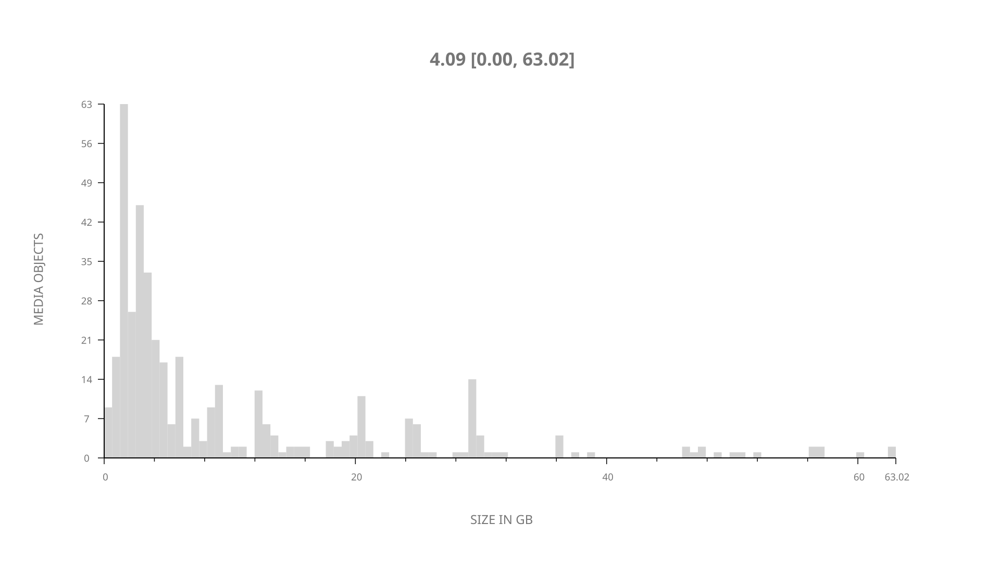
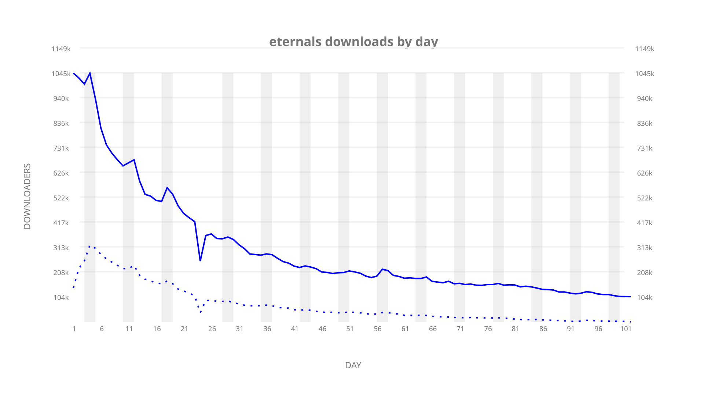
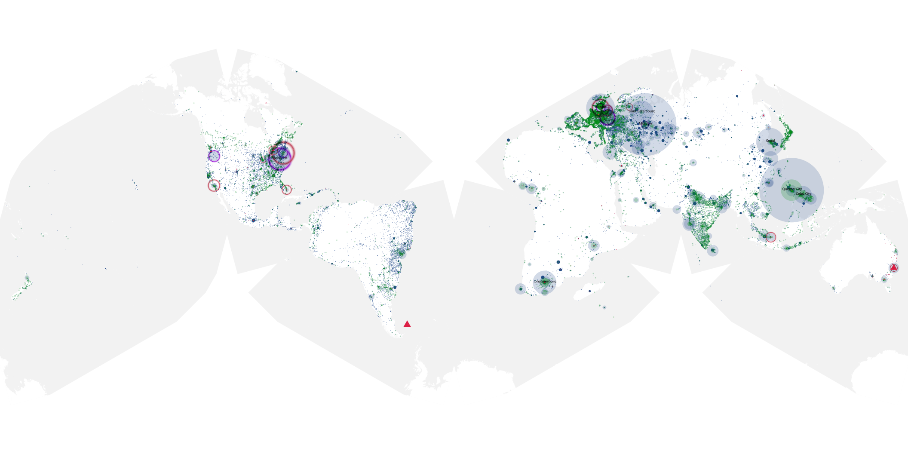
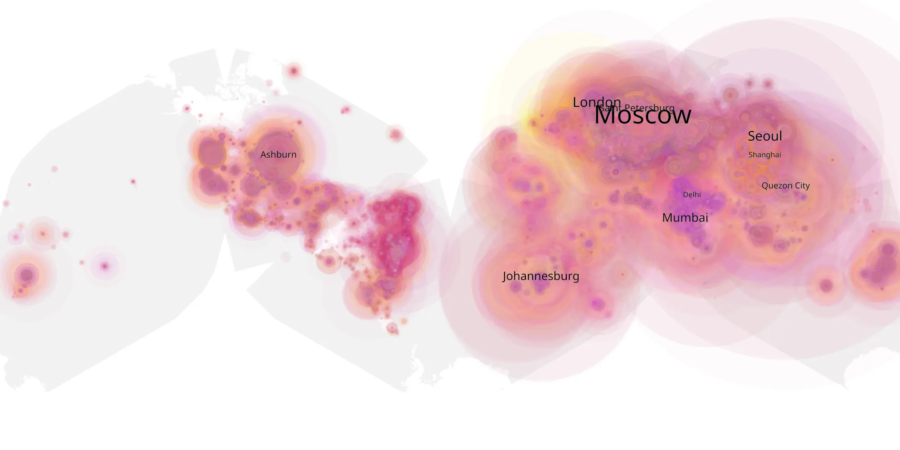
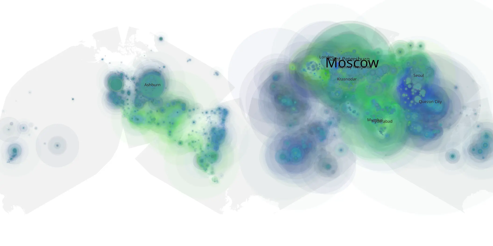

# eternals sample cache audit

## 1. Media object

| Field | Value |
| --- | --- |
| Media object | The Eternals |
| Collection key | `eternals` |
| imdb_id | [tt9032400](https://www.imdb.com/title/tt9032400/) |
| wikipedia_url | [Eternals (film)](https://en.wikipedia.org/wiki/Eternals_(film)) |
| Sample dates | 2022-01-12-to-2022-04-26 |
| Sample days | 105 |
| BTIH count | 494 |
| Unique BTIH count | 411 |
| Downloaders total | 28,437,848 |
| Uploaders total | 10,361,606 |
| Data version | `2026-08-05` |
| IP geolocation version | `6:1777968300` |

## 2. Sample coverage report

- Generated: 2026-09-02T04:14:13Z
- Sample archive directory: `/run/media/bkoz/gold/src/alpha60-samples-raw.gold/eternals.xz`
- Hour directories: 2434
- Zero-length sample files: 0
- Other unparsable sample files: 0
- Hourly discontinuities: 2 (82 missing hours)
- Missing days: 3

### Sample archive discontinuities

- hourly gap: last `2022-02-04 14:10`, resumed `2022-02-08 01:03` — missing 81 hour(s)
- hourly gap: last `2022-03-27 01:03`, resumed `2022-03-27 03:03` — missing 1 hour(s)
- missing day: `2022-02-05`
- missing day: `2022-02-06`
- missing day: `2022-02-07`

## 3. Media objects file size histogram

## 4. Visualization pass — graphs

### Downloads by week cumulative (normalized start)



### Downloads by day, Saturday and Sunday in gray

## 5. Visualization pass — maps

### Cumulative geographic slices

| Africa | Americas | Asia | Europe | Oceania | Unknown |
| --- | --- | --- | --- | --- | --- |
| 8.61 | 13.39 | 32.19 | 36.98 | 1.64 | 0.75 |

### Cumulative network infrastructure

{:target="_blank" rel="noopener"}

### Cumulative data maps

**Cumulative >= 1080p**

{:target="_blank" rel="noopener"}

**Cumulative < 1080p**

{:target="_blank" rel="noopener"}
