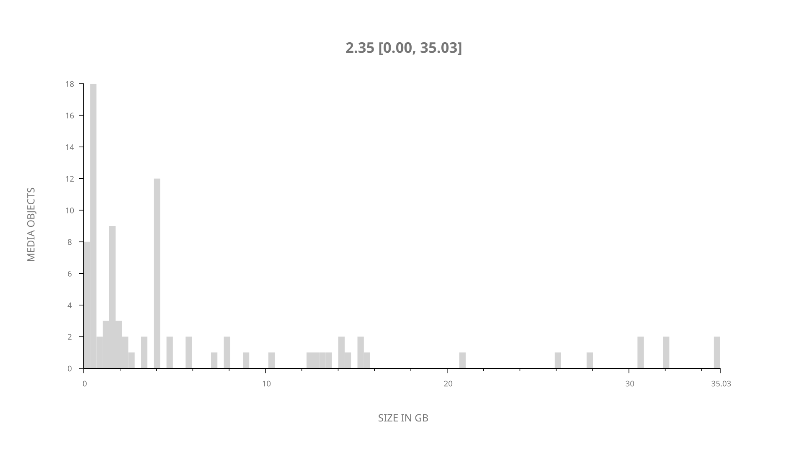
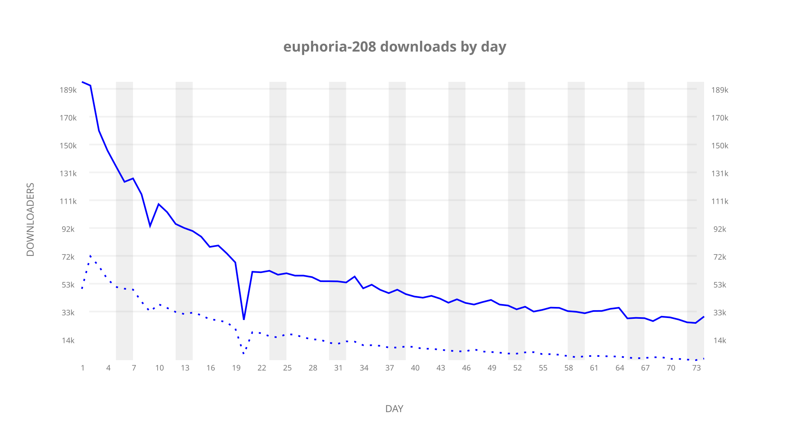
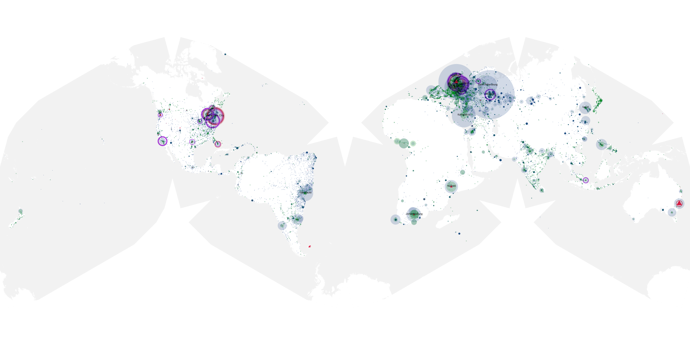
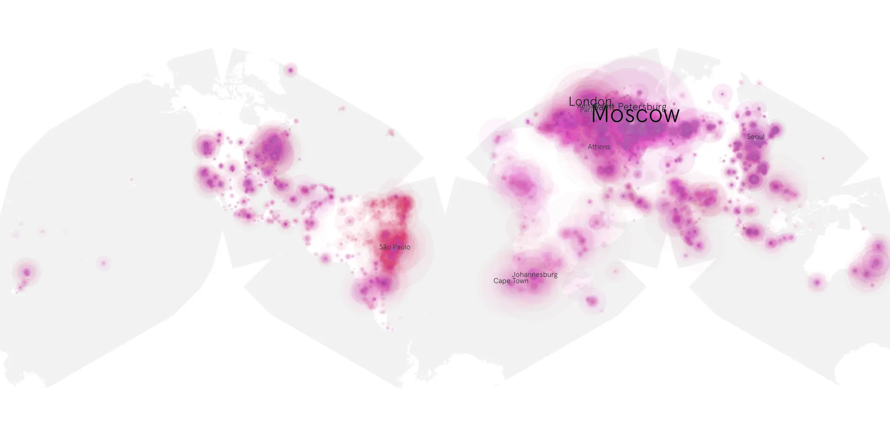
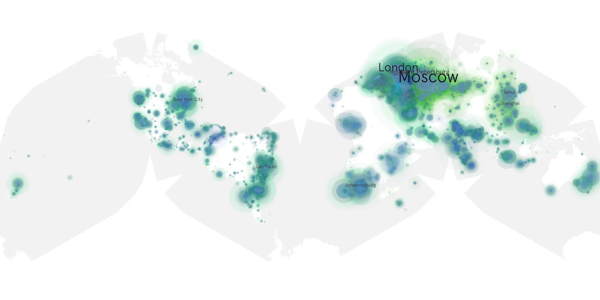

# euphoria-208 sample cache audit

## 1. Media object

| Field | Value |
| --- | --- |
| Media object | Euphoria |
| Collection key | `euphoria-208` |
| imdb_id | [tt8772296](https://www.imdb.com/title/tt8772296/) |
| wikipedia_url | [Euphoria (American TV series)](https://en.wikipedia.org/wiki/Euphoria_(American_TV_series)) |
| Sample dates | 2022-02-28-to-2022-05-15 |
| Sample days | 77 |
| BTIH count | 115 |
| Unique BTIH count | 88 |
| Downloaders total | 3,787,497 |
| Uploaders total | 1,383,345 |
| Data version | `2026-08-05` |
| IP geolocation version | `6:1777968300` |

## 2. Sample coverage report

- Generated: 2026-09-02T04:14:13Z
- Sample archive directory: `/run/media/bkoz/gold/src/alpha60-samples-raw.gold/euphoria-208.xz`
- Hour directories: 1748
- Zero-length sample files: 0
- Other unparsable sample files: 0
- Hourly discontinuities: 2 (98 missing hours)
- Missing days: 3

### Sample archive discontinuities

- hourly gap: last `2022-03-07 22:03`, resumed `2022-03-08 06:40` — missing 7 hour(s)
- hourly gap: last `2022-03-18 22:03`, resumed `2022-03-22 18:03` — missing 91 hour(s)
- missing day: `2022-03-19`
- missing day: `2022-03-20`
- missing day: `2022-03-21`

## 3. Media objects file size histogram

## 4. Visualization pass — graphs

### Downloads by week cumulative (normalized start)



### Downloads by day, Saturday and Sunday in gray

## 5. Visualization pass — maps

### Cumulative geographic slices

| Africa | Americas | Asia | Europe | Oceania | Unknown |
| --- | --- | --- | --- | --- | --- |
| 8.61 | 19.51 | 17.75 | 43.74 | 2.09 | 0.61 |

### Cumulative network infrastructure

{:target="_blank" rel="noopener"}

### Cumulative data maps

**Cumulative >= 1080p**

{:target="_blank" rel="noopener"}

**Cumulative < 1080p**

{:target="_blank" rel="noopener"}
