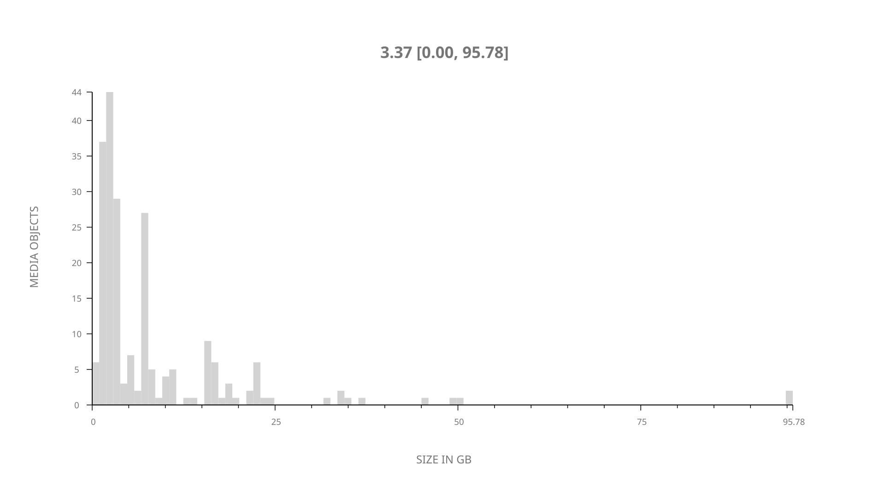
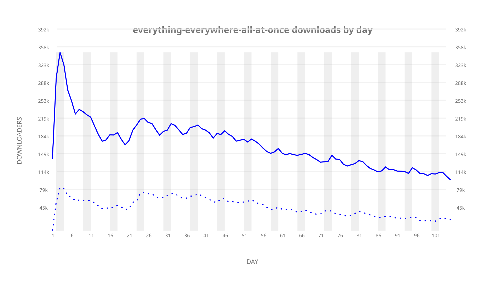
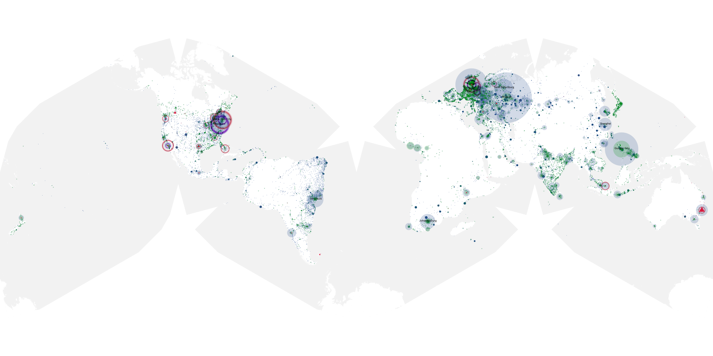
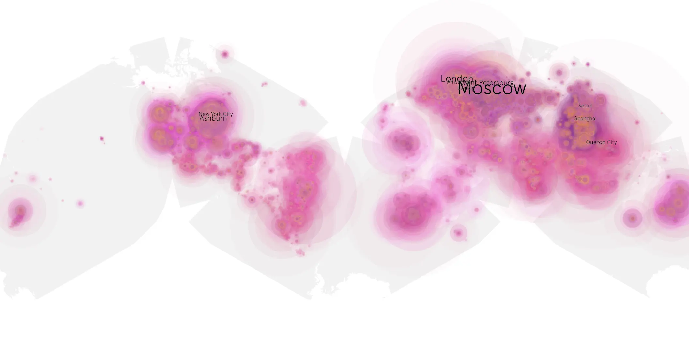
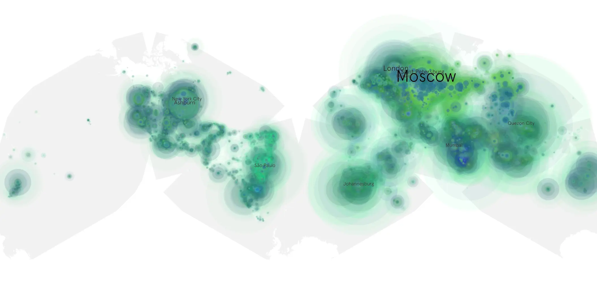

# everything-everywhere-all-at-once sample cache audit

## 1. Media object

| Field | Value |
| --- | --- |
| Media object | Everything Everywhere All At Once |
| Collection key | `everything-everywhere-all-at-once` |
| imdb_id | [tt6710474](https://www.imdb.com/title/tt6710474/) |
| wikipedia_url | [Everything Everywhere All at Once](https://en.wikipedia.org/wiki/Everything_Everywhere_All_at_Once) |
| Sample dates | 2022-05-19-to-2022-08-31 |
| Sample days | 105 |
| BTIH count | 250 |
| Unique BTIH count | 212 |
| Downloaders total | 13,249,300 |
| Uploaders total | 4,852,593 |
| Data version | `2026-08-05` |
| IP geolocation version | `6:1777968300` |

## 2. Coverage report

- Generated: 2026-09-02T04:14:13Z
- Sample archive directory: `/run/media/bkoz/gold/src/alpha60-samples-raw.gold/everything-everywhere-all-at-once.xz`
- Hour directories: 2514
- Zero-length sample files: 0
- Other unparsable sample files: 0
- Hourly discontinuities: 0 (0 missing hours)
- Missing days: 0

### Sample archive discontinuities

None detected.

## 3. File sizes histogram *median[lowest, highest]*

## 4. Graphs

### Downloads by week cumulative (normalized start)



### Downloads by day, Saturday and Sunday in gray

## 5. Cumulative Maps

<!-- https://raw.githubusercontent.com/alpha60-devops/alpha60-results-2022/refs/heads/main/data/ -->

### <a href="https://raw.githubusercontent.com/alpha60-devops/alpha60-results-2022/refs/heads/main/data/geojson.cumulative/everything-everywhere-all-at-once-cumulative-aggregate.geojson.gz" data-map-title="Everything Everywhere All At Once — everything-everywhere-all-at-once" onclick="leaflet_map_open_window(this.href, this.dataset.mapTitle); return false;" class="table-link" aria-label="Open Everything Everywhere All At Once (everything-everywhere-all-at-once) cumulative data map in new window" title="Opens interactive map for Everything Everywhere All At Once (everything-everywhere-all-at-once) data">Swarm Detail</a>

### Geographic Regions

| Africa | Americas | Asia | Europe | Oceania | Unknown |
| --- | --- | --- | --- | --- | --- |
| 6.32 | 18.49 | 24.93 | 36.81 | 2.13 | 0.65 |

### Network infrastructure

{:target="_blank" rel="noopener"}

### Resolution >= 1080p

{:target="_blank" rel="noopener"}

### Resolution < 1080p

{:target="_blank" rel="noopener"}
