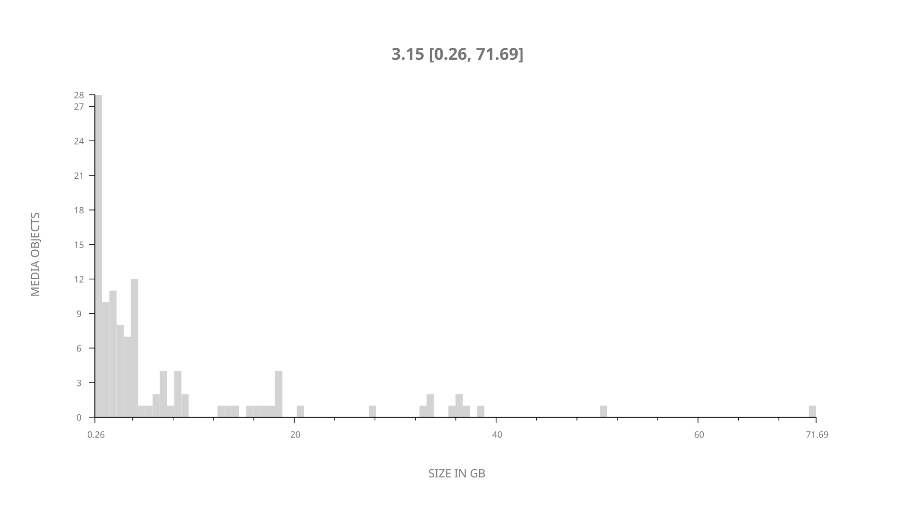
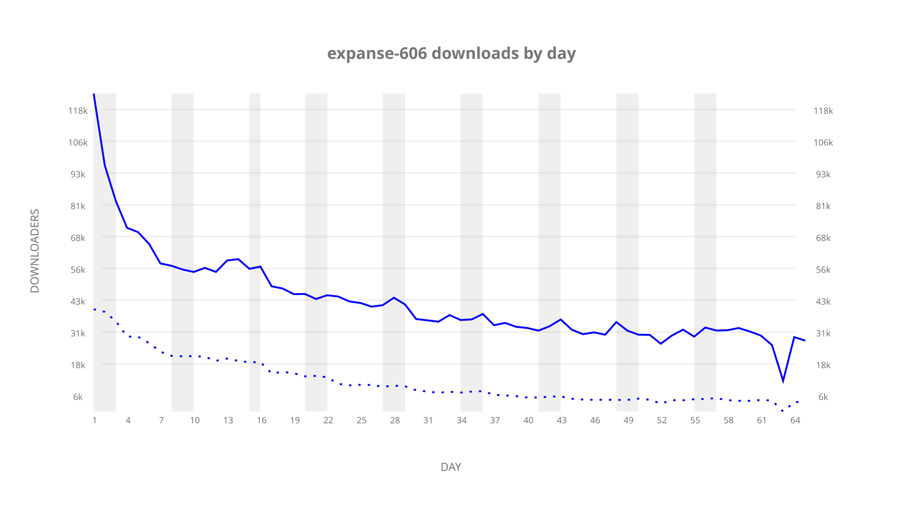
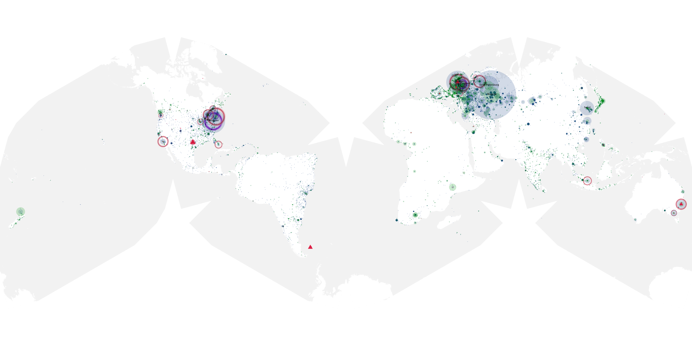
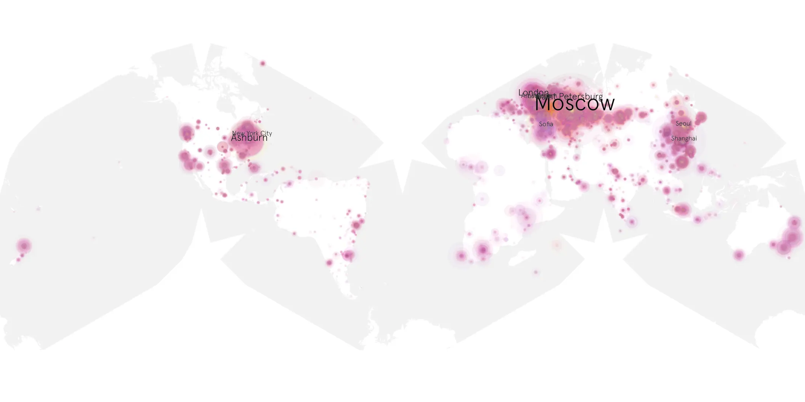
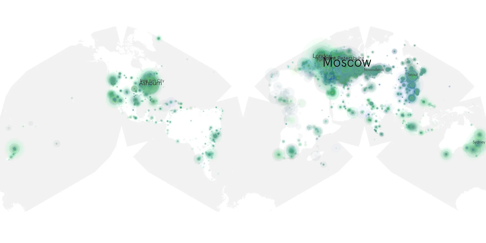

# expanse-606 sample cache audit

## 1. Media object

| Field | Value |
| --- | --- |
| Media object | The Expanse |
| Collection key | `expanse-606` |
| imdb_id | [tt3230854](https://www.imdb.com/title/tt3230854/) |
| wikipedia_url | [The Expanse (TV series)](https://en.wikipedia.org/wiki/The_Expanse_(TV_series)) |
| Sample dates | 2022-01-14-to-2022-03-24 |
| Sample days | 70 |
| BTIH count | 136 |
| Unique BTIH count | 114 |
| Downloaders total | 2,036,460 |
| Uploaders total | 576,458 |
| Data version | `2026-08-05` |
| IP geolocation version | `6:1777968300` |

## 2. Sample coverage report

- Generated: 2026-09-02T04:14:14Z
- Sample archive directory: `/run/media/bkoz/gold/src/alpha60-samples-raw.gold/expanse-606.xz`
- Hour directories: 1515
- Zero-length sample files: 0
- Other unparsable sample files: 0
- Hourly discontinuities: 18 (164 missing hours)
- Missing days: 5

### Sample archive discontinuities

- hourly gap: last `2022-01-14 22:00`, resumed `2022-01-15 00:00` — missing 1 hour(s)
- hourly gap: last `2022-01-15 22:00`, resumed `2022-01-16 00:00` — missing 1 hour(s)
- hourly gap: last `2022-01-16 22:00`, resumed `2022-01-17 00:00` — missing 1 hour(s)
- hourly gap: last `2022-01-17 22:00`, resumed `2022-01-18 00:00` — missing 1 hour(s)
- hourly gap: last `2022-01-18 22:00`, resumed `2022-01-19 00:00` — missing 1 hour(s)
- hourly gap: last `2022-01-19 22:00`, resumed `2022-01-20 00:00` — missing 1 hour(s)
- hourly gap: last `2022-01-20 22:00`, resumed `2022-01-21 00:00` — missing 1 hour(s)
- hourly gap: last `2022-01-21 22:00`, resumed `2022-01-22 00:00` — missing 1 hour(s)
- hourly gap: last `2022-01-22 22:00`, resumed `2022-01-23 00:00` — missing 1 hour(s)
- hourly gap: last `2022-01-23 22:00`, resumed `2022-01-24 00:00` — missing 1 hour(s)
- hourly gap: last `2022-01-24 22:00`, resumed `2022-01-25 00:00` — missing 1 hour(s)
- hourly gap: last `2022-01-25 22:00`, resumed `2022-01-26 00:00` — missing 1 hour(s)
- hourly gap: last `2022-01-26 22:00`, resumed `2022-01-27 00:00` — missing 1 hour(s)
- hourly gap: last `2022-01-27 22:00`, resumed `2022-01-28 00:00` — missing 1 hour(s)
- hourly gap: last `2022-01-28 22:00`, resumed `2022-01-29 00:00` — missing 1 hour(s)
- hourly gap: last `2022-01-29 22:00`, resumed `2022-02-01 01:00` — missing 50 hour(s)
- hourly gap: last `2022-03-07 22:00`, resumed `2022-03-08 07:00` — missing 8 hour(s)
- hourly gap: last `2022-03-18 22:00`, resumed `2022-03-22 18:00` — missing 91 hour(s)
- missing day: `2022-01-30`
- missing day: `2022-01-31`
- missing day: `2022-03-19`
- missing day: `2022-03-20`
- missing day: `2022-03-21`

## 3. Media objects file size histogram

## 4. Visualization pass — graphs

### Downloads by week cumulative (normalized start)



### Downloads by day, Saturday and Sunday in gray

## 5. Visualization pass — maps

### Cumulative geographic slices

| Africa | Americas | Asia | Europe | Oceania | Unknown |
| --- | --- | --- | --- | --- | --- |
| 2.74 | 16.58 | 15.60 | 56.18 | 2.81 | 0.91 |

### Cumulative network infrastructure

{:target="_blank" rel="noopener"}

### Cumulative data maps

**Cumulative >= 1080p**

{:target="_blank" rel="noopener"}

**Cumulative < 1080p**

{:target="_blank" rel="noopener"}
