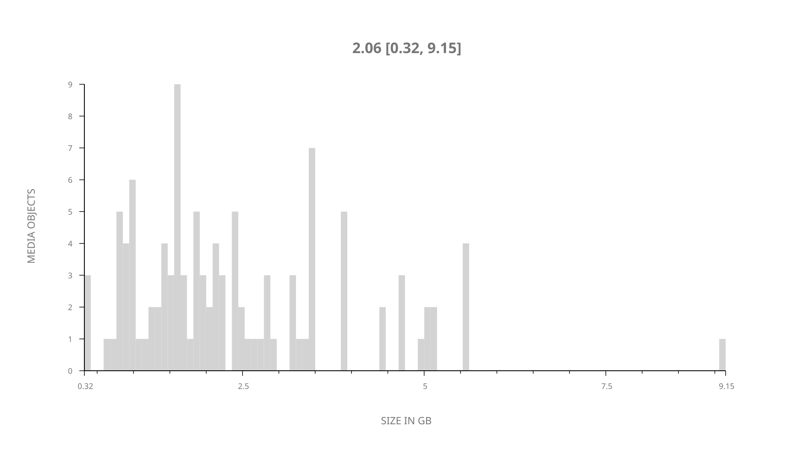
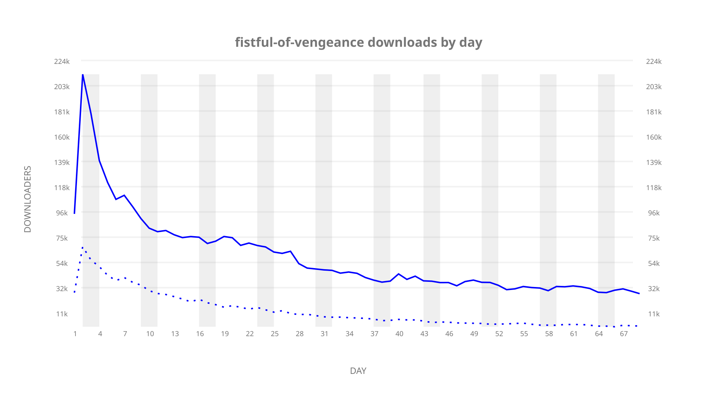
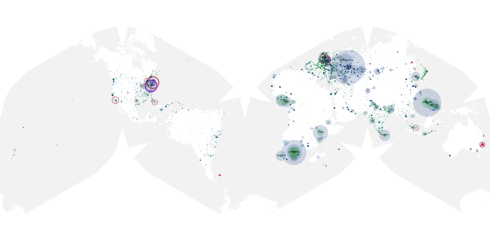
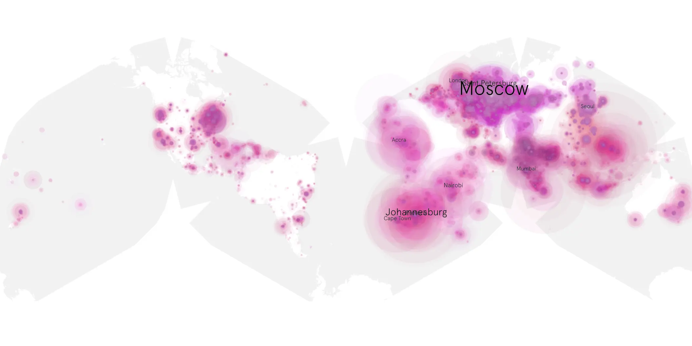
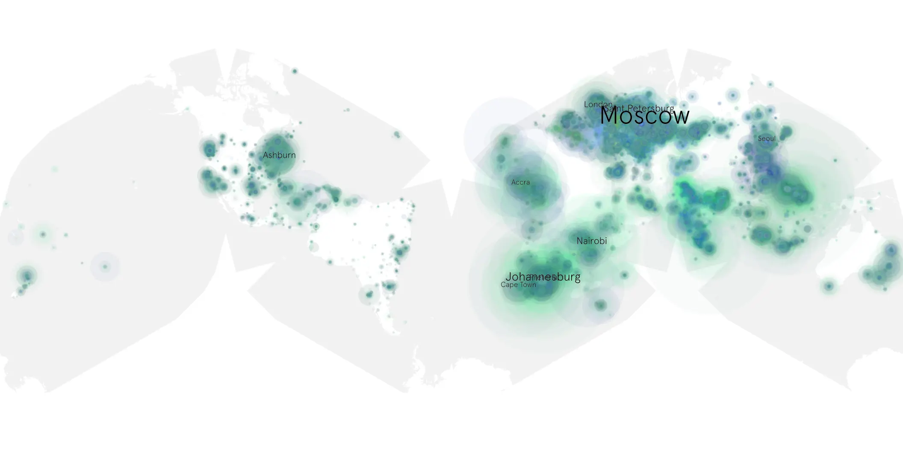

# fistful-of-vengeance sample cache audit

## 1. Media object

| Field | Value |
| --- | --- |
| Media object | Fistful of Vengeance |
| Collection key | `fistful-of-vengeance` |
| imdb_id | [tt14158554](https://www.imdb.com/title/tt14158554/) |
| wikipedia_url | [Fistful of Vengeance](https://en.wikipedia.org/wiki/Fistful_of_Vengeance) |
| Sample dates | 2022-02-17-to-2022-04-27 |
| Sample days | 70 |
| BTIH count | 146 |
| Unique BTIH count | 109 |
| Downloaders total | 3,959,549 |
| Uploaders total | 1,270,606 |
| Data version | `2026-08-05` |
| IP geolocation version | `6:1777968300` |

## 2. Sample coverage report

- Generated: 2026-09-02T04:14:14Z
- Sample archive directory: `/run/media/bkoz/gold/src/alpha60-samples-raw.gold/fistful-of-vengeance.xz`
- Hour directories: 1663
- Zero-length sample files: 0
- Other unparsable sample files: 0
- Hourly discontinuities: 1 (1 missing hours)
- Missing days: 0

### Sample archive discontinuities

- hourly gap: last `2022-03-27 01:03`, resumed `2022-03-27 03:03` — missing 1 hour(s)

## 3. Media objects file size histogram

## 4. Visualization pass — graphs

### Downloads by week cumulative (normalized start)



### Downloads by day, Saturday and Sunday in gray

## 5. Visualization pass — maps

### Cumulative geographic slices

| Africa | Americas | Asia | Europe | Oceania | Unknown |
| --- | --- | --- | --- | --- | --- |
| 17.87 | 9.39 | 25.60 | 34.49 | 1.60 | 0.66 |

### Cumulative network infrastructure

{:target="_blank" rel="noopener"}

### Cumulative data maps

**Cumulative >= 1080p**

{:target="_blank" rel="noopener"}

**Cumulative < 1080p**

{:target="_blank" rel="noopener"}
