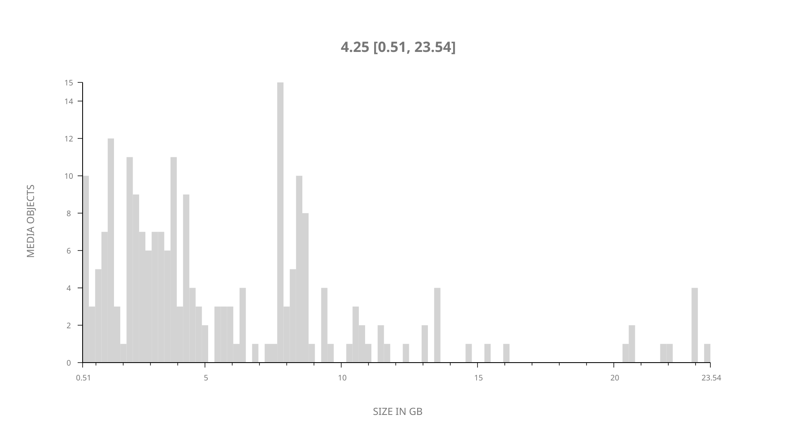
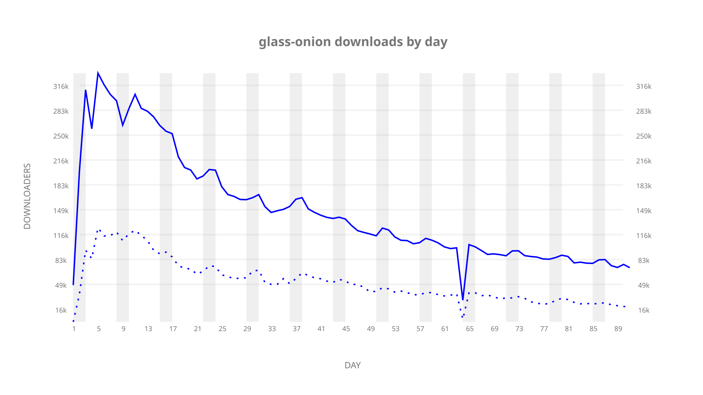
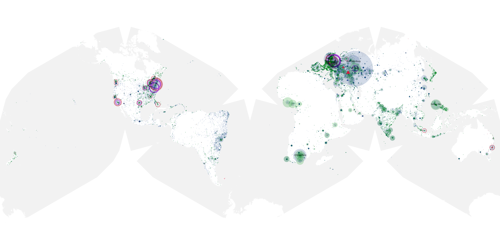
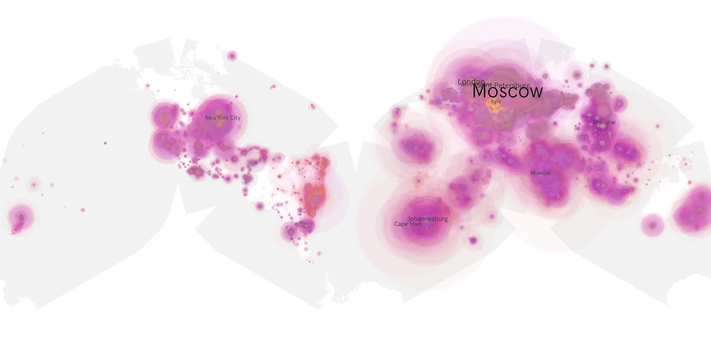
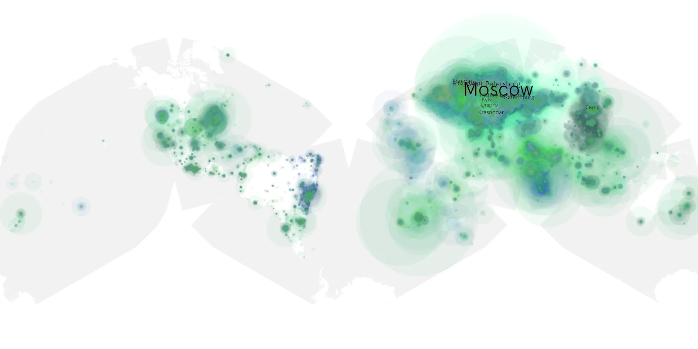

# glass-onion sample cache audit

## 1. Media object

| Field | Value |
| --- | --- |
| Media object | Knives Out: Glass Onion |
| Collection key | `glass-onion` |
| imdb_id | [tt11564570](https://www.imdb.com/title/tt11564570/) |
| wikipedia_url | [Glass Onion: A Knives Out Mystery](https://en.wikipedia.org/wiki/Glass_Onion:_A_Knives_Out_Mystery) |
| Sample dates | 2022-12-23-to-2023-03-23 |
| Sample days | 91 |
| BTIH count | 245 |
| Unique BTIH count | 220 |
| Downloaders total | 9,621,060 |
| Uploaders total | 3,358,759 |
| Data version | `2026-08-05` |
| IP geolocation version | `6:1777968300` |

## 2. Sample coverage report

- Generated: 2026-09-02T04:14:14Z
- Sample archive directory: `/run/media/bkoz/gold/src/alpha60-samples-raw.gold/glass-onion.xz`
- Hour directories: 2543
- Zero-length sample files: 0
- Other unparsable sample files: 0
- Hourly discontinuities: 109 (126 missing hours)
- Missing days: 0

### Sample archive discontinuities

- hourly gap: last `2022-12-23 22:00`, resumed `2022-12-24 00:00` — missing 1 hour(s)
- hourly gap: last `2022-12-24 22:00`, resumed `2022-12-25 00:00` — missing 1 hour(s)
- hourly gap: last `2022-12-25 22:00`, resumed `2022-12-26 00:00` — missing 1 hour(s)
- hourly gap: last `2022-12-26 22:00`, resumed `2022-12-27 00:00` — missing 1 hour(s)
- hourly gap: last `2022-12-27 22:00`, resumed `2022-12-28 00:00` — missing 1 hour(s)
- hourly gap: last `2022-12-28 22:00`, resumed `2022-12-29 00:00` — missing 1 hour(s)
- hourly gap: last `2022-12-29 22:00`, resumed `2022-12-30 00:00` — missing 1 hour(s)
- hourly gap: last `2022-12-30 22:00`, resumed `2022-12-31 00:00` — missing 1 hour(s)
- hourly gap: last `2022-12-31 22:00`, resumed `2023-01-01 00:00` — missing 1 hour(s)
- hourly gap: last `2023-01-01 22:00`, resumed `2023-01-02 00:00` — missing 1 hour(s)
- hourly gap: last `2023-01-02 22:00`, resumed `2023-01-03 00:00` — missing 1 hour(s)
- hourly gap: last `2023-01-03 22:00`, resumed `2023-01-04 00:00` — missing 1 hour(s)
- hourly gap: last `2023-01-04 22:00`, resumed `2023-01-05 00:00` — missing 1 hour(s)
- hourly gap: last `2023-01-05 22:00`, resumed `2023-01-06 00:00` — missing 1 hour(s)
- hourly gap: last `2023-01-06 22:00`, resumed `2023-01-07 00:00` — missing 1 hour(s)
- hourly gap: last `2023-01-07 22:00`, resumed `2023-01-08 00:00` — missing 1 hour(s)
- hourly gap: last `2023-01-08 22:00`, resumed `2023-01-09 00:00` — missing 1 hour(s)
- hourly gap: last `2023-01-09 22:00`, resumed `2023-01-10 00:00` — missing 1 hour(s)
- hourly gap: last `2023-01-10 22:00`, resumed `2023-01-11 00:00` — missing 1 hour(s)
- hourly gap: last `2023-01-12 22:00`, resumed `2023-01-13 00:00` — missing 1 hour(s)
- hourly gap: last `2023-01-14 22:00`, resumed `2023-01-15 00:00` — missing 1 hour(s)
- hourly gap: last `2023-01-15 22:00`, resumed `2023-01-16 00:00` — missing 1 hour(s)
- hourly gap: last `2023-01-16 22:00`, resumed `2023-01-17 00:00` — missing 1 hour(s)
- hourly gap: last `2023-01-17 22:00`, resumed `2023-01-18 00:00` — missing 1 hour(s)
- hourly gap: last `2023-01-18 22:00`, resumed `2023-01-19 00:00` — missing 1 hour(s)
- hourly gap: last `2023-01-19 22:00`, resumed `2023-01-20 00:00` — missing 1 hour(s)
- hourly gap: last `2023-01-20 22:00`, resumed `2023-01-21 00:00` — missing 1 hour(s)
- hourly gap: last `2023-01-21 22:00`, resumed `2023-01-22 00:00` — missing 1 hour(s)
- hourly gap: last `2023-01-22 22:00`, resumed `2023-01-23 00:00` — missing 1 hour(s)
- hourly gap: last `2023-01-23 22:00`, resumed `2023-01-24 00:00` — missing 1 hour(s)
- hourly gap: last `2023-01-24 22:00`, resumed `2023-01-25 00:00` — missing 1 hour(s)
- hourly gap: last `2023-01-25 22:00`, resumed `2023-01-26 00:00` — missing 1 hour(s)
- hourly gap: last `2023-01-26 22:00`, resumed `2023-01-27 00:00` — missing 1 hour(s)
- hourly gap: last `2023-01-27 22:00`, resumed `2023-01-28 00:00` — missing 1 hour(s)
- hourly gap: last `2023-01-28 22:00`, resumed `2023-01-29 00:00` — missing 1 hour(s)
- hourly gap: last `2023-01-29 22:00`, resumed `2023-01-30 00:00` — missing 1 hour(s)
- hourly gap: last `2023-01-30 22:00`, resumed `2023-01-31 00:00` — missing 1 hour(s)
- hourly gap: last `2023-01-31 22:00`, resumed `2023-02-01 00:00` — missing 1 hour(s)
- hourly gap: last `2023-02-01 22:00`, resumed `2023-02-02 00:00` — missing 1 hour(s)
- hourly gap: last `2023-02-02 22:00`, resumed `2023-02-03 00:00` — missing 1 hour(s)
- hourly gap: last `2023-02-03 22:00`, resumed `2023-02-04 00:00` — missing 1 hour(s)
- hourly gap: last `2023-02-04 22:00`, resumed `2023-02-05 00:00` — missing 1 hour(s)
- hourly gap: last `2023-02-05 22:00`, resumed `2023-02-06 00:00` — missing 1 hour(s)
- hourly gap: last `2023-02-06 22:00`, resumed `2023-02-07 00:00` — missing 1 hour(s)
- hourly gap: last `2023-02-07 22:00`, resumed `2023-02-08 00:00` — missing 1 hour(s)
- hourly gap: last `2023-02-08 22:00`, resumed `2023-02-09 00:00` — missing 1 hour(s)
- hourly gap: last `2023-02-09 22:00`, resumed `2023-02-10 00:00` — missing 1 hour(s)
- hourly gap: last `2023-02-10 22:00`, resumed `2023-02-11 00:00` — missing 1 hour(s)
- hourly gap: last `2023-02-11 22:00`, resumed `2023-02-12 00:00` — missing 1 hour(s)
- hourly gap: last `2023-02-12 22:00`, resumed `2023-02-13 00:00` — missing 1 hour(s)
- hourly gap: last `2023-02-13 22:00`, resumed `2023-02-14 00:00` — missing 1 hour(s)
- hourly gap: last `2023-02-14 22:00`, resumed `2023-02-15 00:00` — missing 1 hour(s)
- hourly gap: last `2023-02-15 22:00`, resumed `2023-02-16 00:00` — missing 1 hour(s)
- hourly gap: last `2023-02-16 22:00`, resumed `2023-02-17 00:00` — missing 1 hour(s)
- hourly gap: last `2023-02-17 22:00`, resumed `2023-02-18 00:00` — missing 1 hour(s)
- hourly gap: last `2023-02-18 22:00`, resumed `2023-02-19 00:00` — missing 1 hour(s)
- hourly gap: last `2023-02-19 22:00`, resumed `2023-02-20 00:00` — missing 1 hour(s)
- hourly gap: last `2023-02-20 22:00`, resumed `2023-02-21 00:00` — missing 1 hour(s)
- hourly gap: last `2023-02-21 22:00`, resumed `2023-02-22 00:00` — missing 1 hour(s)
- hourly gap: last `2023-02-22 22:00`, resumed `2023-02-23 00:00` — missing 1 hour(s)
- hourly gap: last `2023-02-23 22:00`, resumed `2023-02-24 00:00` — missing 1 hour(s)
- hourly gap: last `2023-02-24 05:00`, resumed `2023-02-25 00:00` — missing 18 hour(s)
- hourly gap: last `2023-02-25 22:00`, resumed `2023-02-26 00:00` — missing 1 hour(s)
- hourly gap: last `2023-02-26 22:00`, resumed `2023-02-27 00:00` — missing 1 hour(s)
- hourly gap: last `2023-02-27 22:00`, resumed `2023-02-28 00:00` — missing 1 hour(s)
- hourly gap: last `2023-02-28 22:00`, resumed `2023-03-01 00:00` — missing 1 hour(s)
- hourly gap: last `2023-03-01 22:00`, resumed `2023-03-02 00:00` — missing 1 hour(s)
- hourly gap: last `2023-03-02 22:00`, resumed `2023-03-03 00:00` — missing 1 hour(s)
- hourly gap: last `2023-03-03 22:00`, resumed `2023-03-04 00:00` — missing 1 hour(s)
- hourly gap: last `2023-03-04 22:00`, resumed `2023-03-05 00:00` — missing 1 hour(s)
- hourly gap: last `2023-03-05 22:00`, resumed `2023-03-06 00:00` — missing 1 hour(s)
- hourly gap: last `2023-03-06 22:00`, resumed `2023-03-07 00:00` — missing 1 hour(s)
- hourly gap: last `2023-03-07 22:00`, resumed `2023-03-08 00:00` — missing 1 hour(s)
- hourly gap: last `2023-03-08 22:00`, resumed `2023-03-09 00:00` — missing 1 hour(s)
- hourly gap: last `2023-03-09 22:00`, resumed `2023-03-10 00:00` — missing 1 hour(s)
- hourly gap: last `2023-03-10 22:00`, resumed `2023-03-11 00:00` — missing 1 hour(s)
- hourly gap: last `2023-03-11 22:00`, resumed `2023-03-12 00:00` — missing 1 hour(s)
- hourly gap: last `2023-03-12 22:00`, resumed `2023-03-13 00:00` — missing 1 hour(s)
- hourly gap: last `2023-03-13 22:00`, resumed `2023-03-14 00:00` — missing 1 hour(s)
- hourly gap: last `2023-03-14 22:00`, resumed `2023-03-15 00:00` — missing 1 hour(s)
- hourly gap: last `2023-03-15 22:00`, resumed `2023-03-16 00:00` — missing 1 hour(s)
- hourly gap: last `2023-03-16 22:00`, resumed `2023-03-17 00:00` — missing 1 hour(s)
- hourly gap: last `2023-03-17 22:00`, resumed `2023-03-18 00:00` — missing 1 hour(s)
- hourly gap: last `2023-03-18 22:00`, resumed `2023-03-19 00:00` — missing 1 hour(s)
- hourly gap: last `2023-03-19 22:00`, resumed `2023-03-20 00:00` — missing 1 hour(s)
- hourly gap: last `2023-03-20 22:00`, resumed `2023-03-21 00:00` — missing 1 hour(s)
- hourly gap: last `2023-03-21 22:00`, resumed `2023-03-22 00:00` — missing 1 hour(s)
- hourly gap: last `2023-03-22 22:00`, resumed `2023-03-23 00:00` — missing 1 hour(s)
- hourly gap: last `2023-03-23 22:00`, resumed `2023-03-24 00:00` — missing 1 hour(s)
- hourly gap: last `2023-03-24 22:00`, resumed `2023-03-25 00:00` — missing 1 hour(s)
- hourly gap: last `2023-03-25 22:00`, resumed `2023-03-26 00:00` — missing 1 hour(s)
- hourly gap: last `2023-03-26 01:00`, resumed `2023-03-26 03:00` — missing 1 hour(s)
- hourly gap: last `2023-03-26 22:00`, resumed `2023-03-27 00:00` — missing 1 hour(s)
- hourly gap: last `2023-03-27 22:00`, resumed `2023-03-28 00:00` — missing 1 hour(s)
- hourly gap: last `2023-03-28 22:00`, resumed `2023-03-29 00:00` — missing 1 hour(s)
- hourly gap: last `2023-03-29 22:00`, resumed `2023-03-30 00:00` — missing 1 hour(s)
- hourly gap: last `2023-03-30 22:00`, resumed `2023-03-31 00:00` — missing 1 hour(s)
- hourly gap: last `2023-03-31 22:00`, resumed `2023-04-01 00:00` — missing 1 hour(s)
- hourly gap: last `2023-04-01 22:00`, resumed `2023-04-02 00:00` — missing 1 hour(s)
- hourly gap: last `2023-04-02 22:00`, resumed `2023-04-03 00:00` — missing 1 hour(s)
- hourly gap: last `2023-04-03 22:00`, resumed `2023-04-04 00:00` — missing 1 hour(s)
- hourly gap: last `2023-04-04 22:00`, resumed `2023-04-05 00:00` — missing 1 hour(s)
- hourly gap: last `2023-04-05 22:00`, resumed `2023-04-06 00:00` — missing 1 hour(s)
- hourly gap: last `2023-04-06 22:00`, resumed `2023-04-07 00:00` — missing 1 hour(s)
- hourly gap: last `2023-04-08 22:00`, resumed `2023-04-09 00:00` — missing 1 hour(s)
- hourly gap: last `2023-04-09 22:00`, resumed `2023-04-10 00:00` — missing 1 hour(s)
- hourly gap: last `2023-04-10 22:00`, resumed `2023-04-11 00:00` — missing 1 hour(s)
- hourly gap: last `2023-04-11 22:00`, resumed `2023-04-12 00:00` — missing 1 hour(s)
- hourly gap: last `2023-04-12 22:00`, resumed `2023-04-13 00:00` — missing 1 hour(s)

## 3. Media objects file size histogram

## 4. Visualization pass — graphs

### Downloads by week cumulative (normalized start)



### Downloads by day, Saturday and Sunday in gray

## 5. Visualization pass — maps

### Cumulative geographic slices

| Africa | Americas | Asia | Europe | Oceania | Unknown |
| --- | --- | --- | --- | --- | --- |
| 8.25 | 12.50 | 23.10 | 47.79 | 1.69 | 0.48 |

### Cumulative network infrastructure

{:target="_blank" rel="noopener"}

### Cumulative data maps

**Cumulative >= 1080p**

{:target="_blank" rel="noopener"}

**Cumulative < 1080p**

{:target="_blank" rel="noopener"}
