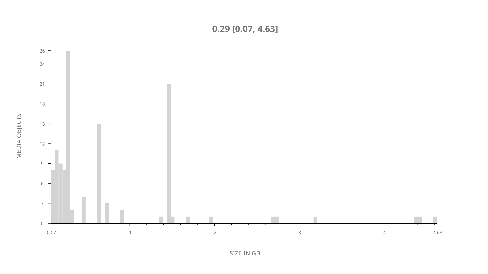
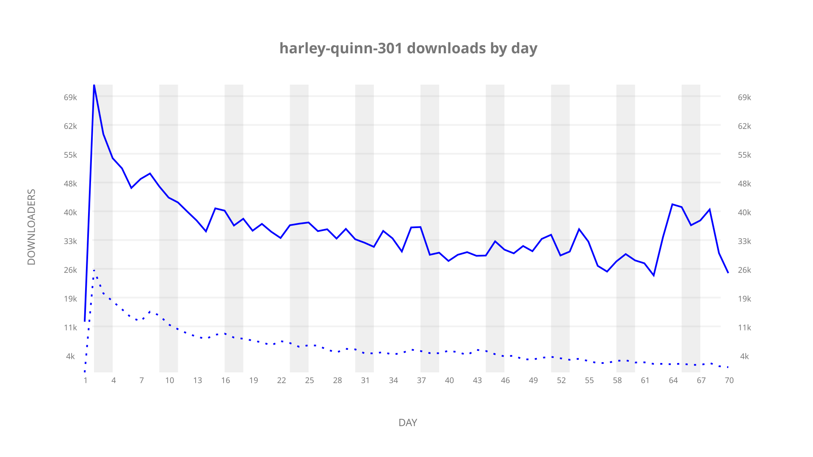
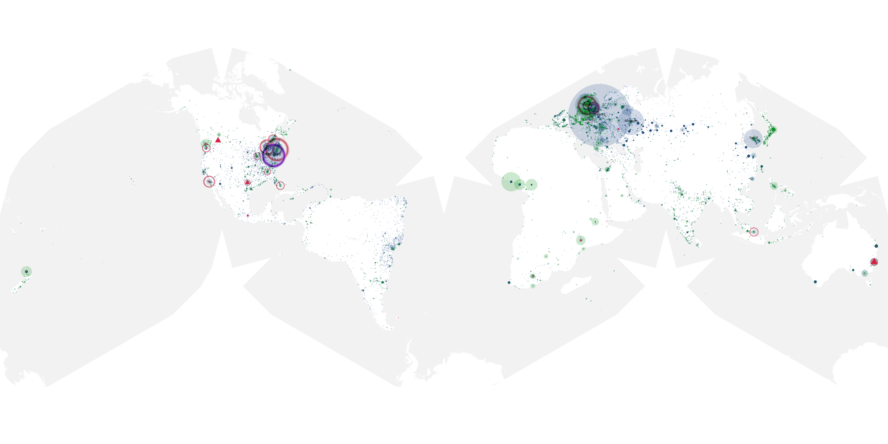
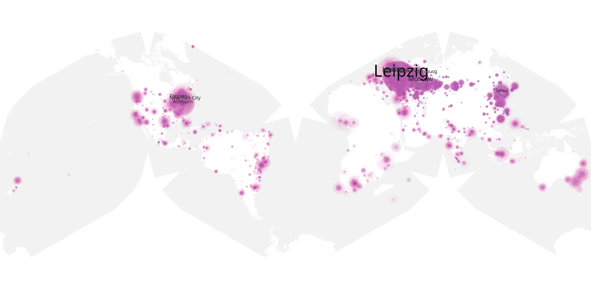
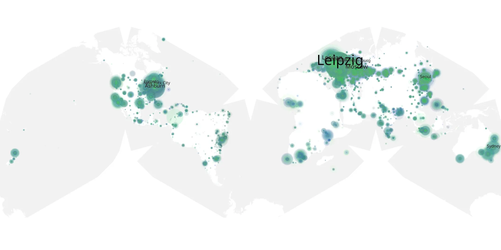

# harley-quinn-301 sample cache audit

## 1. Media object

| Field | Value |
| --- | --- |
| Media object | Harley Quinn |
| Collection key | `harley-quinn-301` |
| imdb_id | [tt7658402](https://www.imdb.com/title/tt7658402/) |
| wikipedia_url | [Harley Quinn (TV series)](https://en.wikipedia.org/wiki/Harley_Quinn_(TV_series)) |
| Sample dates | 2022-07-28-to-2022-10-05 |
| Sample days | 70 |
| BTIH count | 145 |
| Unique BTIH count | 119 |
| Downloaders total | 2,024,049 |
| Uploaders total | 393,298 |
| Data version | `2026-08-05` |
| IP geolocation version | `6:1777968300` |

## 2. Sample coverage report

- Generated: 2026-09-02T04:14:15Z
- Sample archive directory: `/run/media/bkoz/gold/src/alpha60-samples-raw.gold/harley-quinn-301.xz`
- Hour directories: 1655
- Zero-length sample files: 0
- Other unparsable sample files: 0
- Hourly discontinuities: 2 (2 missing hours)
- Missing days: 0

### Sample archive discontinuities

- hourly gap: last `2022-09-10 22:03`, resumed `2022-09-11 00:06` — missing 1 hour(s)
- hourly gap: last `2022-09-11 22:06`, resumed `2022-09-12 00:40` — missing 1 hour(s)

## 3. Media objects file size histogram

## 4. Visualization pass — graphs

### Downloads by week cumulative (normalized start)



### Downloads by day, Saturday and Sunday in gray

## 5. Visualization pass — maps

### Cumulative geographic slices

| Africa | Americas | Asia | Europe | Oceania | Unknown |
| --- | --- | --- | --- | --- | --- |
| 3.72 | 23.44 | 18.34 | 47.57 | 3.25 | 0.72 |

### Cumulative network infrastructure

{:target="_blank" rel="noopener"}

### Cumulative data maps

**Cumulative >= 1080p**

{:target="_blank" rel="noopener"}

**Cumulative < 1080p**

{:target="_blank" rel="noopener"}
