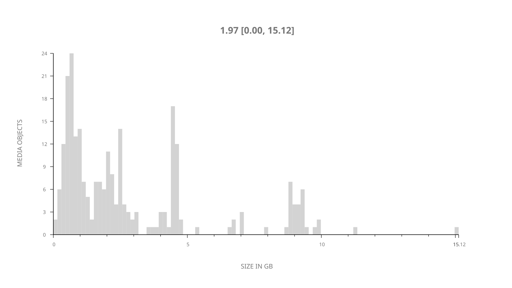
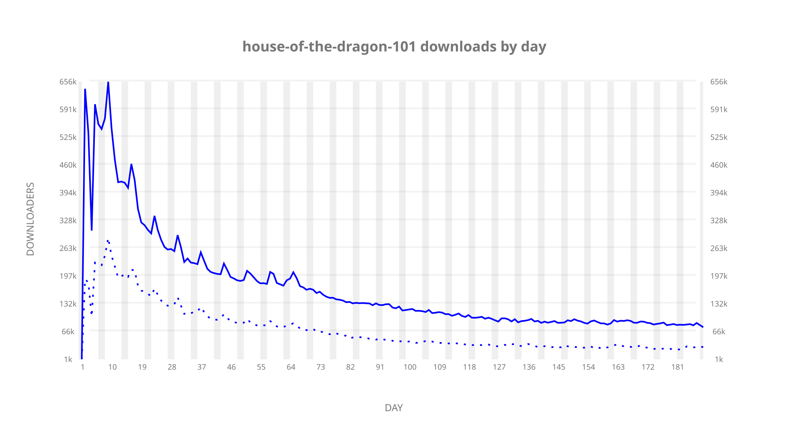
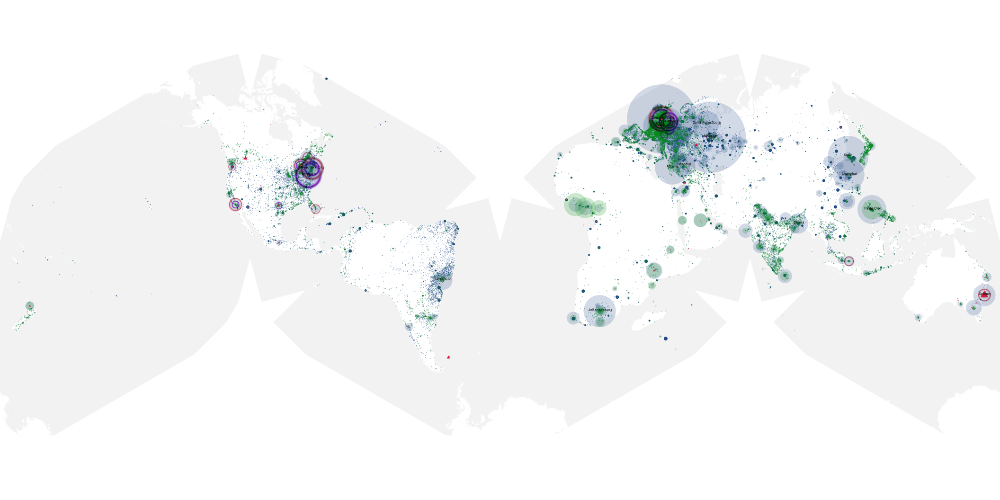
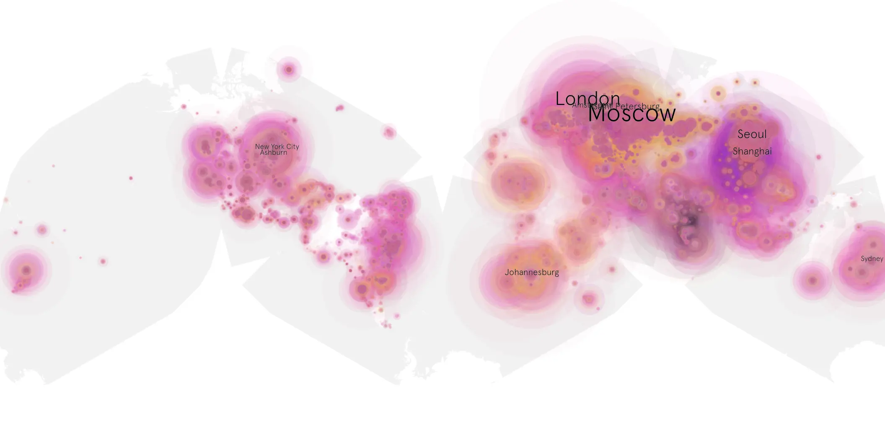
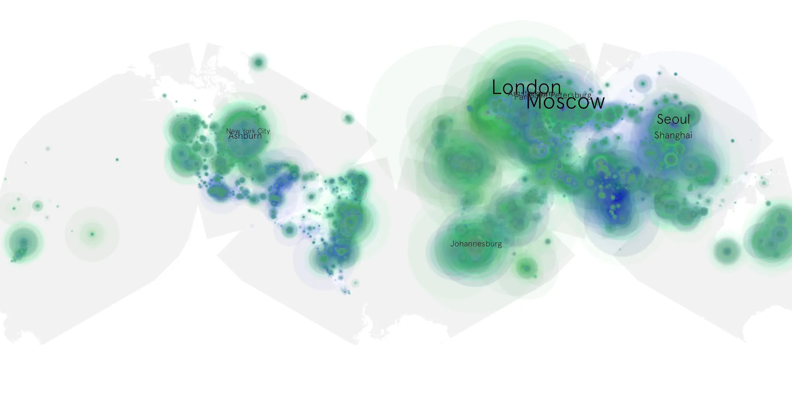

# house-of-the-dragon-101 sample cache audit

## 1. Media object

| Field | Value |
| --- | --- |
| Media object | House of the Dragon |
| Collection key | `house-of-the-dragon-101` |
| imdb_id | [tt11198330](https://www.imdb.com/title/tt11198330/) |
| wikipedia_url | [House of the Dragon](https://en.wikipedia.org/wiki/House_of_the_Dragon) |
| Sample dates | 2022-08-21-to-2023-02-25 |
| Sample days | 189 |
| BTIH count | 290 |
| Unique BTIH count | 252 |
| Downloaders total | 18,609,093 |
| Uploaders total | 6,582,652 |
| Data version | `2026-08-05` |
| IP geolocation version | `6:1777968300` |

## 2. Sample coverage report

- Generated: 2026-09-02T04:14:15Z
- Sample archive directory: `/run/media/bkoz/gold/src/alpha60-samples-raw.gold/house-of-the-dragon-101.xz`
- Hour directories: 4365
- Zero-length sample files: 0
- Other unparsable sample files: 0
- Hourly discontinuities: 162 (164 missing hours)
- Missing days: 0

### Sample archive discontinuities

- hourly gap: last `2022-09-11 22:03`, resumed `2022-09-12 00:03` — missing 1 hour(s)
- hourly gap: last `2022-09-12 22:03`, resumed `2022-09-13 00:03` — missing 1 hour(s)
- hourly gap: last `2022-09-13 22:03`, resumed `2022-09-14 00:03` — missing 1 hour(s)
- hourly gap: last `2022-09-14 22:03`, resumed `2022-09-15 00:03` — missing 1 hour(s)
- hourly gap: last `2022-09-15 22:03`, resumed `2022-09-16 00:03` — missing 1 hour(s)
- hourly gap: last `2022-09-16 22:03`, resumed `2022-09-17 00:03` — missing 1 hour(s)
- hourly gap: last `2022-09-17 22:03`, resumed `2022-09-18 00:03` — missing 1 hour(s)
- hourly gap: last `2022-09-18 22:03`, resumed `2022-09-19 00:03` — missing 1 hour(s)
- hourly gap: last `2022-09-21 20:03`, resumed `2022-09-22 00:03` — missing 3 hour(s)
- hourly gap: last `2022-09-22 22:03`, resumed `2022-09-23 00:03` — missing 1 hour(s)
- hourly gap: last `2022-09-23 22:03`, resumed `2022-09-24 00:03` — missing 1 hour(s)
- hourly gap: last `2022-09-24 22:03`, resumed `2022-09-25 00:03` — missing 1 hour(s)
- hourly gap: last `2022-09-25 22:03`, resumed `2022-09-26 00:03` — missing 1 hour(s)
- hourly gap: last `2022-09-26 22:03`, resumed `2022-09-27 00:03` — missing 1 hour(s)
- hourly gap: last `2022-09-27 22:03`, resumed `2022-09-28 00:03` — missing 1 hour(s)
- hourly gap: last `2022-09-28 22:03`, resumed `2022-09-29 00:03` — missing 1 hour(s)
- hourly gap: last `2022-09-29 22:03`, resumed `2022-09-30 00:03` — missing 1 hour(s)
- hourly gap: last `2022-09-30 22:03`, resumed `2022-10-01 00:03` — missing 1 hour(s)
- hourly gap: last `2022-10-01 22:03`, resumed `2022-10-02 00:03` — missing 1 hour(s)
- hourly gap: last `2022-10-02 22:03`, resumed `2022-10-03 00:03` — missing 1 hour(s)
- hourly gap: last `2022-10-03 22:03`, resumed `2022-10-04 00:03` — missing 1 hour(s)
- hourly gap: last `2022-10-04 22:03`, resumed `2022-10-05 00:03` — missing 1 hour(s)
- hourly gap: last `2022-10-05 22:03`, resumed `2022-10-06 00:03` — missing 1 hour(s)
- hourly gap: last `2022-10-06 22:03`, resumed `2022-10-07 00:03` — missing 1 hour(s)
- hourly gap: last `2022-10-07 22:03`, resumed `2022-10-08 00:03` — missing 1 hour(s)
- hourly gap: last `2022-10-08 22:03`, resumed `2022-10-09 00:03` — missing 1 hour(s)
- hourly gap: last `2022-10-09 22:03`, resumed `2022-10-10 00:03` — missing 1 hour(s)
- hourly gap: last `2022-10-10 22:03`, resumed `2022-10-11 00:03` — missing 1 hour(s)
- hourly gap: last `2022-10-11 22:03`, resumed `2022-10-12 00:03` — missing 1 hour(s)
- hourly gap: last `2022-10-12 22:03`, resumed `2022-10-13 00:03` — missing 1 hour(s)
- hourly gap: last `2022-10-13 22:03`, resumed `2022-10-14 00:03` — missing 1 hour(s)
- hourly gap: last `2022-10-14 22:03`, resumed `2022-10-15 00:03` — missing 1 hour(s)
- hourly gap: last `2022-10-15 22:03`, resumed `2022-10-16 00:03` — missing 1 hour(s)
- hourly gap: last `2022-10-16 22:03`, resumed `2022-10-17 00:03` — missing 1 hour(s)
- hourly gap: last `2022-10-17 22:03`, resumed `2022-10-18 00:03` — missing 1 hour(s)
- hourly gap: last `2022-10-19 22:03`, resumed `2022-10-20 00:03` — missing 1 hour(s)
- hourly gap: last `2022-10-20 22:03`, resumed `2022-10-21 00:03` — missing 1 hour(s)
- hourly gap: last `2022-10-21 22:03`, resumed `2022-10-22 00:03` — missing 1 hour(s)
- hourly gap: last `2022-10-22 22:03`, resumed `2022-10-23 00:03` — missing 1 hour(s)
- hourly gap: last `2022-10-23 22:03`, resumed `2022-10-24 00:03` — missing 1 hour(s)
- hourly gap: last `2022-10-24 22:03`, resumed `2022-10-25 00:03` — missing 1 hour(s)
- hourly gap: last `2022-10-25 22:03`, resumed `2022-10-26 00:03` — missing 1 hour(s)
- hourly gap: last `2022-10-26 22:03`, resumed `2022-10-27 00:03` — missing 1 hour(s)
- hourly gap: last `2022-10-27 22:03`, resumed `2022-10-28 00:03` — missing 1 hour(s)
- hourly gap: last `2022-10-28 22:03`, resumed `2022-10-29 00:03` — missing 1 hour(s)
- hourly gap: last `2022-10-29 22:03`, resumed `2022-10-30 00:03` — missing 1 hour(s)
- hourly gap: last `2022-10-30 22:03`, resumed `2022-10-31 00:03` — missing 1 hour(s)
- hourly gap: last `2022-10-31 22:03`, resumed `2022-11-01 00:03` — missing 1 hour(s)
- hourly gap: last `2022-11-01 22:03`, resumed `2022-11-02 00:03` — missing 1 hour(s)
- hourly gap: last `2022-11-02 22:03`, resumed `2022-11-03 00:03` — missing 1 hour(s)
- hourly gap: last `2022-11-03 22:03`, resumed `2022-11-04 00:03` — missing 1 hour(s)
- hourly gap: last `2022-11-04 22:03`, resumed `2022-11-05 00:03` — missing 1 hour(s)
- hourly gap: last `2022-11-06 22:03`, resumed `2022-11-07 00:03` — missing 1 hour(s)
- hourly gap: last `2022-11-07 22:03`, resumed `2022-11-08 00:03` — missing 1 hour(s)
- hourly gap: last `2022-11-08 22:03`, resumed `2022-11-09 00:03` — missing 1 hour(s)
- hourly gap: last `2022-11-09 22:03`, resumed `2022-11-10 00:03` — missing 1 hour(s)
- hourly gap: last `2022-11-10 22:03`, resumed `2022-11-11 00:03` — missing 1 hour(s)
- hourly gap: last `2022-11-11 22:03`, resumed `2022-11-12 00:03` — missing 1 hour(s)
- hourly gap: last `2022-11-12 22:03`, resumed `2022-11-13 00:03` — missing 1 hour(s)
- hourly gap: last `2022-11-13 22:03`, resumed `2022-11-14 00:03` — missing 1 hour(s)
- hourly gap: last `2022-11-14 22:03`, resumed `2022-11-15 00:03` — missing 1 hour(s)
- hourly gap: last `2022-11-15 22:03`, resumed `2022-11-16 00:03` — missing 1 hour(s)
- hourly gap: last `2022-11-16 22:03`, resumed `2022-11-17 00:03` — missing 1 hour(s)
- hourly gap: last `2022-11-17 22:03`, resumed `2022-11-18 00:03` — missing 1 hour(s)
- hourly gap: last `2022-11-18 22:03`, resumed `2022-11-19 00:03` — missing 1 hour(s)
- hourly gap: last `2022-11-19 22:03`, resumed `2022-11-20 00:03` — missing 1 hour(s)
- hourly gap: last `2022-11-20 22:03`, resumed `2022-11-21 00:03` — missing 1 hour(s)
- hourly gap: last `2022-11-21 22:03`, resumed `2022-11-22 00:03` — missing 1 hour(s)
- hourly gap: last `2022-11-22 22:03`, resumed `2022-11-23 00:03` — missing 1 hour(s)
- hourly gap: last `2022-11-23 22:03`, resumed `2022-11-24 00:03` — missing 1 hour(s)
- hourly gap: last `2022-11-24 22:03`, resumed `2022-11-25 00:03` — missing 1 hour(s)
- hourly gap: last `2022-11-25 22:03`, resumed `2022-11-26 00:03` — missing 1 hour(s)
- hourly gap: last `2022-11-26 22:03`, resumed `2022-11-27 00:03` — missing 1 hour(s)
- hourly gap: last `2022-11-27 22:03`, resumed `2022-11-28 00:03` — missing 1 hour(s)
- hourly gap: last `2022-11-28 22:03`, resumed `2022-11-29 00:03` — missing 1 hour(s)
- hourly gap: last `2022-11-29 22:03`, resumed `2022-11-30 00:03` — missing 1 hour(s)
- hourly gap: last `2022-11-30 22:03`, resumed `2022-12-01 00:03` — missing 1 hour(s)
- hourly gap: last `2022-12-01 22:03`, resumed `2022-12-02 00:03` — missing 1 hour(s)
- hourly gap: last `2022-12-02 22:03`, resumed `2022-12-03 00:03` — missing 1 hour(s)
- hourly gap: last `2022-12-03 22:03`, resumed `2022-12-04 00:03` — missing 1 hour(s)
- hourly gap: last `2022-12-04 22:03`, resumed `2022-12-05 00:03` — missing 1 hour(s)
- hourly gap: last `2022-12-05 22:03`, resumed `2022-12-06 00:03` — missing 1 hour(s)
- hourly gap: last `2022-12-06 22:03`, resumed `2022-12-07 00:03` — missing 1 hour(s)
- hourly gap: last `2022-12-07 22:03`, resumed `2022-12-08 00:03` — missing 1 hour(s)
- hourly gap: last `2022-12-08 22:03`, resumed `2022-12-09 00:03` — missing 1 hour(s)
- hourly gap: last `2022-12-09 22:03`, resumed `2022-12-10 00:03` — missing 1 hour(s)
- hourly gap: last `2022-12-10 22:03`, resumed `2022-12-11 00:03` — missing 1 hour(s)
- hourly gap: last `2022-12-11 22:03`, resumed `2022-12-12 00:03` — missing 1 hour(s)
- hourly gap: last `2022-12-12 22:03`, resumed `2022-12-13 00:03` — missing 1 hour(s)
- hourly gap: last `2022-12-13 22:03`, resumed `2022-12-14 00:03` — missing 1 hour(s)
- hourly gap: last `2022-12-14 22:03`, resumed `2022-12-15 00:03` — missing 1 hour(s)
- hourly gap: last `2022-12-15 22:03`, resumed `2022-12-16 00:03` — missing 1 hour(s)
- hourly gap: last `2022-12-16 22:03`, resumed `2022-12-17 00:03` — missing 1 hour(s)
- hourly gap: last `2022-12-17 22:03`, resumed `2022-12-18 00:03` — missing 1 hour(s)
- hourly gap: last `2022-12-18 22:03`, resumed `2022-12-19 00:03` — missing 1 hour(s)
- hourly gap: last `2022-12-19 22:03`, resumed `2022-12-20 00:03` — missing 1 hour(s)
- hourly gap: last `2022-12-20 22:03`, resumed `2022-12-21 00:03` — missing 1 hour(s)
- hourly gap: last `2022-12-21 22:03`, resumed `2022-12-22 00:03` — missing 1 hour(s)
- hourly gap: last `2022-12-22 22:03`, resumed `2022-12-23 00:03` — missing 1 hour(s)
- hourly gap: last `2022-12-23 22:03`, resumed `2022-12-24 00:03` — missing 1 hour(s)
- hourly gap: last `2022-12-24 22:03`, resumed `2022-12-25 00:03` — missing 1 hour(s)
- hourly gap: last `2022-12-25 22:03`, resumed `2022-12-26 00:03` — missing 1 hour(s)
- hourly gap: last `2022-12-26 22:03`, resumed `2022-12-27 00:03` — missing 1 hour(s)
- hourly gap: last `2022-12-27 22:03`, resumed `2022-12-28 00:03` — missing 1 hour(s)
- hourly gap: last `2022-12-28 22:03`, resumed `2022-12-29 00:03` — missing 1 hour(s)
- hourly gap: last `2022-12-29 22:03`, resumed `2022-12-30 00:03` — missing 1 hour(s)
- hourly gap: last `2022-12-30 22:03`, resumed `2022-12-31 00:03` — missing 1 hour(s)
- hourly gap: last `2022-12-31 22:03`, resumed `2023-01-01 00:03` — missing 1 hour(s)
- hourly gap: last `2023-01-01 22:03`, resumed `2023-01-02 00:03` — missing 1 hour(s)
- hourly gap: last `2023-01-02 22:03`, resumed `2023-01-03 00:03` — missing 1 hour(s)
- hourly gap: last `2023-01-03 22:03`, resumed `2023-01-04 00:03` — missing 1 hour(s)
- hourly gap: last `2023-01-04 22:03`, resumed `2023-01-05 00:03` — missing 1 hour(s)
- hourly gap: last `2023-01-05 22:03`, resumed `2023-01-06 00:03` — missing 1 hour(s)
- hourly gap: last `2023-01-06 22:03`, resumed `2023-01-07 00:03` — missing 1 hour(s)
- hourly gap: last `2023-01-07 22:03`, resumed `2023-01-08 00:03` — missing 1 hour(s)
- hourly gap: last `2023-01-08 22:03`, resumed `2023-01-09 00:03` — missing 1 hour(s)
- hourly gap: last `2023-01-09 22:03`, resumed `2023-01-10 00:03` — missing 1 hour(s)
- hourly gap: last `2023-01-10 22:03`, resumed `2023-01-11 00:03` — missing 1 hour(s)
- hourly gap: last `2023-01-11 22:03`, resumed `2023-01-12 00:03` — missing 1 hour(s)
- hourly gap: last `2023-01-12 22:03`, resumed `2023-01-13 00:03` — missing 1 hour(s)
- hourly gap: last `2023-01-13 22:03`, resumed `2023-01-14 00:03` — missing 1 hour(s)
- hourly gap: last `2023-01-15 22:03`, resumed `2023-01-16 00:03` — missing 1 hour(s)
- hourly gap: last `2023-01-16 22:03`, resumed `2023-01-17 00:03` — missing 1 hour(s)
- hourly gap: last `2023-01-17 22:03`, resumed `2023-01-18 00:03` — missing 1 hour(s)
- hourly gap: last `2023-01-18 22:03`, resumed `2023-01-19 00:03` — missing 1 hour(s)
- hourly gap: last `2023-01-19 22:03`, resumed `2023-01-20 00:03` — missing 1 hour(s)
- hourly gap: last `2023-01-20 22:03`, resumed `2023-01-21 00:03` — missing 1 hour(s)
- hourly gap: last `2023-01-21 22:03`, resumed `2023-01-22 00:03` — missing 1 hour(s)
- hourly gap: last `2023-01-22 22:03`, resumed `2023-01-23 00:03` — missing 1 hour(s)
- hourly gap: last `2023-01-23 22:03`, resumed `2023-01-24 00:03` — missing 1 hour(s)
- hourly gap: last `2023-01-24 22:03`, resumed `2023-01-25 00:03` — missing 1 hour(s)
- hourly gap: last `2023-01-25 22:03`, resumed `2023-01-26 00:03` — missing 1 hour(s)
- hourly gap: last `2023-01-26 22:03`, resumed `2023-01-27 00:03` — missing 1 hour(s)
- hourly gap: last `2023-01-27 22:03`, resumed `2023-01-28 00:03` — missing 1 hour(s)
- hourly gap: last `2023-01-28 22:03`, resumed `2023-01-29 00:03` — missing 1 hour(s)
- hourly gap: last `2023-01-29 22:03`, resumed `2023-01-30 00:03` — missing 1 hour(s)
- hourly gap: last `2023-01-30 22:03`, resumed `2023-01-31 00:03` — missing 1 hour(s)
- hourly gap: last `2023-01-31 22:03`, resumed `2023-02-01 00:03` — missing 1 hour(s)
- hourly gap: last `2023-02-01 22:03`, resumed `2023-02-02 00:03` — missing 1 hour(s)
- hourly gap: last `2023-02-02 22:03`, resumed `2023-02-03 00:03` — missing 1 hour(s)
- hourly gap: last `2023-02-03 22:03`, resumed `2023-02-04 00:03` — missing 1 hour(s)
- hourly gap: last `2023-02-04 22:03`, resumed `2023-02-05 00:03` — missing 1 hour(s)
- hourly gap: last `2023-02-05 22:03`, resumed `2023-02-06 00:03` — missing 1 hour(s)
- hourly gap: last `2023-02-06 22:03`, resumed `2023-02-07 00:03` — missing 1 hour(s)
- hourly gap: last `2023-02-07 22:03`, resumed `2023-02-08 00:03` — missing 1 hour(s)
- hourly gap: last `2023-02-08 22:03`, resumed `2023-02-09 00:03` — missing 1 hour(s)
- hourly gap: last `2023-02-09 22:03`, resumed `2023-02-10 00:03` — missing 1 hour(s)
- hourly gap: last `2023-02-10 22:03`, resumed `2023-02-11 00:03` — missing 1 hour(s)
- hourly gap: last `2023-02-11 22:03`, resumed `2023-02-12 00:03` — missing 1 hour(s)
- hourly gap: last `2023-02-12 22:03`, resumed `2023-02-13 00:03` — missing 1 hour(s)
- hourly gap: last `2023-02-13 22:03`, resumed `2023-02-14 00:03` — missing 1 hour(s)
- hourly gap: last `2023-02-14 22:03`, resumed `2023-02-15 00:03` — missing 1 hour(s)
- hourly gap: last `2023-02-15 22:03`, resumed `2023-02-16 00:03` — missing 1 hour(s)
- hourly gap: last `2023-02-16 22:03`, resumed `2023-02-17 00:03` — missing 1 hour(s)
- hourly gap: last `2023-02-17 22:03`, resumed `2023-02-18 00:03` — missing 1 hour(s)
- hourly gap: last `2023-02-18 22:03`, resumed `2023-02-19 00:03` — missing 1 hour(s)
- hourly gap: last `2023-02-19 22:03`, resumed `2023-02-20 00:03` — missing 1 hour(s)
- hourly gap: last `2023-02-20 22:03`, resumed `2023-02-21 00:03` — missing 1 hour(s)
- hourly gap: last `2023-02-21 22:03`, resumed `2023-02-22 00:03` — missing 1 hour(s)
- hourly gap: last `2023-02-22 22:03`, resumed `2023-02-23 00:03` — missing 1 hour(s)
- hourly gap: last `2023-02-23 22:03`, resumed `2023-02-24 00:03` — missing 1 hour(s)
- hourly gap: last `2023-02-24 22:03`, resumed `2023-02-25 00:03` — missing 1 hour(s)

## 3. Media objects file size histogram

## 4. Visualization pass — graphs

### Downloads by week cumulative (normalized start)



### Downloads by day, Saturday and Sunday in gray

## 5. Visualization pass — maps

### Cumulative geographic slices

| Africa | Americas | Asia | Europe | Oceania | Unknown |
| --- | --- | --- | --- | --- | --- |
| 9.12 | 16.19 | 26.81 | 37.79 | 2.38 | 0.59 |

### Cumulative network infrastructure

{:target="_blank" rel="noopener"}

### Cumulative data maps

**Cumulative >= 1080p**

{:target="_blank" rel="noopener"}

**Cumulative < 1080p**

{:target="_blank" rel="noopener"}
