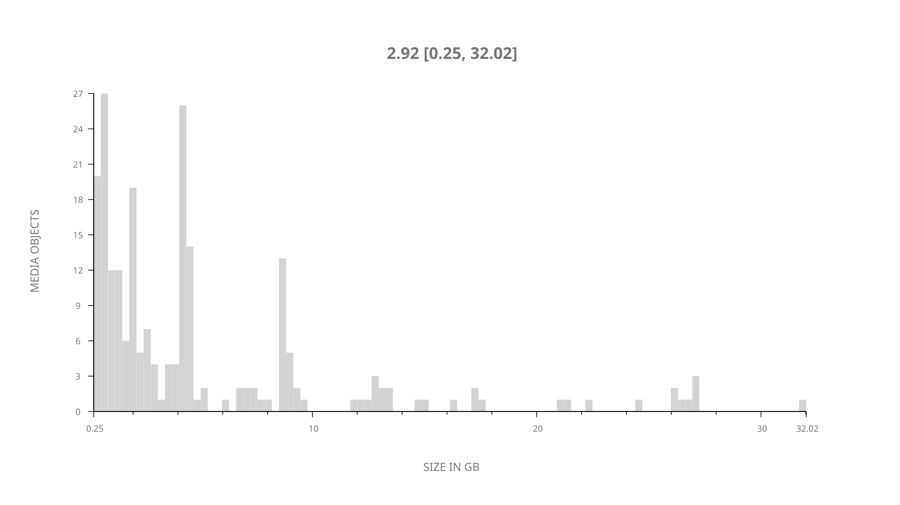
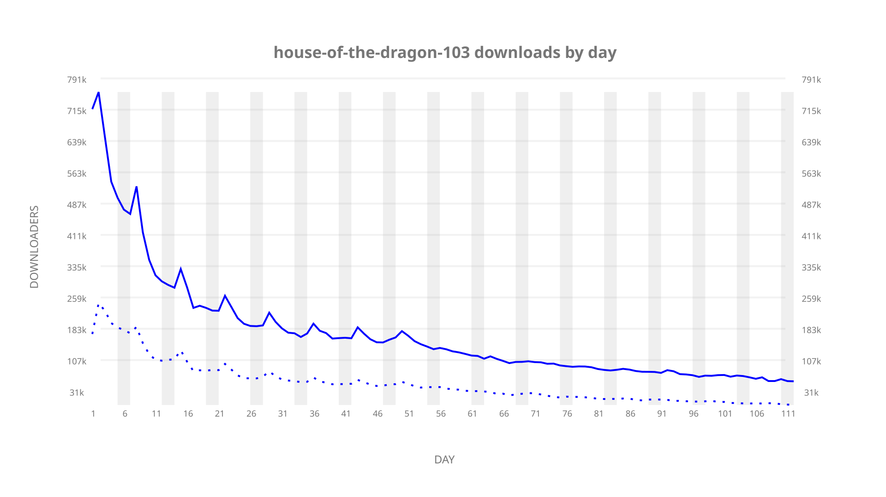
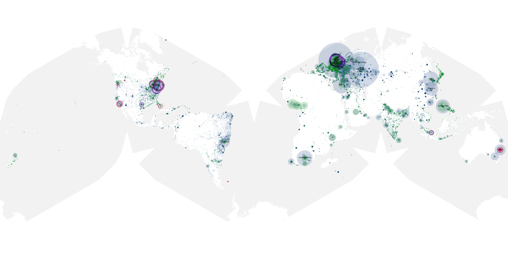
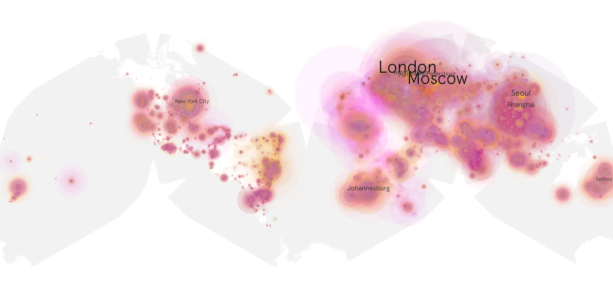
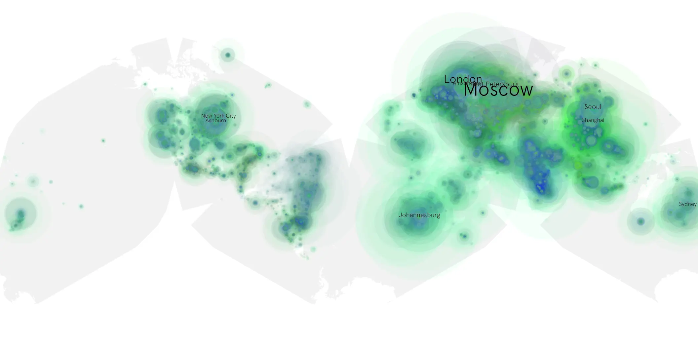

# house-of-the-dragon-103 sample cache audit

## 1. Media object

| Field | Value |
| --- | --- |
| Media object | House of the Dragon |
| Collection key | `house-of-the-dragon-103` |
| imdb_id | [tt11198330](https://www.imdb.com/title/tt11198330/) |
| wikipedia_url | [House of the Dragon](https://en.wikipedia.org/wiki/House_of_the_Dragon) |
| Sample dates | 2022-09-05-to-2022-12-25 |
| Sample days | 112 |
| BTIH count | 252 |
| Unique BTIH count | 222 |
| Downloaders total | 12,811,911 |
| Uploaders total | 4,600,973 |
| Data version | `2026-08-05` |
| IP geolocation version | `6:1777968300` |

## 2. Sample coverage report

- Generated: 2026-09-02T04:14:15Z
- Sample archive directory: `/run/media/bkoz/gold/src/alpha60-samples-raw.gold/house-of-the-dragon-103.xz`
- Hour directories: 2663
- Zero-length sample files: 0
- Other unparsable sample files: 0
- Hourly discontinuities: 22 (24 missing hours)
- Missing days: 0

### Sample archive discontinuities

- hourly gap: last `2022-09-10 22:00`, resumed `2022-09-11 00:00` — missing 1 hour(s)
- hourly gap: last `2022-09-11 22:00`, resumed `2022-09-12 00:00` — missing 1 hour(s)
- hourly gap: last `2022-09-12 22:00`, resumed `2022-09-13 00:00` — missing 1 hour(s)
- hourly gap: last `2022-09-13 22:00`, resumed `2022-09-14 00:00` — missing 1 hour(s)
- hourly gap: last `2022-09-14 22:00`, resumed `2022-09-15 00:00` — missing 1 hour(s)
- hourly gap: last `2022-09-15 22:00`, resumed `2022-09-16 00:00` — missing 1 hour(s)
- hourly gap: last `2022-09-16 22:00`, resumed `2022-09-17 00:00` — missing 1 hour(s)
- hourly gap: last `2022-09-17 22:00`, resumed `2022-09-18 00:00` — missing 1 hour(s)
- hourly gap: last `2022-09-18 22:00`, resumed `2022-09-19 00:00` — missing 1 hour(s)
- hourly gap: last `2022-09-19 22:00`, resumed `2022-09-20 00:00` — missing 1 hour(s)
- hourly gap: last `2022-09-20 22:00`, resumed `2022-09-21 00:00` — missing 1 hour(s)
- hourly gap: last `2022-09-21 20:00`, resumed `2022-09-22 00:00` — missing 3 hour(s)
- hourly gap: last `2022-09-22 22:00`, resumed `2022-09-23 00:00` — missing 1 hour(s)
- hourly gap: last `2022-09-23 22:00`, resumed `2022-09-24 00:00` — missing 1 hour(s)
- hourly gap: last `2022-09-24 22:00`, resumed `2022-09-25 00:00` — missing 1 hour(s)
- hourly gap: last `2022-09-25 22:00`, resumed `2022-09-26 00:00` — missing 1 hour(s)
- hourly gap: last `2022-09-26 22:00`, resumed `2022-09-27 00:00` — missing 1 hour(s)
- hourly gap: last `2022-09-27 22:00`, resumed `2022-09-28 00:00` — missing 1 hour(s)
- hourly gap: last `2022-09-28 22:00`, resumed `2022-09-29 00:00` — missing 1 hour(s)
- hourly gap: last `2022-09-29 22:00`, resumed `2022-09-30 00:00` — missing 1 hour(s)
- hourly gap: last `2022-09-30 22:00`, resumed `2022-10-01 00:00` — missing 1 hour(s)
- hourly gap: last `2022-10-01 22:00`, resumed `2022-10-02 00:00` — missing 1 hour(s)

## 3. Media objects file size histogram

## 4. Visualization pass — graphs

### Downloads by week cumulative (normalized start)



### Downloads by day, Saturday and Sunday in gray

## 5. Visualization pass — maps

### Cumulative geographic slices

| Africa | Americas | Asia | Europe | Oceania | Unknown |
| --- | --- | --- | --- | --- | --- |
| 9.25 | 17.07 | 25.42 | 38.83 | 2.64 | 0.61 |

### Cumulative network infrastructure

{:target="_blank" rel="noopener"}

### Cumulative data maps

**Cumulative >= 1080p**

{:target="_blank" rel="noopener"}

**Cumulative < 1080p**

{:target="_blank" rel="noopener"}
