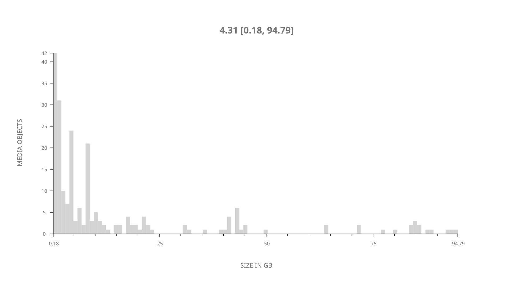
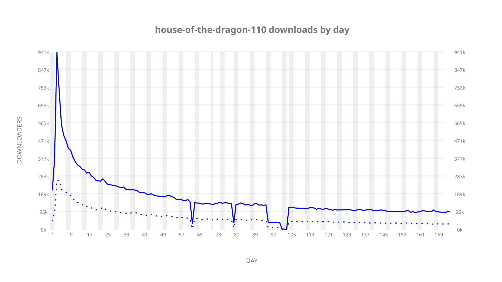
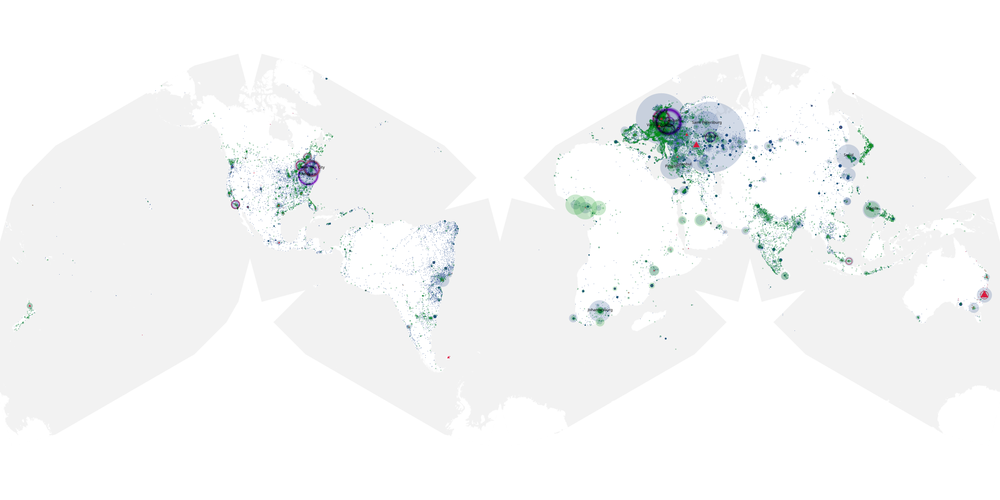
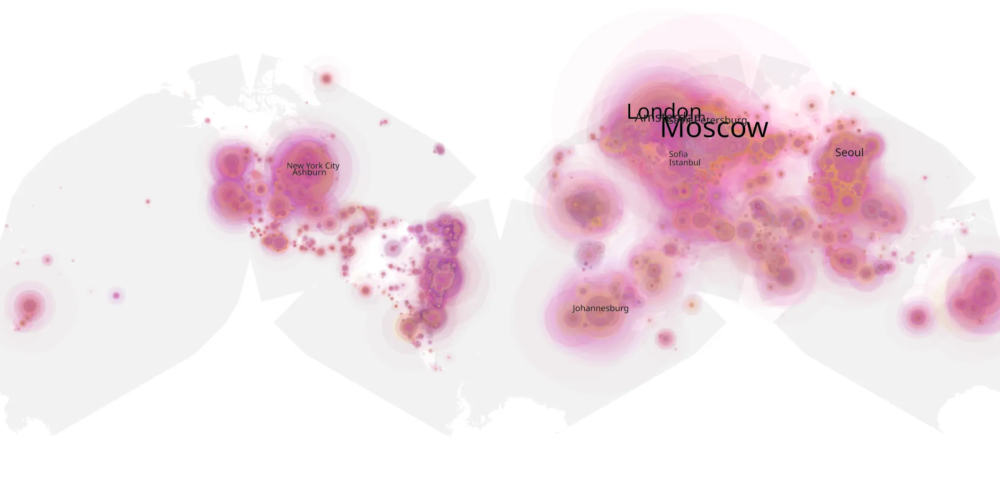
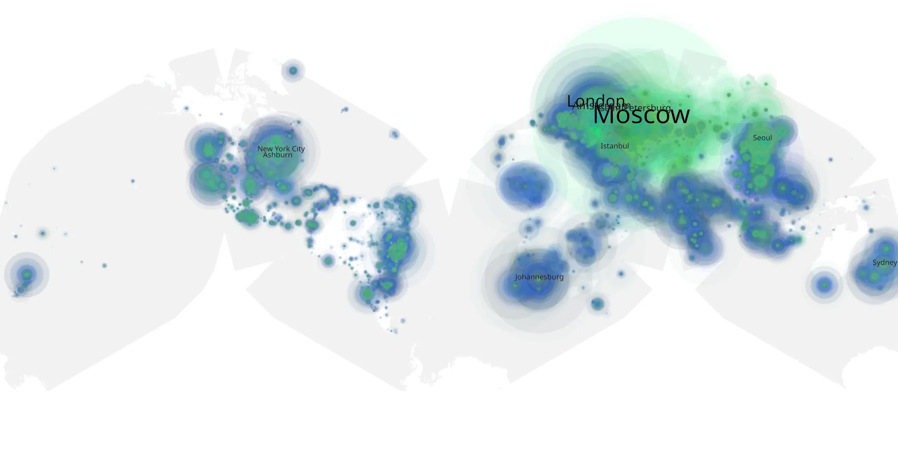

# house-of-the-dragon-110 sample cache audit

## 1. Media object

| Field | Value |
| --- | --- |
| Media object | House of the Dragon |
| Collection key | `house-of-the-dragon-110` |
| imdb_id | [tt11198330](https://www.imdb.com/title/tt11198330/) |
| wikipedia_url | [House of the Dragon](https://en.wikipedia.org/wiki/House_of_the_Dragon) |
| Sample dates | 2022-10-22-to-2023-04-21 |
| Sample days | 182 |
| BTIH count | 257 |
| Unique BTIH count | 218 |
| Downloaders total | 14,461,065 |
| Uploaders total | 4,738,204 |
| Data version | `2026-08-05` |
| IP geolocation version | `6:1777968300` |

## 2. Sample coverage report

- Generated: 2026-09-02T04:14:16Z
- Sample archive directory: `/run/media/bkoz/gold/src/alpha60-samples-raw.gold/house-of-the-dragon-110.xz`
- Hour directories: 4287
- Zero-length sample files: 0
- Other unparsable sample files: 0
- Hourly discontinuities: 7 (305 missing hours)
- Missing days: 9

### Sample archive discontinuities

- hourly gap: last `2022-11-04 14:06`, resumed `2022-11-04 16:43` — missing 1 hour(s)
- hourly gap: last `2022-12-21 22:06`, resumed `2022-12-22 23:35` — missing 24 hour(s)
- hourly gap: last `2022-12-31 22:06`, resumed `2023-01-04 00:06` — missing 73 hour(s)
- hourly gap: last `2023-01-11 22:06`, resumed `2023-01-13 23:19` — missing 48 hour(s)
- hourly gap: last `2023-02-03 08:00`, resumed `2023-02-05 04:00` — missing 43 hour(s)
- hourly gap: last `2023-02-05 04:00`, resumed `2023-02-10 00:00` — missing 115 hour(s)
- hourly gap: last `2023-03-26 01:00`, resumed `2023-03-26 03:00` — missing 1 hour(s)
- missing day: `2023-01-01`
- missing day: `2023-01-02`
- missing day: `2023-01-03`
- missing day: `2023-01-12`
- missing day: `2023-02-04`
- missing day: `2023-02-06`
- missing day: `2023-02-07`
- missing day: `2023-02-08`
- missing day: `2023-02-09`

## 3. Media objects file size histogram

## 4. Visualization pass — graphs

### Downloads by week cumulative (normalized start)



### Downloads by day, Saturday and Sunday in gray

## 5. Visualization pass — maps

### Cumulative geographic slices

| Africa | Americas | Asia | Europe | Oceania | Unknown |
| --- | --- | --- | --- | --- | --- |
| 6.70 | 15.62 | 21.93 | 45.37 | 2.11 | 1.13 |

### Cumulative network infrastructure

{:target="_blank" rel="noopener"}

### Cumulative data maps

**Cumulative >= 1080p**

{:target="_blank" rel="noopener"}

**Cumulative < 1080p**

{:target="_blank" rel="noopener"}
