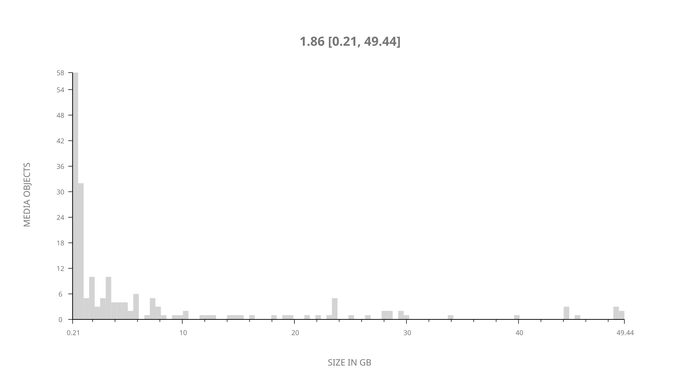
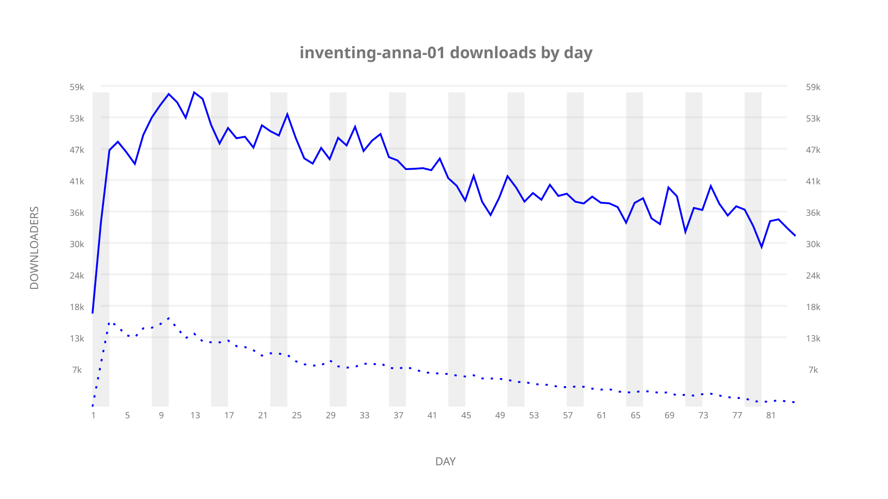
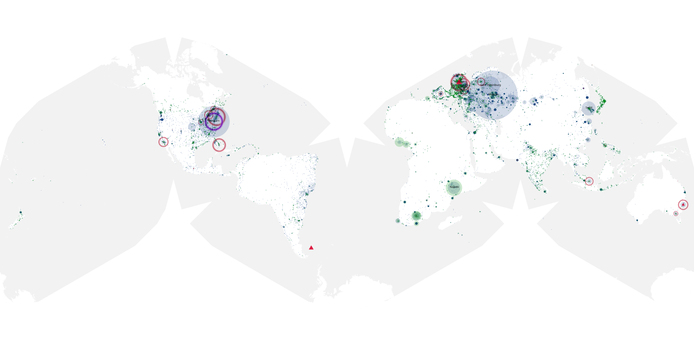
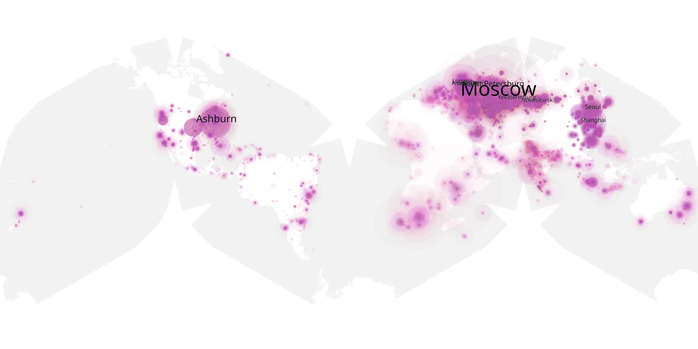
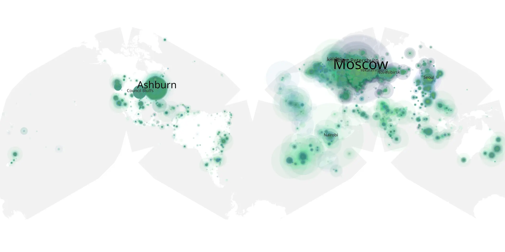

# inventing-anna-01 sample cache audit

## 1. Media object

| Field | Value |
| --- | --- |
| Media object | Inventing Anna |
| Collection key | `inventing-anna-01` |
| imdb_id | [tt8740976](https://www.imdb.com/title/tt8740976/) |
| wikipedia_url | [Inventing Anna](https://en.wikipedia.org/wiki/Inventing_Anna) |
| Sample dates | 2022-02-11-to-2022-05-05 |
| Sample days | 84 |
| BTIH count | 238 |
| Unique BTIH count | 195 |
| Downloaders total | 3,504,172 |
| Uploaders total | 844,874 |
| Data version | `2026-08-05` |
| IP geolocation version | `6:1777968300` |

## 2. Coverage report

- Generated: 2026-09-02T04:14:16Z
- Sample archive directory: `/run/media/bkoz/gold/src/alpha60-samples-raw.gold/inventing-anna-01.xz`
- Hour directories: 1999
- Zero-length sample files: 0
- Other unparsable sample files: 0
- Hourly discontinuities: 1 (1 missing hours)
- Missing days: 0

### Sample archive discontinuities

- hourly gap: last `2022-03-27 01:09`, resumed `2022-03-27 03:09` — missing 1 hour(s)

## 3. File sizes histogram *median[lowest, highest]*

## 4. Graphs

### Downloads by week cumulative (normalized start)



### Downloads by day, Saturday and Sunday in gray

## 5. Cumulative Maps

<!-- https://raw.githubusercontent.com/alpha60-devops/alpha60-results-2022/refs/heads/main/data/ -->

### <a href="https://raw.githubusercontent.com/alpha60-devops/alpha60-results-2022/refs/heads/main/data/geojson.cumulative/inventing-anna-01-cumulative-aggregate.geojson.gz" data-map-title="Inventing Anna — inventing-anna-01" onclick="leaflet_map_open_window(this.href, this.dataset.mapTitle); return false;" class="table-link" aria-label="Open Inventing Anna (inventing-anna-01) cumulative data map in new window" title="Opens interactive map for Inventing Anna (inventing-anna-01) data">Swarm Detail</a>

### Geographic Regions

| Africa | Americas | Asia | Europe | Oceania | Unknown |
| --- | --- | --- | --- | --- | --- |
| 7.87 | 15.63 | 17.75 | 50.07 | 1.72 | 0.97 |

### Network infrastructure

{:target="_blank" rel="noopener"}

### Resolution >= 1080p

{:target="_blank" rel="noopener"}

### Resolution < 1080p

{:target="_blank" rel="noopener"}
