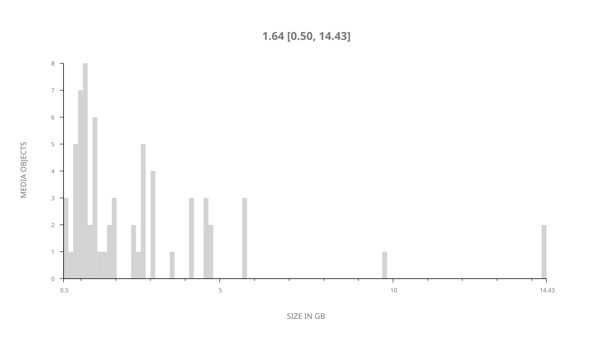
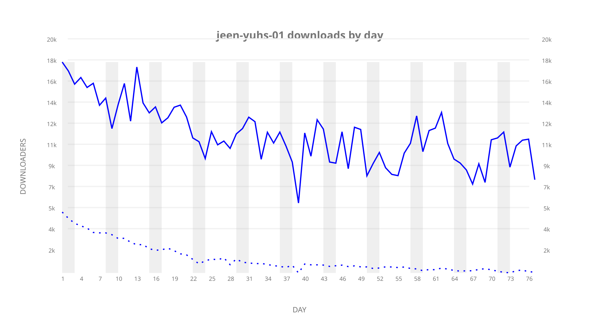
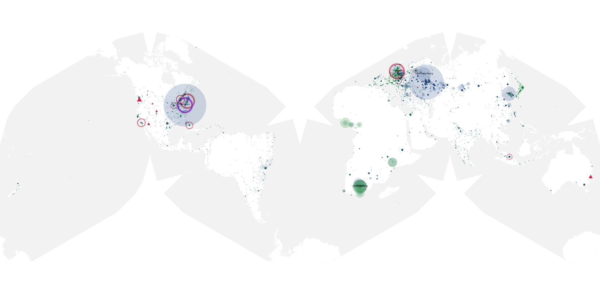
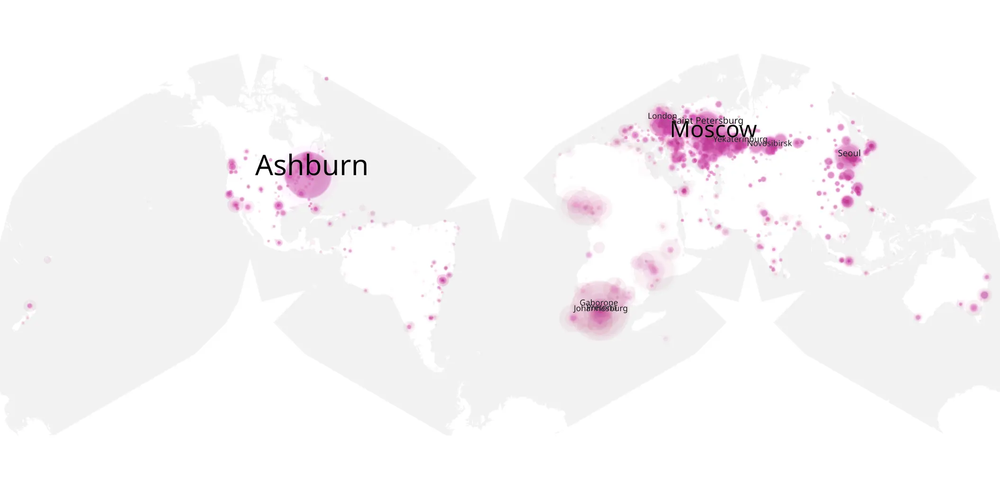
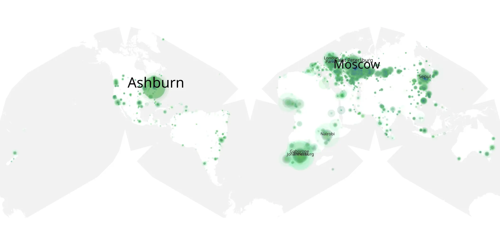

# jeen-yuhs-01 sample cache audit

## 1. Media object

| Field | Value |
| --- | --- |
| Media object | Jeen Yuhs |
| Collection key | `jeen-yuhs-01` |
| imdb_id | [tt14599438](https://www.imdb.com/title/tt14599438/) |
| wikipedia_url | [Jeen-Yuhs](https://en.wikipedia.org/wiki/Jeen-Yuhs) |
| Sample dates | 2022-03-04-to-2022-05-19 |
| Sample days | 77 |
| BTIH count | 78 |
| Unique BTIH count | 66 |
| Downloaders total | 818,763 |
| Uploaders total | 151,149 |
| Data version | `2026-08-05` |
| IP geolocation version | `6:1777968300` |

## 2. Coverage report

- Generated: 2026-09-02T04:14:16Z
- Sample archive directory: `/run/media/bkoz/gold/src/alpha60-samples-raw.gold/jeen-yuhs-01.xz`
- Hour directories: 1845
- Zero-length sample files: 0
- Other unparsable sample files: 0
- Hourly discontinuities: 1 (3 missing hours)
- Missing days: 0

### Sample archive discontinuities

- hourly gap: last `2022-04-11 21:03`, resumed `2022-04-12 01:03` — missing 3 hour(s)

## 3. File sizes histogram *median[lowest, highest]*

## 4. Graphs

### Downloads by week cumulative (normalized start)



### Downloads by day, Saturday and Sunday in gray

## 5. Cumulative Maps

<!-- https://raw.githubusercontent.com/alpha60-devops/alpha60-results-2022/refs/heads/main/data/ -->

### <a href="https://raw.githubusercontent.com/alpha60-devops/alpha60-results-2022/refs/heads/main/data/geojson.cumulative/jeen-yuhs-01-cumulative-aggregate.geojson.gz" data-map-title="Jeen Yuhs — jeen-yuhs-01" onclick="leaflet_map_open_window(this.href, this.dataset.mapTitle); return false;" class="table-link" aria-label="Open Jeen Yuhs (jeen-yuhs-01) cumulative data map in new window" title="Opens interactive map for Jeen Yuhs (jeen-yuhs-01) data">Swarm Detail</a>

### Geographic Regions

| Africa | Americas | Asia | Europe | Oceania | Unknown |
| --- | --- | --- | --- | --- | --- |
| 12.13 | 18.24 | 15.35 | 47.14 | 1.11 | 1.00 |

### Network infrastructure

{:target="_blank" rel="noopener"}

### Resolution >= 1080p

{:target="_blank" rel="noopener"}

### Resolution < 1080p

{:target="_blank" rel="noopener"}
