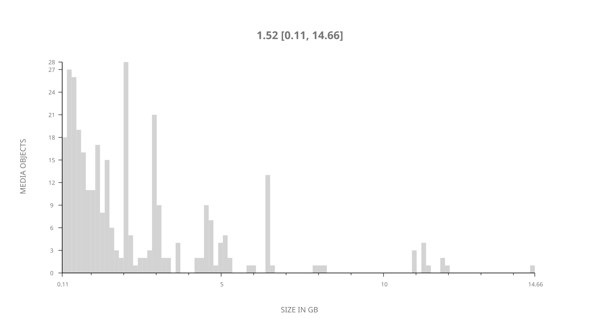
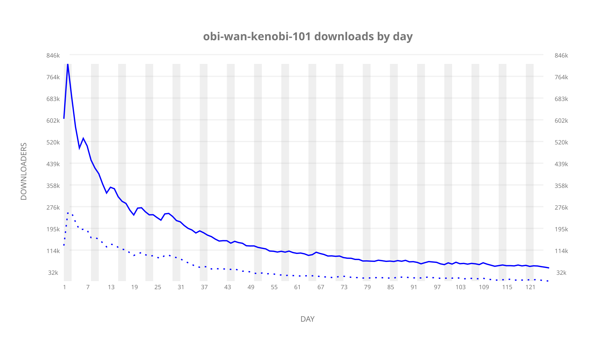
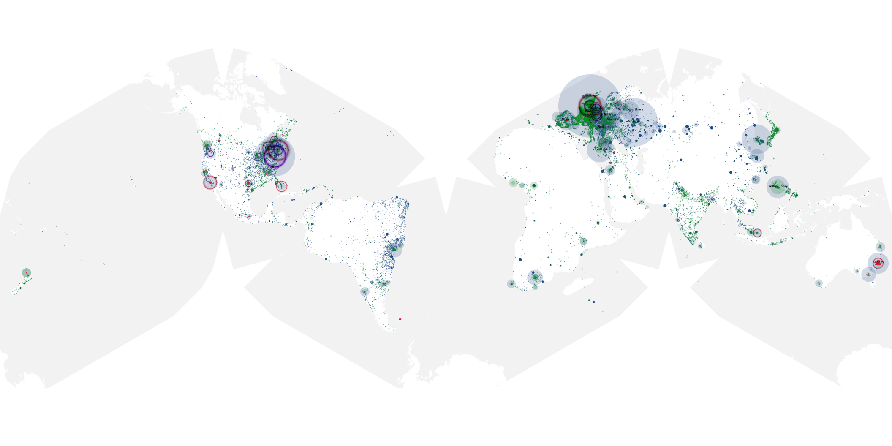
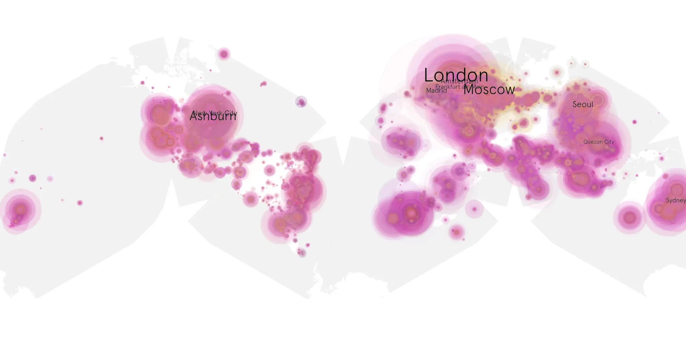
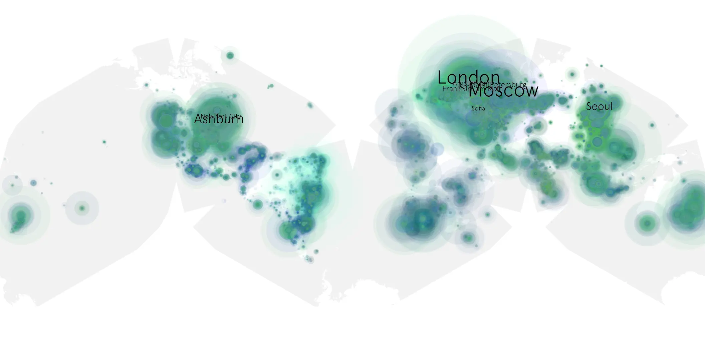

# obi-wan-kenobi-101 sample cache audit

## 1. Media object

| Field | Value |
| --- | --- |
| Media object | Obi-Wan Kenobi |
| Collection key | `obi-wan-kenobi-101` |
| imdb_id | [tt8466564](https://www.imdb.com/title/tt8466564/) |
| wikipedia_url | [Obi-Wan Kenobi (miniseries)](https://en.wikipedia.org/wiki/Obi-Wan_Kenobi_(miniseries)) |
| Sample dates | 2022-05-27-to-2022-09-29 |
| Sample days | 126 |
| BTIH count | 365 |
| Unique BTIH count | 321 |
| Downloaders total | 14,562,800 |
| Uploaders total | 5,025,955 |
| Data version | `2026-08-05` |
| IP geolocation version | `6:1777968300` |

## 2. Coverage report

- Generated: 2026-09-02T04:14:16Z
- Sample archive directory: `/run/media/bkoz/gold/src/alpha60-samples-raw.gold/obi-wan-kenobi-101.xz`
- Hour directories: 3017
- Zero-length sample files: 0
- Other unparsable sample files: 0
- Hourly discontinuities: 0 (0 missing hours)
- Missing days: 0

### Sample archive discontinuities

None detected.

## 3. File sizes histogram *median[lowest, highest]*

## 4. Graphs

### Downloads by week cumulative (normalized start)



### Downloads by day, Saturday and Sunday in gray

## 5. Cumulative Maps

<!-- https://raw.githubusercontent.com/alpha60-devops/alpha60-results-2022/refs/heads/main/data/ -->

### <a href="https://raw.githubusercontent.com/alpha60-devops/alpha60-results-2022/refs/heads/main/data/geojson.cumulative/obi-wan-kenobi-101-cumulative-aggregate.geojson.gz" data-map-title="Obi-Wan Kenobi — obi-wan-kenobi-101" onclick="leaflet_map_open_window(this.href, this.dataset.mapTitle); return false;" class="table-link" aria-label="Open Obi-Wan Kenobi (obi-wan-kenobi-101) cumulative data map in new window" title="Opens interactive map for Obi-Wan Kenobi (obi-wan-kenobi-101) data">Swarm Detail</a>

### Geographic Regions

| Africa | Americas | Asia | Europe | Oceania | Unknown |
| --- | --- | --- | --- | --- | --- |
| 5.32 | 22.31 | 18.76 | 45.92 | 3.38 | 0.58 |

### Network infrastructure

{:target="_blank" rel="noopener"}

### Resolution >= 1080p

{:target="_blank" rel="noopener"}

### Resolution < 1080p

{:target="_blank" rel="noopener"}
