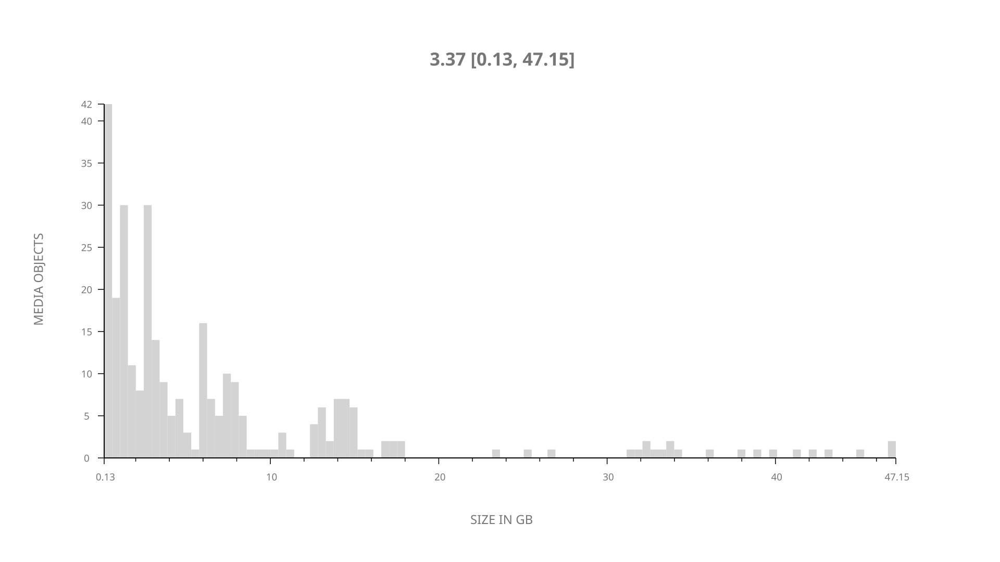
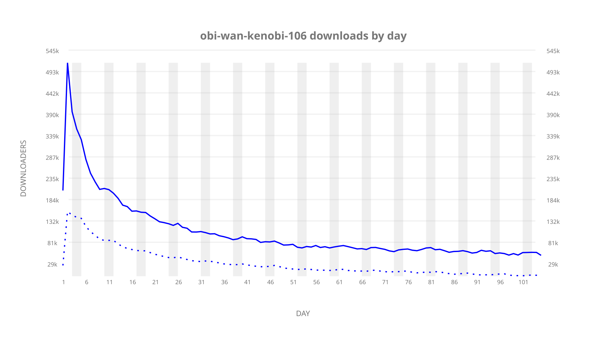
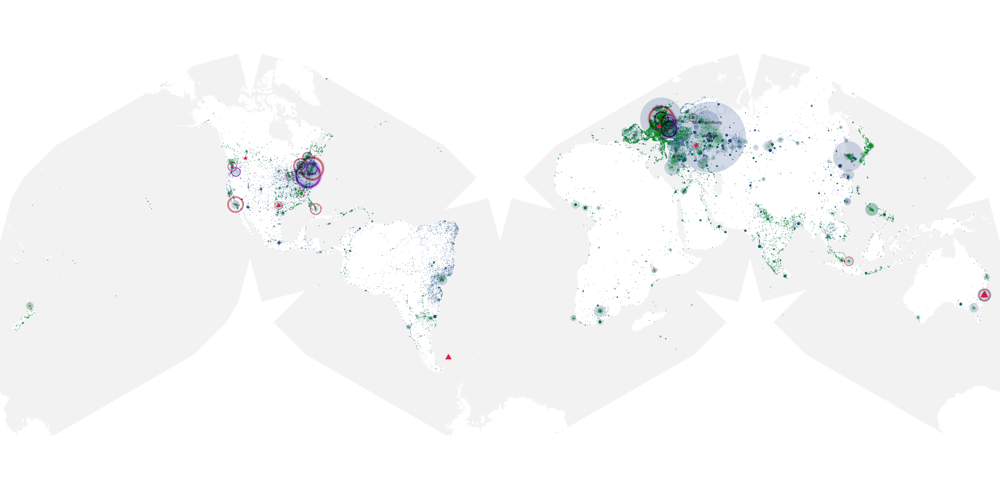
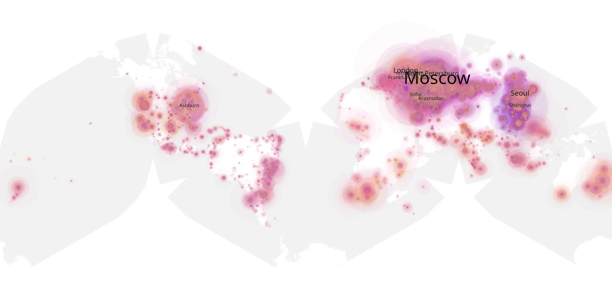
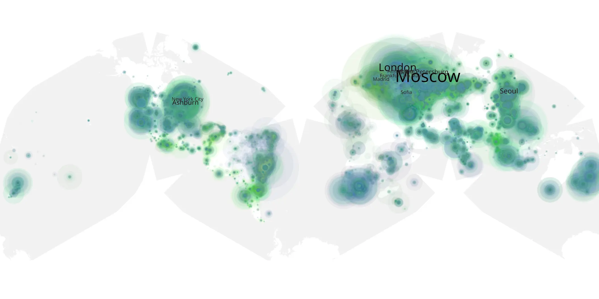

# obi-wan-kenobi-106 sample cache audit

## 1. Media object

| Field | Value |
| --- | --- |
| Media object | Obi-Wan Kenobi |
| Collection key | `obi-wan-kenobi-106` |
| imdb_id | [tt8466564](https://www.imdb.com/title/tt8466564/) |
| wikipedia_url | [Obi-Wan Kenobi (miniseries)](https://en.wikipedia.org/wiki/Obi-Wan_Kenobi_(miniseries)) |
| Sample dates | 2022-06-22-to-2022-10-04 |
| Sample days | 105 |
| BTIH count | 347 |
| Unique BTIH count | 301 |
| Downloaders total | 9,231,700 |
| Uploaders total | 3,380,234 |
| Data version | `2026-08-05` |
| IP geolocation version | `6:1777968300` |

## 2. Sample coverage report

- Generated: 2026-09-02T04:14:17Z
- Sample archive directory: `/run/media/bkoz/gold/src/alpha60-samples-raw.gold/obi-wan-kenobi-106.xz`
- Hour directories: 2504
- Zero-length sample files: 0
- Other unparsable sample files: 0
- Hourly discontinuities: 2 (2 missing hours)
- Missing days: 0

### Sample archive discontinuities

- hourly gap: last `2022-06-24 22:00`, resumed `2022-06-25 00:00` — missing 1 hour(s)
- hourly gap: last `2022-08-23 22:00`, resumed `2022-08-24 00:00` — missing 1 hour(s)

## 3. Media objects file size histogram

## 4. Visualization pass — graphs

### Downloads by week cumulative (normalized start)



### Downloads by day, Saturday and Sunday in gray

## 5. Visualization pass — maps

### Cumulative geographic slices

| Africa | Americas | Asia | Europe | Oceania | Unknown |
| --- | --- | --- | --- | --- | --- |
| 3.93 | 18.03 | 17.92 | 52.82 | 2.53 | 0.66 |

### Cumulative network infrastructure

{:target="_blank" rel="noopener"}

### Cumulative data maps

**Cumulative >= 1080p**

{:target="_blank" rel="noopener"}

**Cumulative < 1080p**

{:target="_blank" rel="noopener"}
