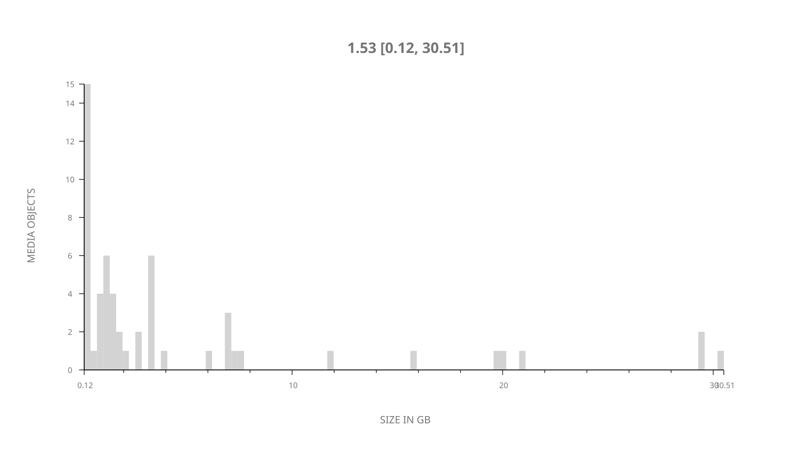
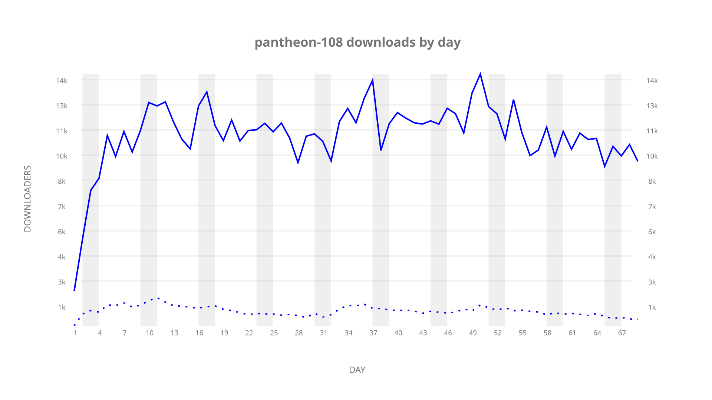
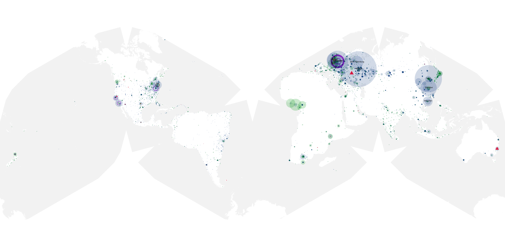
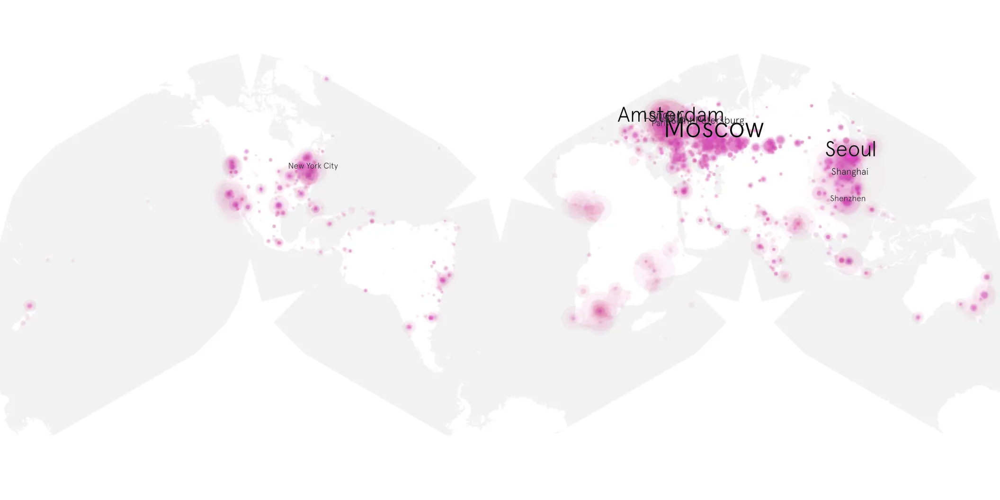
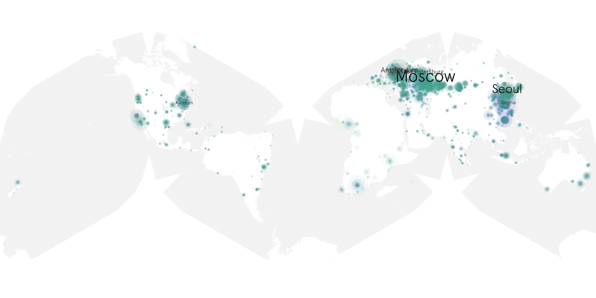

# pantheon-108 sample cache audit

## 1. Media object

| Field | Value |
| --- | --- |
| Media object | Pantheon |
| Collection key | `pantheon-108` |
| imdb_id | [tt11680642](https://www.imdb.com/title/tt11680642/) |
| wikipedia_url | [Pantheon (TV series)](https://en.wikipedia.org/wiki/Pantheon_(TV_series)) |
| Sample dates | 2022-10-13-to-2022-12-20 |
| Sample days | 69 |
| BTIH count | 69 |
| Unique BTIH count | 56 |
| Downloaders total | 597,695 |
| Uploaders total | 70,787 |
| Data version | `2026-08-05` |
| IP geolocation version | `6:1777968300` |

## 2. Sample coverage report

- Generated: 2026-09-02T04:14:17Z
- Sample archive directory: `/run/media/bkoz/gold/src/alpha60-samples-raw.gold/pantheon-108.xz`
- Hour directories: 1638
- Zero-length sample files: 0
- Other unparsable sample files: 0
- Hourly discontinuities: 0 (0 missing hours)
- Missing days: 0

### Sample archive discontinuities

None detected.

## 3. Media objects file size histogram

## 4. Visualization pass — graphs

### Downloads by week cumulative (normalized start)



### Downloads by day, Saturday and Sunday in gray

## 5. Visualization pass — maps

### Cumulative geographic slices

| Africa | Americas | Asia | Europe | Oceania | Unknown |
| --- | --- | --- | --- | --- | --- |
| 4.19 | 14.82 | 23.46 | 42.65 | 1.54 | 5.12 |

### Cumulative network infrastructure

{:target="_blank" rel="noopener"}

### Cumulative data maps

**Cumulative >= 1080p**

{:target="_blank" rel="noopener"}

**Cumulative < 1080p**

{:target="_blank" rel="noopener"}
