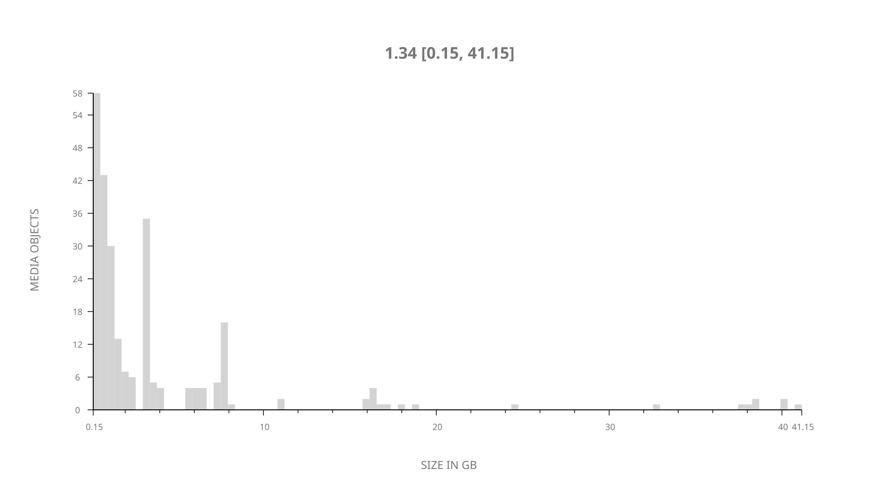
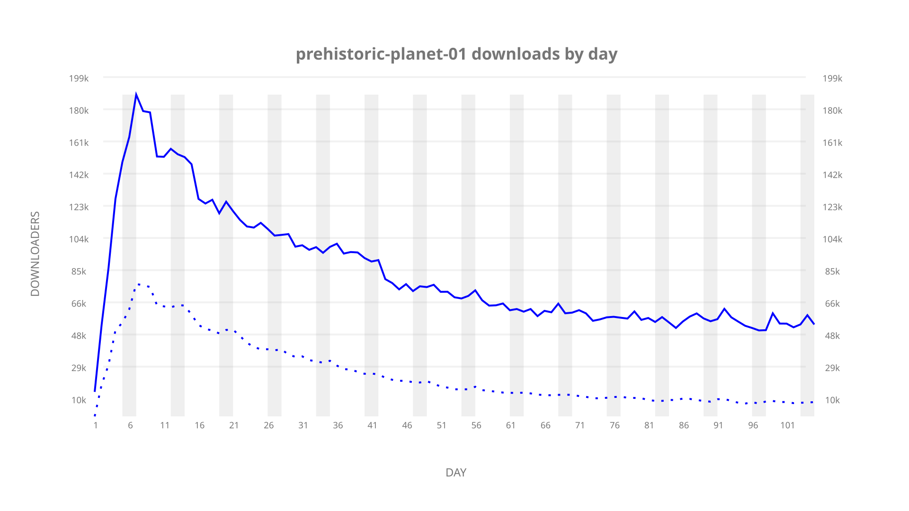
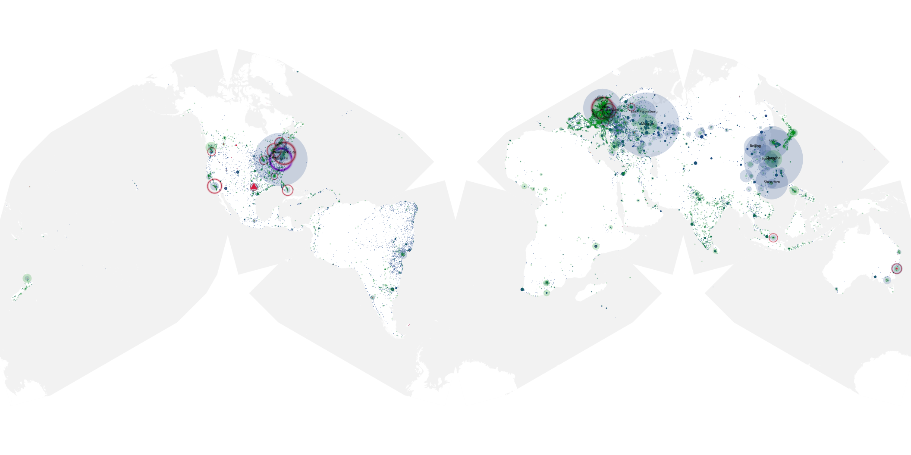
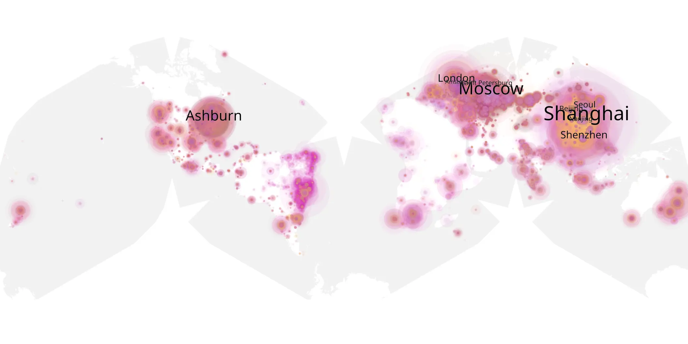
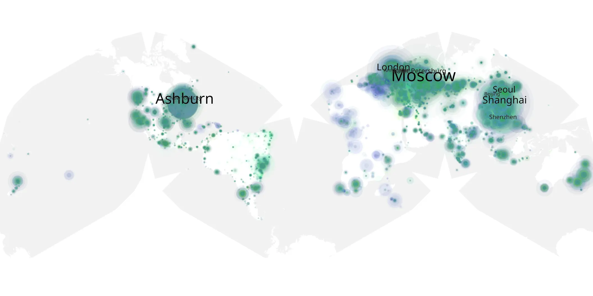

# prehistoric-planet-01 sample cache audit

## 1. Media object

| Field | Value |
| --- | --- |
| Media object | Prehistoric Planet |
| Collection key | `prehistoric-planet-01` |
| imdb_id | [tt10324164](https://www.imdb.com/title/tt10324164/) |
| wikipedia_url | [Prehistoric Planet](https://en.wikipedia.org/wiki/Prehistoric_Planet) |
| Sample dates | 2022-05-23-to-2022-09-04 |
| Sample days | 105 |
| BTIH count | 311 |
| Unique BTIH count | 256 |
| Downloaders total | 6,477,202 |
| Uploaders total | 1,898,212 |
| Data version | `2026-08-05` |
| IP geolocation version | `6:1777968300` |

## 2. Coverage report

- Generated: 2026-09-02T04:14:18Z
- Sample archive directory: `/run/media/bkoz/gold/src/alpha60-samples-raw.gold/prehistoric-planet-01.xz`
- Hour directories: 2504
- Zero-length sample files: 0
- Other unparsable sample files: 0
- Hourly discontinuities: 0 (0 missing hours)
- Missing days: 0

### Sample archive discontinuities

None detected.

## 3. File sizes histogram *median[lowest, highest]*

## 4. Graphs

### Downloads by week cumulative (normalized start)



### Downloads by day, Saturday and Sunday in gray

## 5. Cumulative Maps

<!-- https://raw.githubusercontent.com/alpha60-devops/alpha60-results-2022/refs/heads/main/data/ -->

### <a href="https://raw.githubusercontent.com/alpha60-devops/alpha60-results-2022/refs/heads/main/data/geojson.cumulative/prehistoric-planet-01-cumulative-aggregate.geojson.gz" data-map-title="Prehistoric Planet — prehistoric-planet-01" onclick="leaflet_map_open_window(this.href, this.dataset.mapTitle); return false;" class="table-link" aria-label="Open Prehistoric Planet (prehistoric-planet-01) cumulative data map in new window" title="Opens interactive map for Prehistoric Planet (prehistoric-planet-01) data">Swarm Detail</a>

### Geographic Regions

| Africa | Americas | Asia | Europe | Oceania | Unknown |
| --- | --- | --- | --- | --- | --- |
| 2.52 | 19.16 | 30.20 | 43.01 | 2.07 | 0.93 |

### Network infrastructure

{:target="_blank" rel="noopener"}

### Resolution >= 1080p

{:target="_blank" rel="noopener"}

### Resolution < 1080p

{:target="_blank" rel="noopener"}
