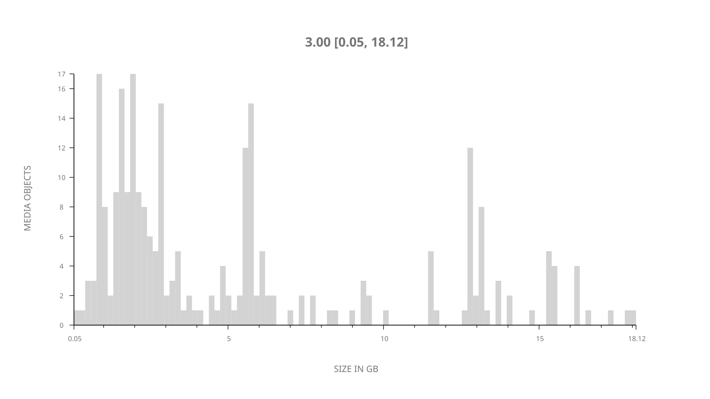
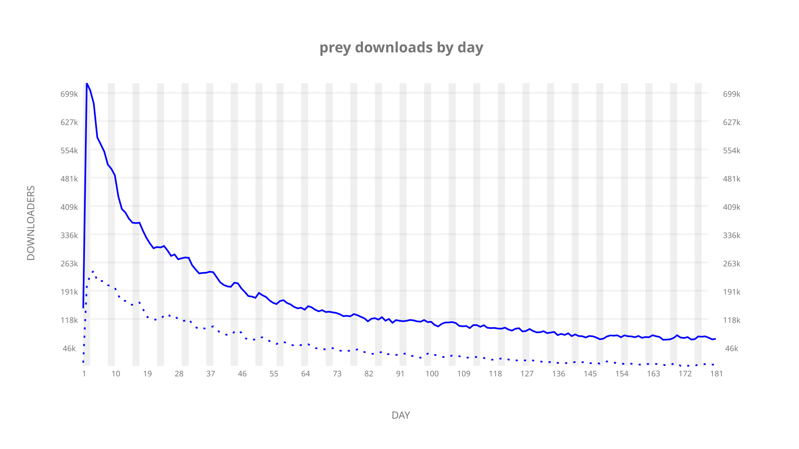
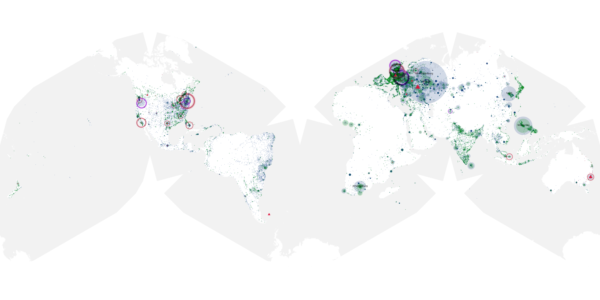
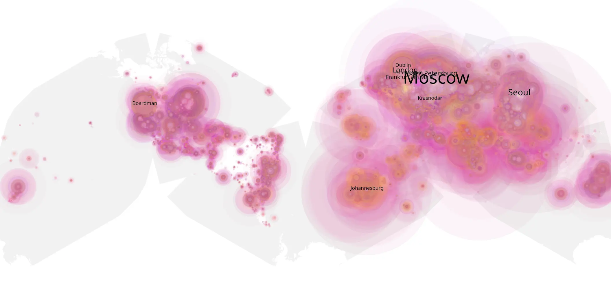
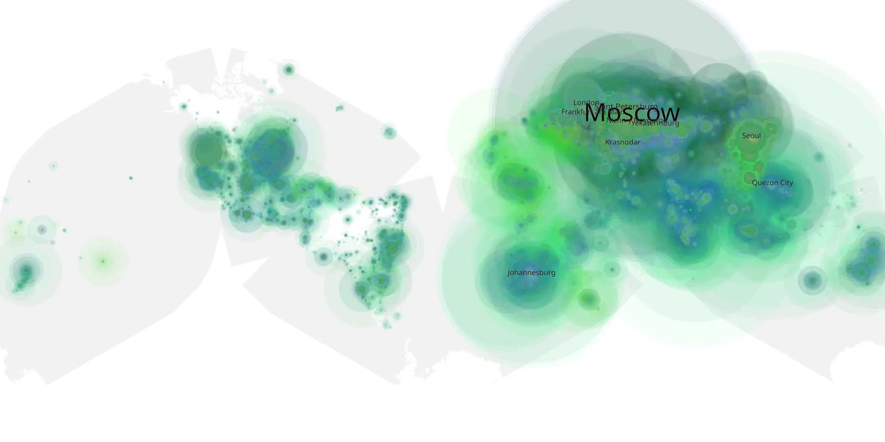

# prey sample cache audit

## 1. Media object

| Field | Value |
| --- | --- |
| Media object | Prey |
| Collection key | `prey` |
| imdb_id | [tt11866324](https://www.imdb.com/title/tt11866324/) |
| wikipedia_url | [Prey (2022 film)](https://en.wikipedia.org/wiki/Prey_(2022_film)) |
| Sample dates | 2022-08-05-to-2023-02-02 |
| Sample days | 182 |
| BTIH count | 320 |
| Unique BTIH count | 261 |
| Downloaders total | 24,539,733 |
| Uploaders total | 9,951,981 |
| Data version | `2026-08-05` |
| IP geolocation version | `6:1777968300` |

## 2. Sample coverage report

- Generated: 2026-09-02T04:14:18Z
- Sample archive directory: `/run/media/bkoz/gold/src/alpha60-samples-raw.gold/prey.xz`
- Hour directories: 4349
- Zero-length sample files: 0
- Other unparsable sample files: 0
- Hourly discontinuities: 0 (0 missing hours)
- Missing days: 0

### Sample archive discontinuities

None detected.

## 3. Media objects file size histogram

## 4. Visualization pass — graphs

### Downloads by week cumulative (normalized start)



### Downloads by day, Saturday and Sunday in gray

## 5. Visualization pass — maps

### Cumulative geographic slices

| Africa | Americas | Asia | Europe | Oceania | Unknown |
| --- | --- | --- | --- | --- | --- |
| 7.16 | 12.51 | 25.58 | 47.88 | 1.66 | 0.61 |

### Cumulative network infrastructure

{:target="_blank" rel="noopener"}

### Cumulative data maps

**Cumulative >= 1080p**

{:target="_blank" rel="noopener"}

**Cumulative < 1080p**

{:target="_blank" rel="noopener"}
