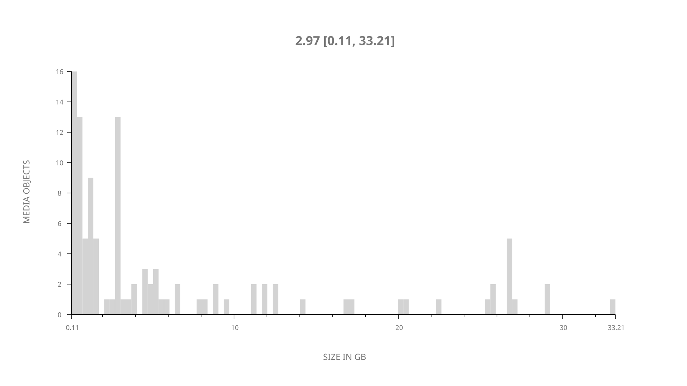
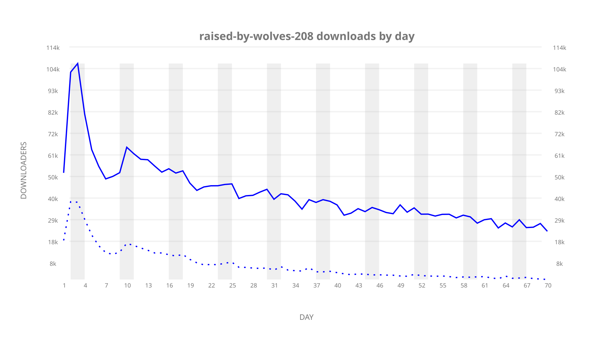
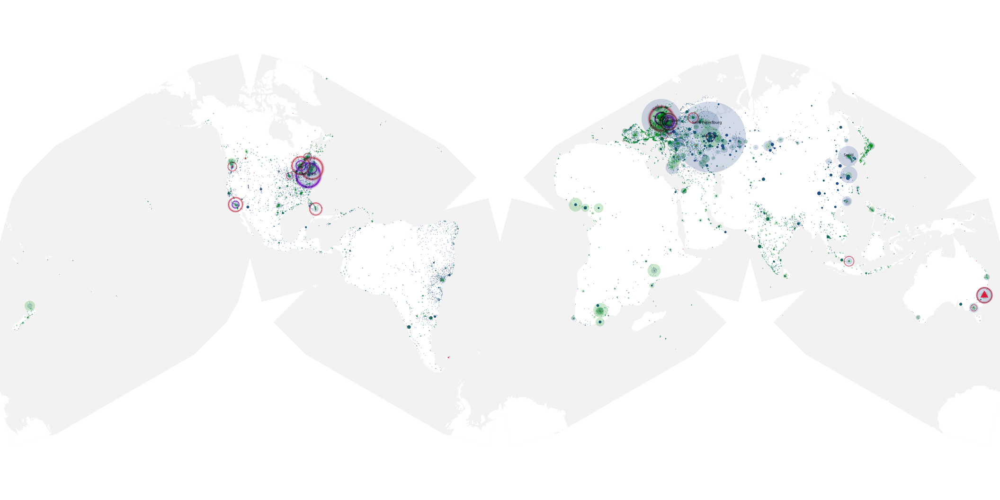
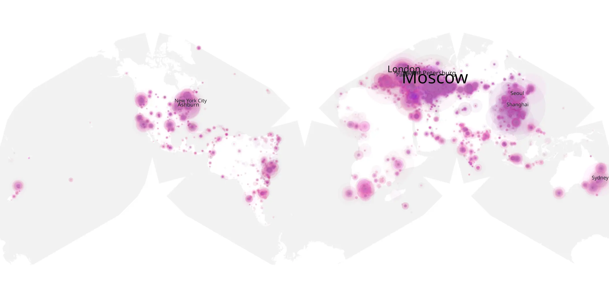
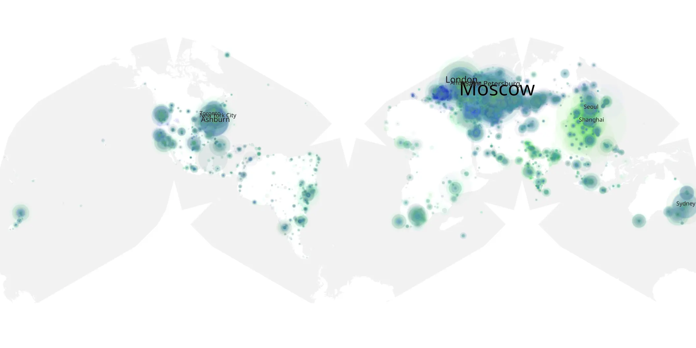

# raised-by-wolves-208 sample cache audit

## 1. Media object

| Field | Value |
| --- | --- |
| Media object | Raised by Wolves |
| Collection key | `raised-by-wolves-208` |
| imdb_id | [tt9170108](https://www.imdb.com/title/tt9170108/) |
| wikipedia_url | [Raised by Wolves (American TV series)](https://en.wikipedia.org/wiki/Raised_by_Wolves_(American_TV_series)) |
| Sample dates | 2022-03-17-to-2022-05-25 |
| Sample days | 70 |
| BTIH count | 136 |
| Unique BTIH count | 108 |
| Downloaders total | 2,188,935 |
| Uploaders total | 539,392 |
| Data version | `2026-08-05` |
| IP geolocation version | `6:1777968300` |

## 2. Sample coverage report

- Generated: 2026-09-02T04:14:19Z
- Sample archive directory: `/run/media/bkoz/gold/src/alpha60-samples-raw.gold/raised-by-wolves-208.xz`
- Hour directories: 1661
- Zero-length sample files: 0
- Other unparsable sample files: 0
- Hourly discontinuities: 1 (1 missing hours)
- Missing days: 0

### Sample archive discontinuities

- hourly gap: last `2022-03-27 01:00`, resumed `2022-03-27 03:00` — missing 1 hour(s)

## 3. Media objects file size histogram

## 4. Visualization pass — graphs

### Downloads by week cumulative (normalized start)



### Downloads by day, Saturday and Sunday in gray

## 5. Visualization pass — maps

### Cumulative geographic slices

| Africa | Americas | Asia | Europe | Oceania | Unknown |
| --- | --- | --- | --- | --- | --- |
| 3.65 | 17.24 | 17.97 | 52.85 | 3.07 | 0.72 |

### Cumulative network infrastructure

{:target="_blank" rel="noopener"}

### Cumulative data maps

**Cumulative >= 1080p**

{:target="_blank" rel="noopener"}

**Cumulative < 1080p**

{:target="_blank" rel="noopener"}
