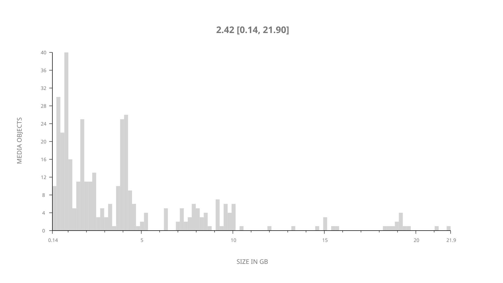
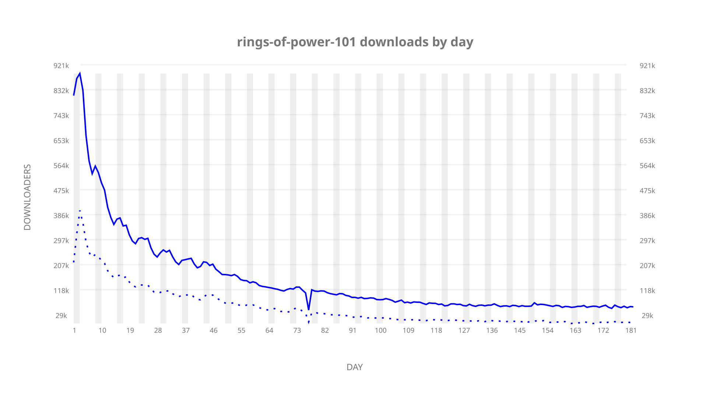
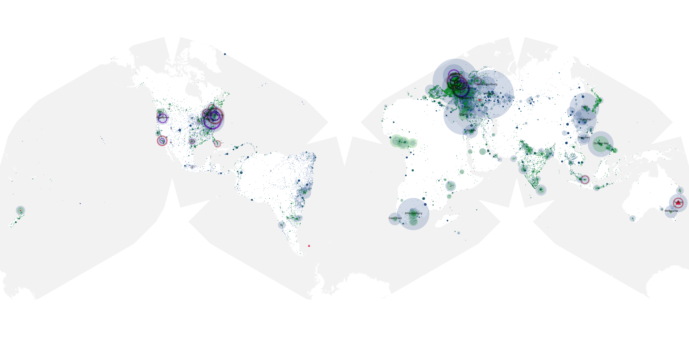
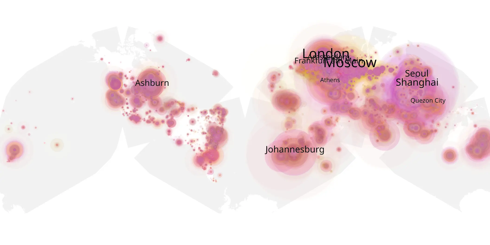
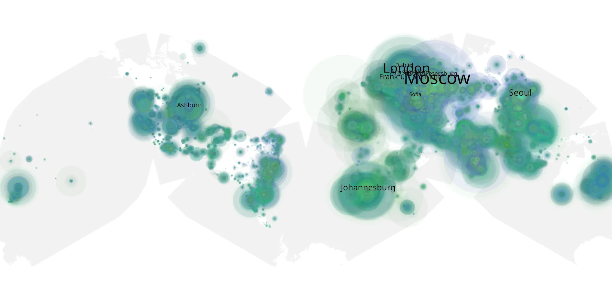

# rings-of-power-101 sample cache audit

## 1. Media object

| Field | Value |
| --- | --- |
| Media object | Rings of Power |
| Collection key | `rings-of-power-101` |
| imdb_id | [tt7631058](https://www.imdb.com/title/tt7631058/) |
| wikipedia_url | [The Lord of the Rings: The Rings of Power](https://en.wikipedia.org/wiki/The_Lord_of_the_Rings:_The_Rings_of_Power) |
| Sample dates | 2022-09-02-to-2023-03-02 |
| Sample days | 182 |
| BTIH count | 434 |
| Unique BTIH count | 377 |
| Downloaders total | 19,754,212 |
| Uploaders total | 7,820,200 |
| Data version | `2026-08-05` |
| IP geolocation version | `6:1777968300` |

## 2. Sample coverage report

- Generated: 2026-09-02T04:14:19Z
- Sample archive directory: `/run/media/bkoz/gold/src/alpha60-samples-raw.gold/rings-of-power-101.xz`
- Hour directories: 4330
- Zero-length sample files: 0
- Other unparsable sample files: 0
- Hourly discontinuities: 36 (36 missing hours)
- Missing days: 0

### Sample archive discontinuities

- hourly gap: last `2022-09-18 22:00`, resumed `2022-09-19 00:00` — missing 1 hour(s)
- hourly gap: last `2022-11-01 22:00`, resumed `2022-11-02 00:00` — missing 1 hour(s)
- hourly gap: last `2022-11-02 22:00`, resumed `2022-11-03 00:00` — missing 1 hour(s)
- hourly gap: last `2022-11-04 22:00`, resumed `2022-11-05 00:00` — missing 1 hour(s)
- hourly gap: last `2022-11-05 22:00`, resumed `2022-11-06 00:00` — missing 1 hour(s)
- hourly gap: last `2022-11-06 22:00`, resumed `2022-11-07 00:00` — missing 1 hour(s)
- hourly gap: last `2022-11-07 22:00`, resumed `2022-11-08 00:00` — missing 1 hour(s)
- hourly gap: last `2022-11-08 22:00`, resumed `2022-11-09 00:00` — missing 1 hour(s)
- hourly gap: last `2022-11-09 22:00`, resumed `2022-11-10 00:03` — missing 1 hour(s)
- hourly gap: last `2023-01-01 22:03`, resumed `2023-01-02 00:03` — missing 1 hour(s)
- hourly gap: last `2023-01-02 22:03`, resumed `2023-01-03 00:03` — missing 1 hour(s)
- hourly gap: last `2023-01-03 22:03`, resumed `2023-01-04 00:03` — missing 1 hour(s)
- hourly gap: last `2023-01-04 22:03`, resumed `2023-01-05 00:03` — missing 1 hour(s)
- hourly gap: last `2023-01-05 22:03`, resumed `2023-01-06 00:03` — missing 1 hour(s)
- hourly gap: last `2023-01-06 22:03`, resumed `2023-01-07 00:03` — missing 1 hour(s)
- hourly gap: last `2023-01-07 22:03`, resumed `2023-01-08 00:03` — missing 1 hour(s)
- hourly gap: last `2023-01-08 22:03`, resumed `2023-01-09 00:03` — missing 1 hour(s)
- hourly gap: last `2023-01-09 22:03`, resumed `2023-01-10 00:03` — missing 1 hour(s)
- hourly gap: last `2023-01-10 22:03`, resumed `2023-01-11 00:03` — missing 1 hour(s)
- hourly gap: last `2023-01-11 22:03`, resumed `2023-01-12 00:03` — missing 1 hour(s)
- hourly gap: last `2023-01-30 22:03`, resumed `2023-01-31 00:03` — missing 1 hour(s)
- hourly gap: last `2023-01-31 22:03`, resumed `2023-02-01 00:03` — missing 1 hour(s)
- hourly gap: last `2023-02-01 22:03`, resumed `2023-02-02 00:03` — missing 1 hour(s)
- hourly gap: last `2023-02-02 22:03`, resumed `2023-02-03 00:03` — missing 1 hour(s)
- hourly gap: last `2023-02-03 22:03`, resumed `2023-02-04 00:03` — missing 1 hour(s)
- hourly gap: last `2023-02-04 22:03`, resumed `2023-02-05 00:03` — missing 1 hour(s)
- hourly gap: last `2023-02-05 22:03`, resumed `2023-02-06 00:03` — missing 1 hour(s)
- hourly gap: last `2023-02-06 22:03`, resumed `2023-02-07 00:03` — missing 1 hour(s)
- hourly gap: last `2023-02-07 22:03`, resumed `2023-02-08 00:03` — missing 1 hour(s)
- hourly gap: last `2023-02-08 22:03`, resumed `2023-02-09 00:03` — missing 1 hour(s)
- hourly gap: last `2023-02-09 22:03`, resumed `2023-02-10 00:03` — missing 1 hour(s)
- hourly gap: last `2023-02-10 22:03`, resumed `2023-02-11 00:03` — missing 1 hour(s)
- hourly gap: last `2023-02-11 22:03`, resumed `2023-02-12 00:03` — missing 1 hour(s)
- hourly gap: last `2023-02-12 22:03`, resumed `2023-02-13 00:03` — missing 1 hour(s)
- hourly gap: last `2023-02-13 22:03`, resumed `2023-02-14 00:03` — missing 1 hour(s)
- hourly gap: last `2023-02-23 22:03`, resumed `2023-02-24 00:03` — missing 1 hour(s)

## 3. Media objects file size histogram

## 4. Visualization pass — graphs

### Downloads by week cumulative (normalized start)



### Downloads by day, Saturday and Sunday in gray

## 5. Visualization pass — maps

### Cumulative geographic slices

| Africa | Americas | Asia | Europe | Oceania | Unknown |
| --- | --- | --- | --- | --- | --- |
| 8.86 | 16.38 | 25.34 | 41.72 | 2.73 | 0.64 |

### Cumulative network infrastructure

{:target="_blank" rel="noopener"}

### Cumulative data maps

**Cumulative >= 1080p**

{:target="_blank" rel="noopener"}

**Cumulative < 1080p**

{:target="_blank" rel="noopener"}
