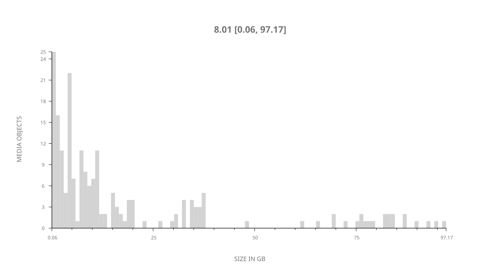
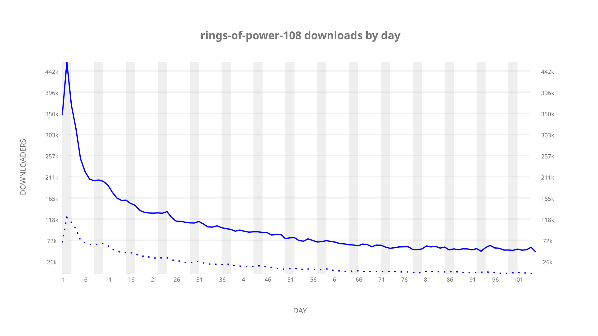
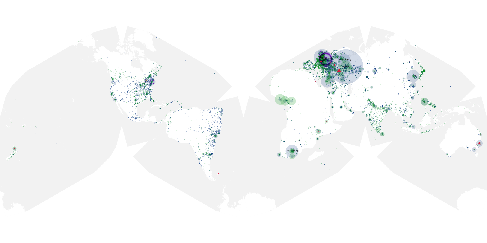
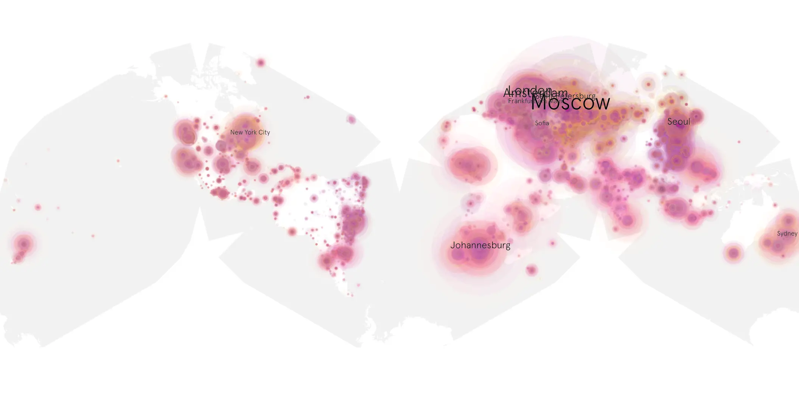
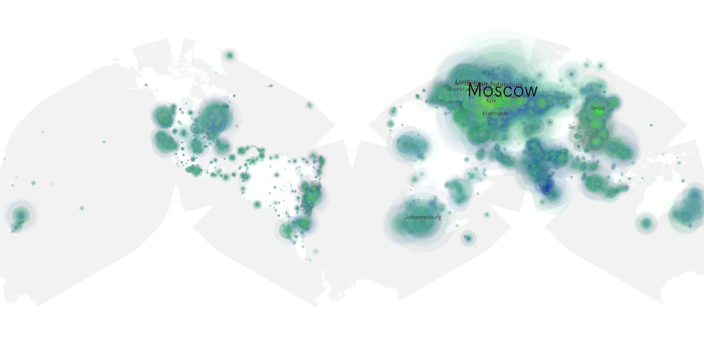

# rings-of-power-108 sample cache audit

## 1. Media object

| Field | Value |
| --- | --- |
| Media object | Rings of Power |
| Collection key | `rings-of-power-108` |
| imdb_id | [tt7631058](https://www.imdb.com/title/tt7631058/) |
| wikipedia_url | [The Lord of the Rings: The Rings of Power](https://en.wikipedia.org/wiki/The_Lord_of_the_Rings:_The_Rings_of_Power) |
| Sample dates | 2022-10-14-to-2023-01-26 |
| Sample days | 105 |
| BTIH count | 239 |
| Unique BTIH count | 201 |
| Downloaders total | 8,865,483 |
| Uploaders total | 2,799,099 |
| Data version | `2026-08-05` |
| IP geolocation version | `6:1777968300` |

## 2. Sample coverage report

- Generated: 2026-09-02T04:14:20Z
- Sample archive directory: `/run/media/bkoz/gold/src/alpha60-samples-raw.gold/rings-of-power-108.xz`
- Hour directories: 2514
- Zero-length sample files: 0
- Other unparsable sample files: 0
- Hourly discontinuities: 0 (0 missing hours)
- Missing days: 0

### Sample archive discontinuities

None detected.

## 3. Media objects file size histogram

## 4. Visualization pass — graphs

### Downloads by week cumulative (normalized start)



### Downloads by day, Saturday and Sunday in gray

## 5. Visualization pass — maps

### Cumulative geographic slices

| Africa | Americas | Asia | Europe | Oceania | Unknown |
| --- | --- | --- | --- | --- | --- |
| 6.70 | 13.45 | 20.82 | 50.33 | 2.23 | 1.94 |

### Cumulative network infrastructure

{:target="_blank" rel="noopener"}

### Cumulative data maps

**Cumulative >= 1080p**

{:target="_blank" rel="noopener"}

**Cumulative < 1080p**

{:target="_blank" rel="noopener"}
