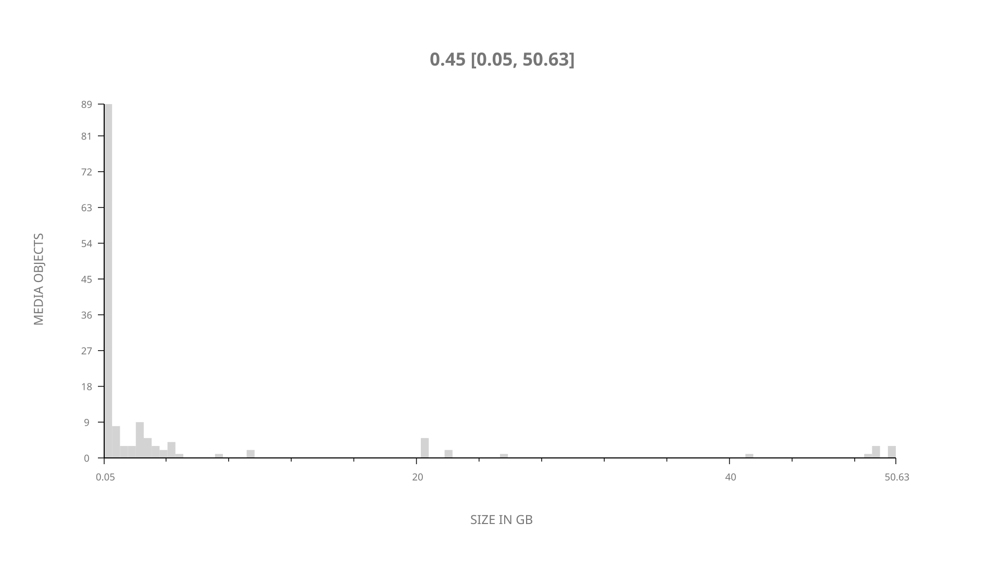
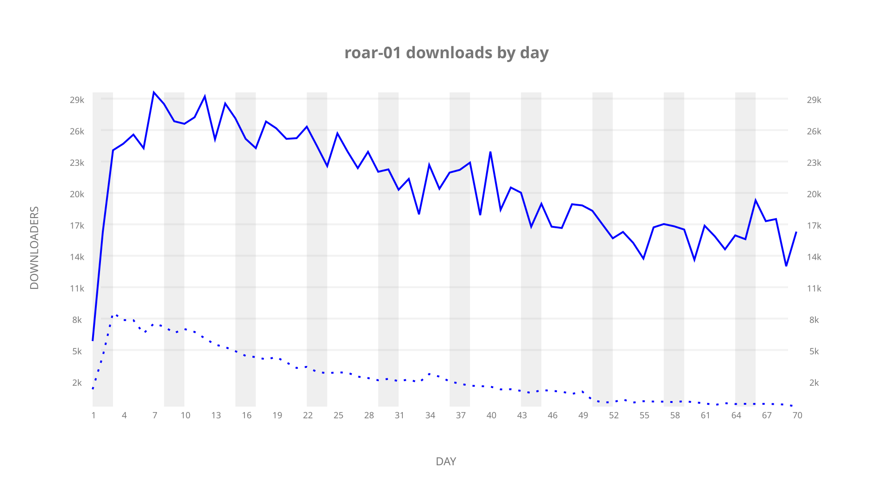
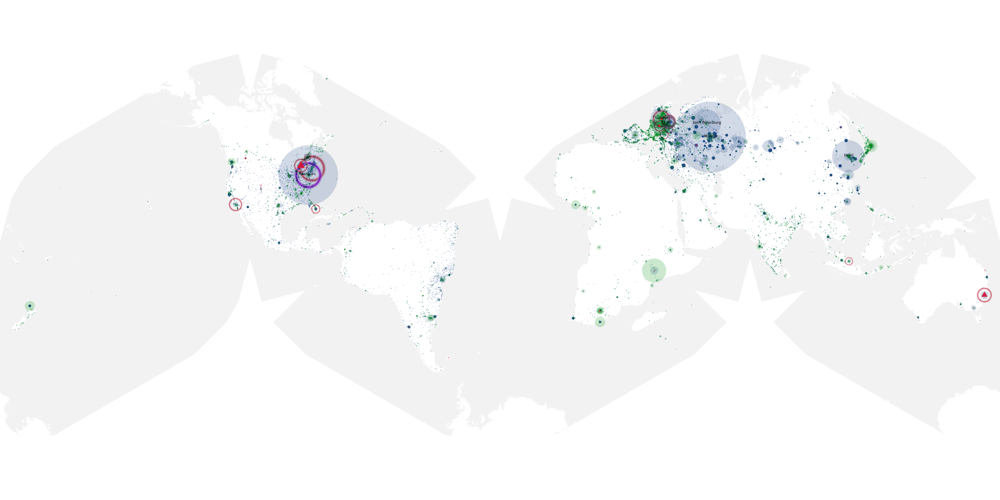
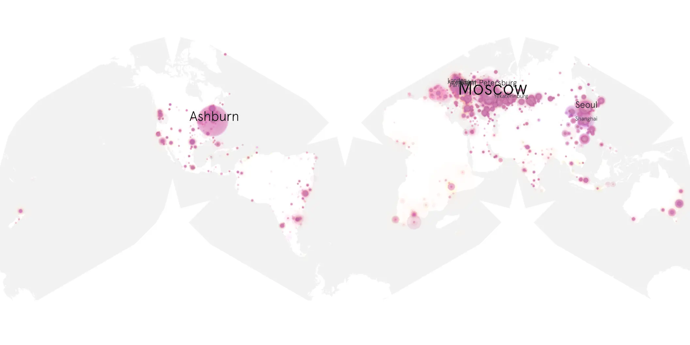
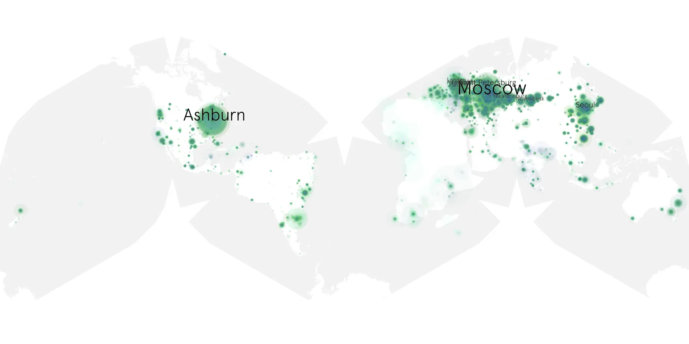

# roar-01 sample cache audit

## 1. Media object

| Field | Value |
| --- | --- |
| Media object | Roar |
| Collection key | `roar-01` |
| imdb_id | [tt9174600](https://www.imdb.com/title/tt9174600/) |
| wikipedia_url | [Roar (2022 TV series)](https://en.wikipedia.org/wiki/Roar_(2022_TV_series)) |
| Sample dates | 2022-04-15-to-2022-06-23 |
| Sample days | 70 |
| BTIH count | 166 |
| Unique BTIH count | 146 |
| Downloaders total | 1,305,384 |
| Uploaders total | 214,977 |
| Data version | `2026-08-05` |
| IP geolocation version | `6:1777968300` |

## 2. Coverage report

- Generated: 2026-09-02T04:14:20Z
- Sample archive directory: `/run/media/bkoz/gold/src/alpha60-samples-raw.gold/roar-01.xz`
- Hour directories: 1658
- Zero-length sample files: 0
- Other unparsable sample files: 0
- Hourly discontinuities: 1 (2 missing hours)
- Missing days: 0

### Sample archive discontinuities

- hourly gap: last `2022-05-27 22:06`, resumed `2022-05-28 01:06` — missing 2 hour(s)

## 3. File sizes histogram *median[lowest, highest]*

## 4. Graphs

### Downloads by week cumulative (normalized start)



### Downloads by day, Saturday and Sunday in gray

## 5. Cumulative Maps

<!-- https://raw.githubusercontent.com/alpha60-devops/alpha60-results-2022/refs/heads/main/data/ -->

### <a href="https://raw.githubusercontent.com/alpha60-devops/alpha60-results-2022/refs/heads/main/data/geojson.cumulative/roar-01-cumulative-aggregate.geojson.gz" data-map-title="Roar — roar-01" onclick="leaflet_map_open_window(this.href, this.dataset.mapTitle); return false;" class="table-link" aria-label="Open Roar (roar-01) cumulative data map in new window" title="Opens interactive map for Roar (roar-01) data">Swarm Detail</a>

### Geographic Regions

| Africa | Americas | Asia | Europe | Oceania | Unknown |
| --- | --- | --- | --- | --- | --- |
| 2.66 | 19.47 | 17.78 | 53.46 | 1.50 | 1.09 |

### Network infrastructure

{:target="_blank" rel="noopener"}

### Resolution >= 1080p

{:target="_blank" rel="noopener"}

### Resolution < 1080p

{:target="_blank" rel="noopener"}
