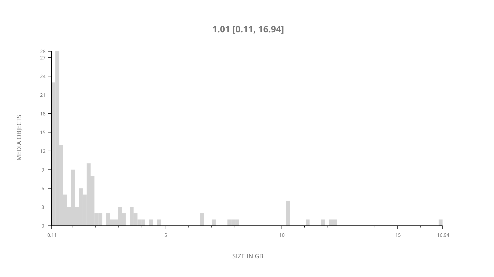
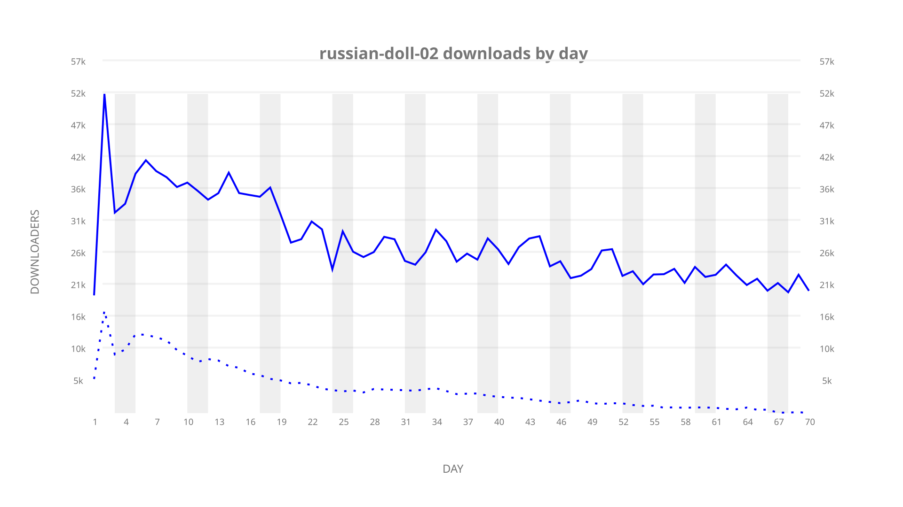
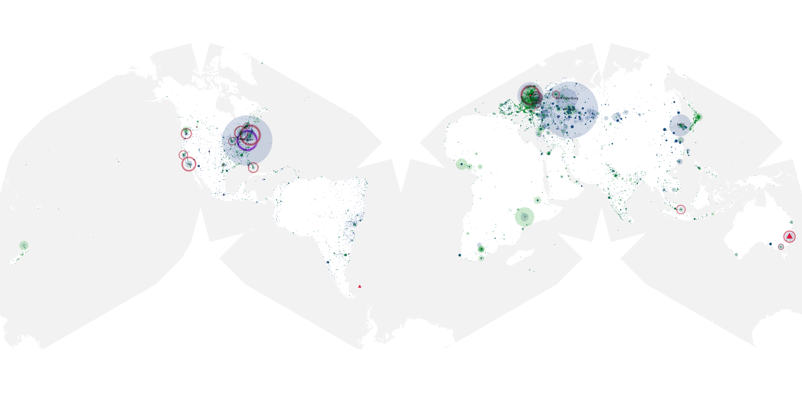
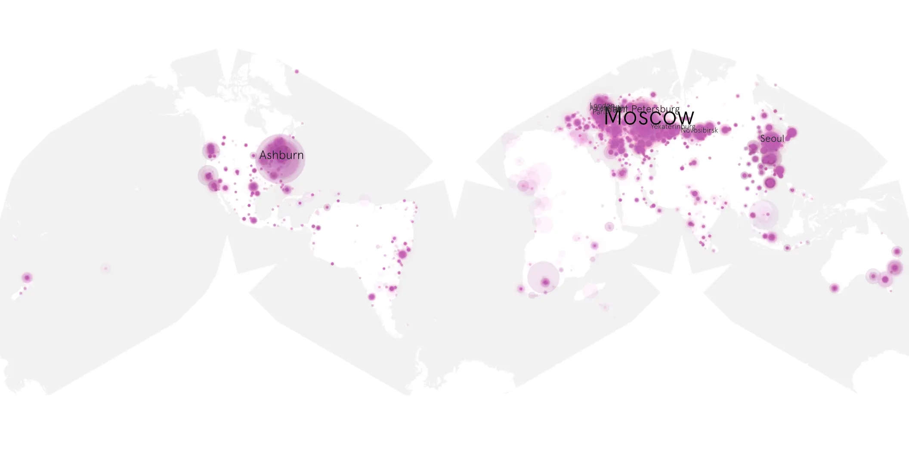
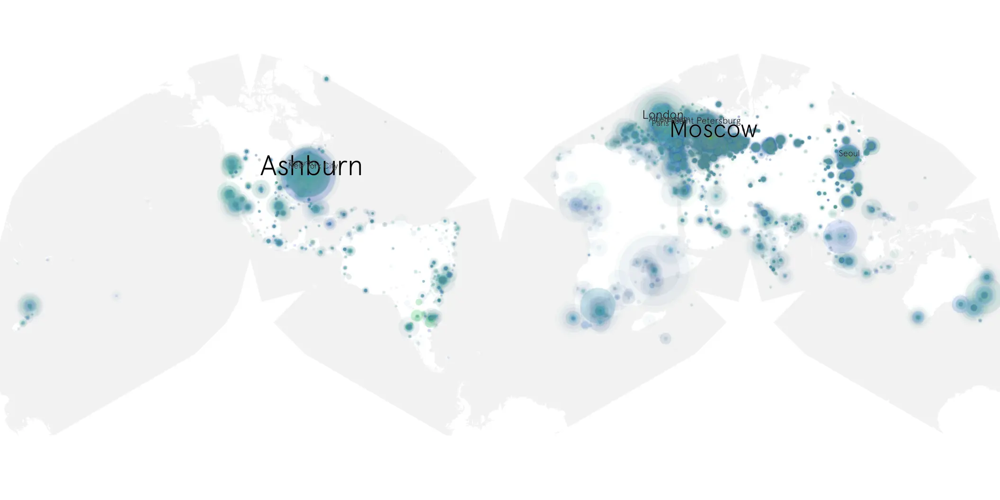

# russian-doll-02 sample cache audit

## 1. Media object

| Field | Value |
| --- | --- |
| Media object | Russian Doll |
| Collection key | `russian-doll-02` |
| imdb_id | [tt7520794](https://www.imdb.com/title/tt7520794/) |
| wikipedia_url | [Russian Doll (TV series)](https://en.wikipedia.org/wiki/Russian_Doll_(TV_series)) |
| Sample dates | 2022-04-20-to-2022-06-28 |
| Sample days | 70 |
| BTIH count | 166 |
| Unique BTIH count | 150 |
| Downloaders total | 1,626,866 |
| Uploaders total | 349,651 |
| Data version | `2026-08-05` |
| IP geolocation version | `6:1777968300` |

## 2. Coverage report

- Generated: 2026-09-02T04:14:20Z
- Sample archive directory: `/run/media/bkoz/gold/src/alpha60-samples-raw.gold/russian-doll-02.xz`
- Hour directories: 1662
- Zero-length sample files: 0
- Other unparsable sample files: 0
- Hourly discontinuities: 0 (0 missing hours)
- Missing days: 0

### Sample archive discontinuities

None detected.

## 3. File sizes histogram *median[lowest, highest]*

## 4. Graphs

### Downloads by week cumulative (normalized start)



### Downloads by day, Saturday and Sunday in gray

## 5. Cumulative Maps

<!-- https://raw.githubusercontent.com/alpha60-devops/alpha60-results-2022/refs/heads/main/data/ -->

### <a href="https://raw.githubusercontent.com/alpha60-devops/alpha60-results-2022/refs/heads/main/data/geojson.cumulative/russian-doll-02-cumulative-aggregate.geojson.gz" data-map-title="Russian Doll — russian-doll-02" onclick="leaflet_map_open_window(this.href, this.dataset.mapTitle); return false;" class="table-link" aria-label="Open Russian Doll (russian-doll-02) cumulative data map in new window" title="Opens interactive map for Russian Doll (russian-doll-02) data">Swarm Detail</a>

### Geographic Regions

| Africa | Americas | Asia | Europe | Oceania | Unknown |
| --- | --- | --- | --- | --- | --- |
| 3.40 | 20.41 | 16.43 | 51.13 | 2.27 | 0.94 |

### Network infrastructure

{:target="_blank" rel="noopener"}

### Resolution >= 1080p

{:target="_blank" rel="noopener"}

### Resolution < 1080p

{:target="_blank" rel="noopener"}
