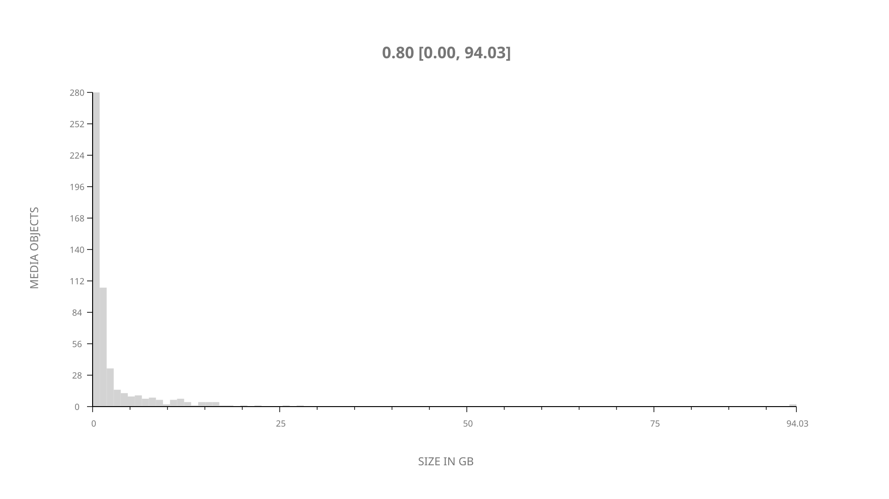
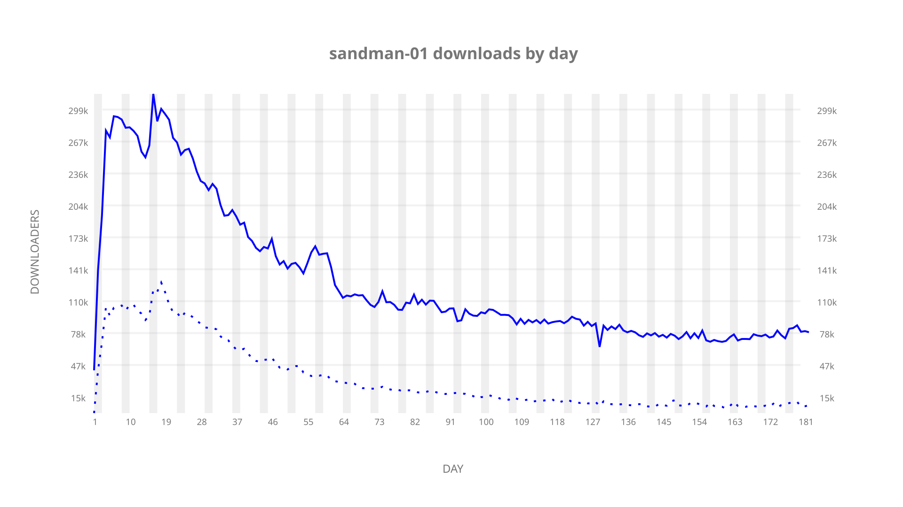
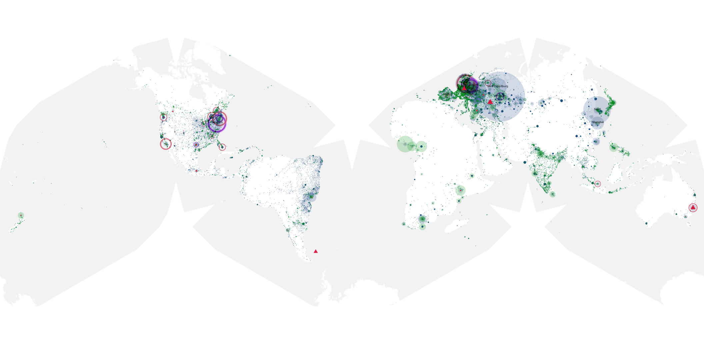
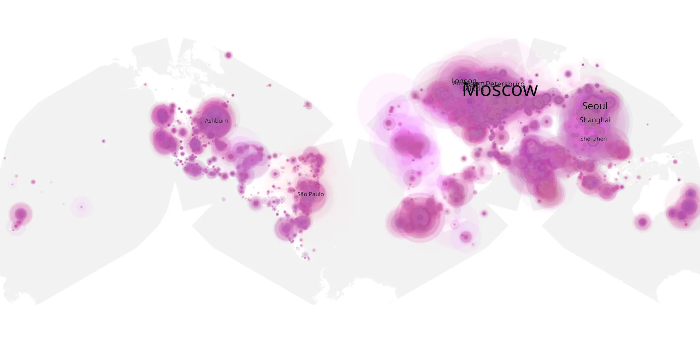
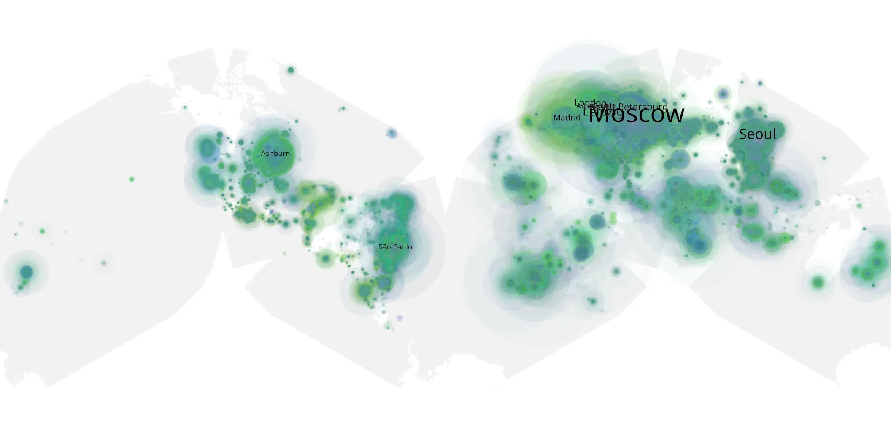

# sandman-01 sample cache audit

## 1. Media object

| Field | Value |
| --- | --- |
| Media object | Sandman |
| Collection key | `sandman-01` |
| imdb_id | [tt1751634](https://www.imdb.com/title/tt1751634/) |
| wikipedia_url | [The Sandman (TV series)](https://en.wikipedia.org/wiki/The_Sandman_(TV_series)) |
| Sample dates | 2022-08-05-to-2023-02-02 |
| Sample days | 182 |
| BTIH count | 554 |
| Unique BTIH count | 527 |
| Downloaders total | 15,600,766 |
| Uploaders total | 3,845,518 |
| Data version | `2026-08-05` |
| IP geolocation version | `6:1777968300` |

## 2. Sample coverage report

- Generated: 2026-09-02T04:14:20Z
- Sample archive directory: `/run/media/bkoz/gold/src/alpha60-samples-raw.gold/sandman-01.xz`
- Hour directories: 4350
- Zero-length sample files: 0
- Other unparsable sample files: 0
- Hourly discontinuities: 0 (0 missing hours)
- Missing days: 0

### Sample archive discontinuities

None detected.

## 3. Media objects file size histogram

## 4. Visualization pass — graphs

### Downloads by week cumulative (normalized start)



### Downloads by day, Saturday and Sunday in gray

## 5. Visualization pass — maps

### Cumulative geographic slices

| Africa | Americas | Asia | Europe | Oceania | Unknown |
| --- | --- | --- | --- | --- | --- |
| 4.96 | 17.59 | 23.19 | 48.34 | 1.46 | 0.76 |

### Cumulative network infrastructure

{:target="_blank" rel="noopener"}

### Cumulative data maps

**Cumulative >= 1080p**

{:target="_blank" rel="noopener"}

**Cumulative < 1080p**

{:target="_blank" rel="noopener"}
