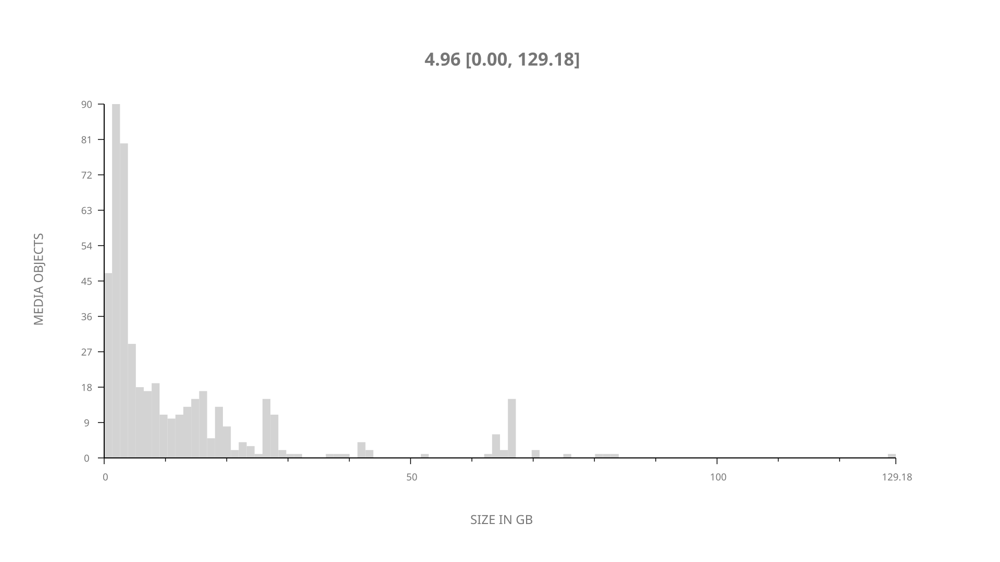
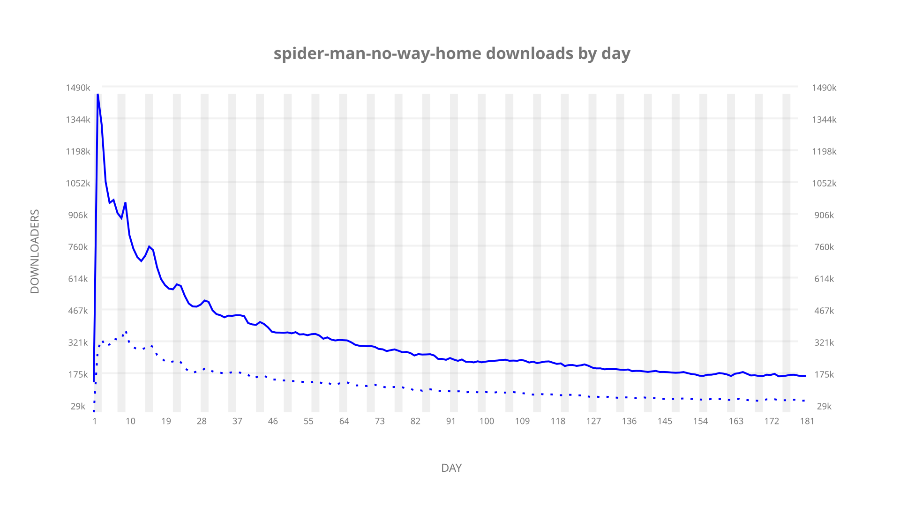
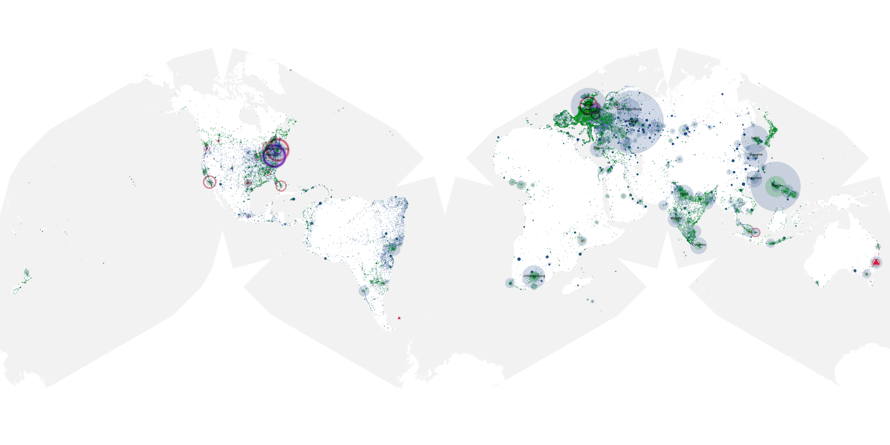
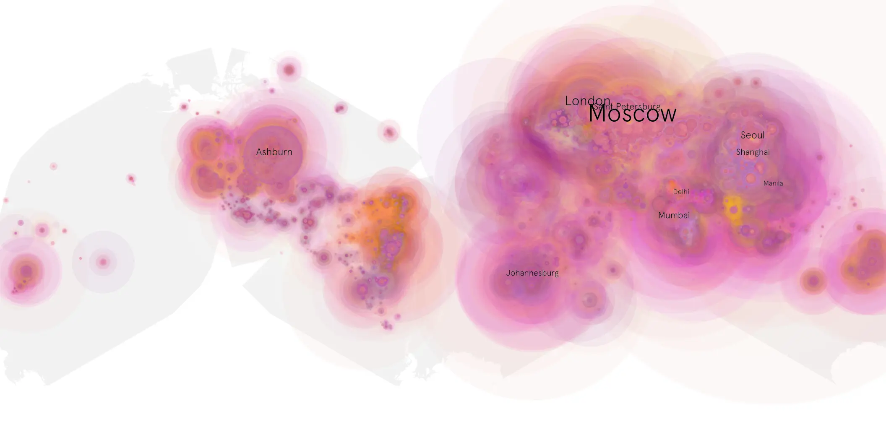
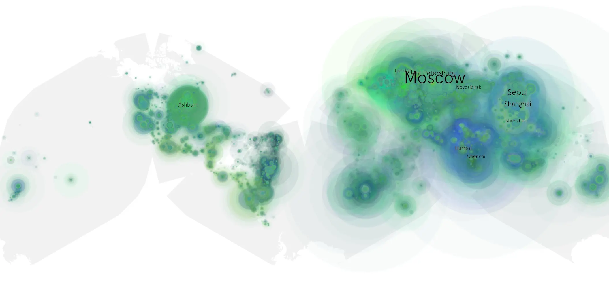

# spider-man-no-way-home sample cache audit

## 1. Media object

| Field | Value |
| --- | --- |
| Media object | Spider Man No Way Home |
| Collection key | `spider-man-no-way-home` |
| imdb_id | [tt10872600](https://www.imdb.com/title/tt10872600/) |
| wikipedia_url | [Spider-Man: No Way Home](https://en.wikipedia.org/wiki/Spider-Man:_No_Way_Home) |
| Sample dates | 2022-03-11-to-2022-09-08 |
| Sample days | 182 |
| BTIH count | 560 |
| Unique BTIH count | 484 |
| Downloaders total | 40,404,189 |
| Uploaders total | 14,260,252 |
| Data version | `2026-08-05` |
| IP geolocation version | `6:1777968300` |

## 2. Coverage report

- Generated: 2026-09-02T04:14:20Z
- Sample archive directory: `/run/media/bkoz/gold/src/alpha60-samples-raw.gold/spider-man-no-way-home.xz`
- Hour directories: 4347
- Zero-length sample files: 0
- Other unparsable sample files: 0
- Hourly discontinuities: 0 (0 missing hours)
- Missing days: 0

### Sample archive discontinuities

None detected.

## 3. File sizes histogram *median[lowest, highest]*

## 4. Graphs

### Downloads by week cumulative (normalized start)



### Downloads by day, Saturday and Sunday in gray

## 5. Cumulative Maps

<!-- https://raw.githubusercontent.com/alpha60-devops/alpha60-results-2022/refs/heads/main/data/ -->

### <a href="https://raw.githubusercontent.com/alpha60-devops/alpha60-results-2022/refs/heads/main/data/geojson.cumulative/spider-man-no-way-home-cumulative-aggregate.geojson.gz" data-map-title="Spider Man No Way Home — spider-man-no-way-home" onclick="leaflet_map_open_window(this.href, this.dataset.mapTitle); return false;" class="table-link" aria-label="Open Spider Man No Way Home (spider-man-no-way-home) cumulative data map in new window" title="Opens interactive map for Spider Man No Way Home (spider-man-no-way-home) data">Swarm Detail</a>

### Geographic Regions

| Africa | Americas | Asia | Europe | Oceania | Unknown |
| --- | --- | --- | --- | --- | --- |
| 7.24 | 15.60 | 31.95 | 35.23 | 1.76 | 0.70 |

### Network infrastructure

{:target="_blank" rel="noopener"}

### Resolution >= 1080p

{:target="_blank" rel="noopener"}

### Resolution < 1080p

{:target="_blank" rel="noopener"}
