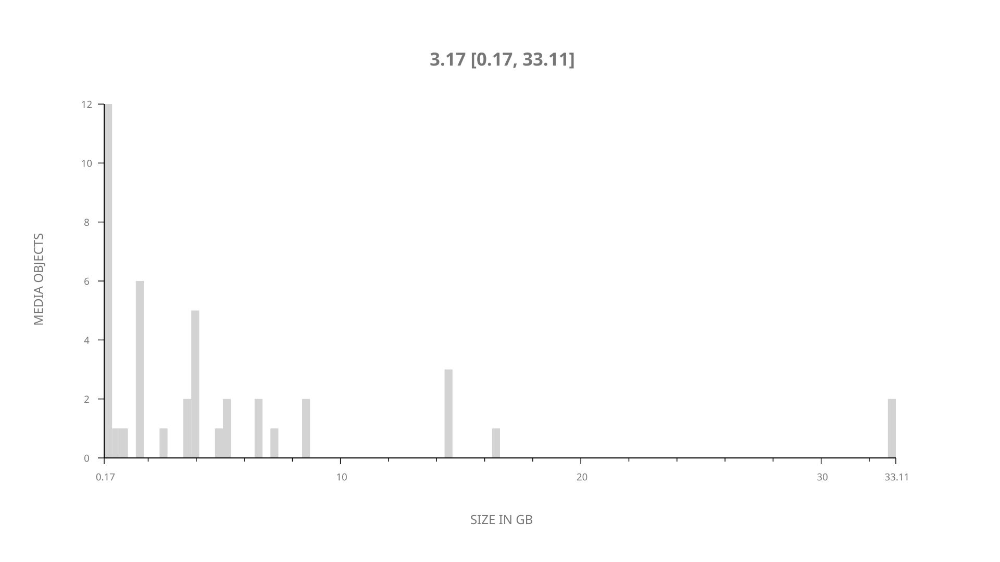
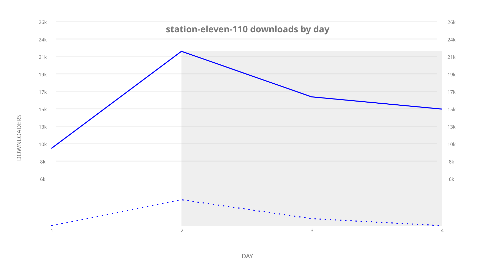
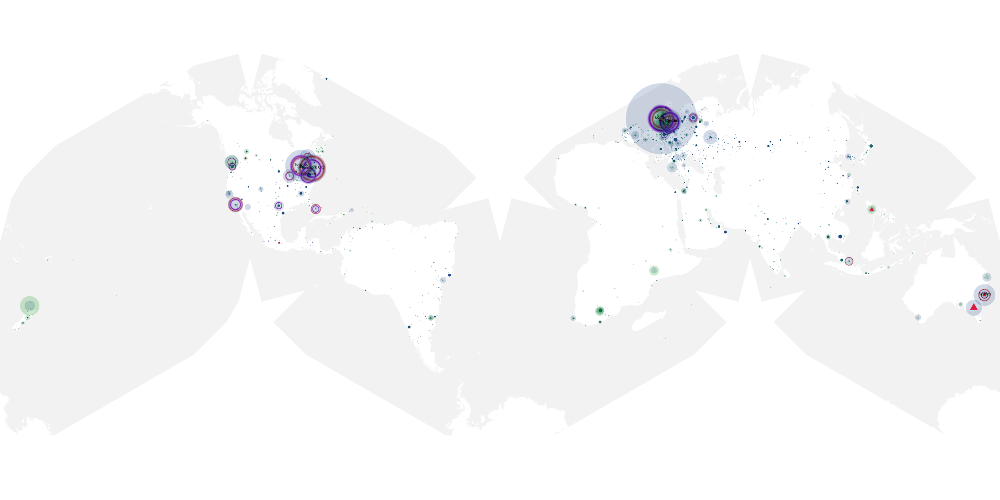
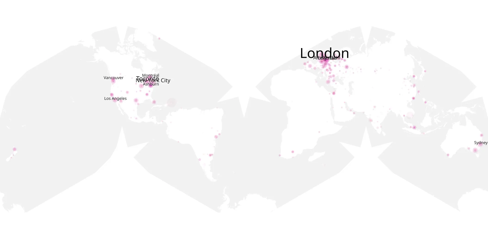
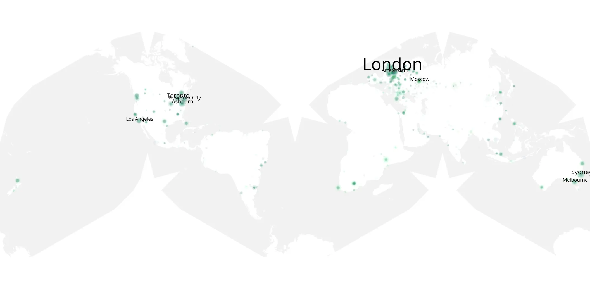

# station-eleven-110 sample cache audit

## 1. Media object

| Field | Value |
| --- | --- |
| Media object | Station Eleven |
| Collection key | `station-eleven-110` |
| imdb_id | [tt10574236](https://www.imdb.com/title/tt10574236/) |
| wikipedia_url | [Station Eleven (miniseries)](https://en.wikipedia.org/wiki/Station_Eleven_(miniseries)) |
| Sample dates | 2022-01-13-to-2022-01-16 |
| Sample days | 4 |
| BTIH count | 46 |
| Unique BTIH count | 42 |
| Downloaders total | 70,691 |
| Uploaders total | 21,934 |
| Data version | `2026-08-05` |
| IP geolocation version | `6:1777968300` |

## 2. Sample coverage report

- Generated: 2026-09-09T22:54:31Z
- Sample archive directory: `/mnt/gold/src/alpha60-samples-raw.gold/station-eleven-110.xz`
- Hour directories: 78
- Zero-length sample files: 0
- Other unparsable sample files: 0
- Hourly discontinuities: 0 (0 missing hours)
- Missing days: 0

### Sample archive discontinuities

None detected.

## 3. Media objects file size histogram

## 4. Visualization pass — graphs

### Downloads by week cumulative (normalized start)



### Downloads by day, Saturday and Sunday in gray

## 5. Visualization pass — maps

### Cumulative geographic slices

| Africa | Americas | Asia | Europe | Oceania | Unknown |
| --- | --- | --- | --- | --- | --- |
| 3.08 | 29.31 | 11.49 | 42.40 | 5.75 | 0.50 |

### Cumulative network infrastructure

{:target="_blank" rel="noopener"}

### Cumulative data maps

**Cumulative >= 1080p**

{:target="_blank" rel="noopener"}

**Cumulative < 1080p**

{:target="_blank" rel="noopener"}
