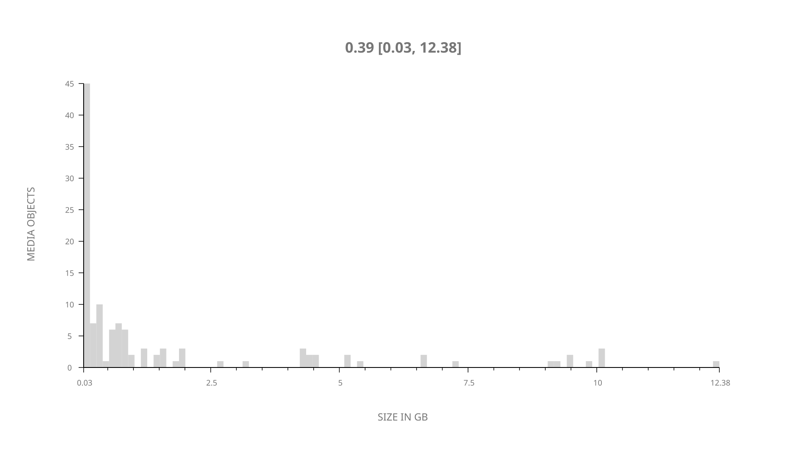
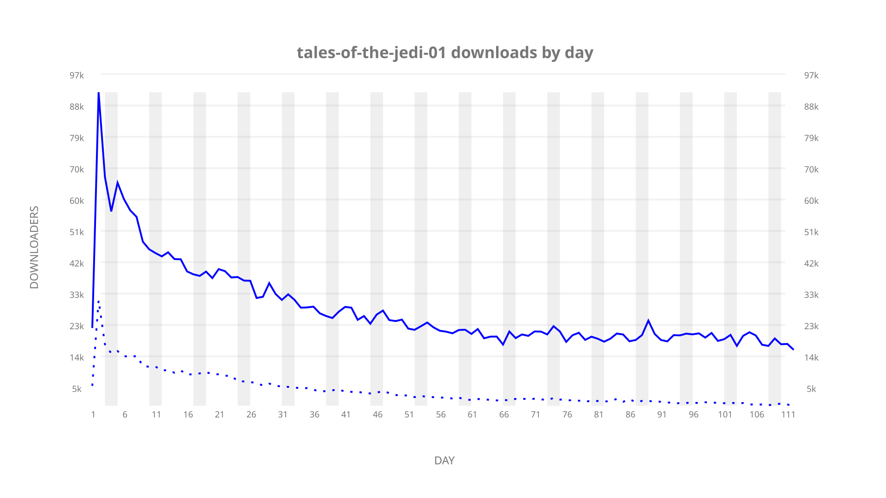
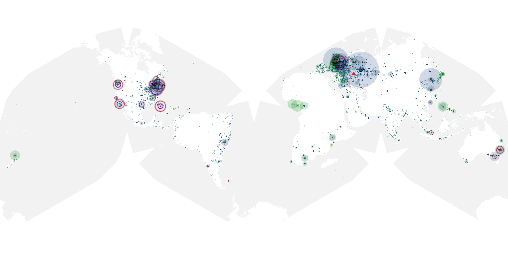
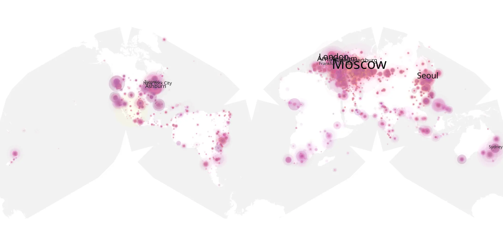
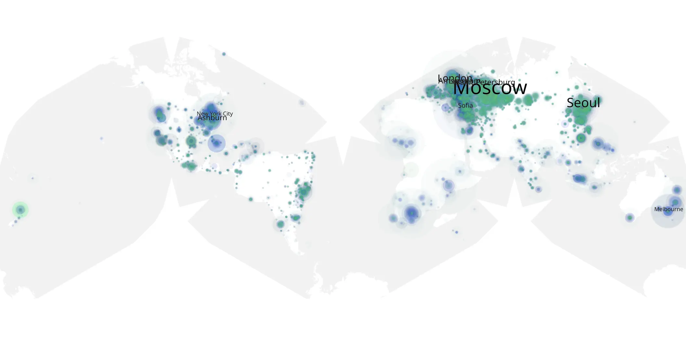

# tales-of-the-jedi-01 sample cache audit

## 1. Media object

| Field | Value |
| --- | --- |
| Media object | Star Wars: Tales of the Jedi |
| Collection key | `tales-of-the-jedi-01` |
| imdb_id | [tt20723374](https://www.imdb.com/title/tt20723374/) |
| wikipedia_url | [Star Wars Tales (TV anthology)](https://en.wikipedia.org/wiki/Star_Wars_Tales_(TV_anthology)) |
| Sample dates | 2022-10-26-to-2023-02-14 |
| Sample days | 112 |
| BTIH count | 143 |
| Unique BTIH count | 120 |
| Downloaders total | 1,861,715 |
| Uploaders total | 363,885 |
| Data version | `2026-08-05` |
| IP geolocation version | `6:1777968300` |

## 2. Sample coverage report

- Generated: 2026-09-09T22:54:32Z
- Sample archive directory: `/mnt/gold/src/alpha60-samples-raw.gold/tales-of-the-jedi-01.xz`
- Hour directories: 2667
- Zero-length sample files: 0
- Other unparsable sample files: 0
- Hourly discontinuities: 0 (0 missing hours)
- Missing days: 0

### Sample archive discontinuities

None detected.

## 3. Media objects file size histogram

## 4. Visualization pass — graphs

### Downloads by week cumulative (normalized start)



### Downloads by day, Saturday and Sunday in gray

## 5. Visualization pass — maps

### Cumulative geographic slices

| Africa | Americas | Asia | Europe | Oceania | Unknown |
| --- | --- | --- | --- | --- | --- |
| 2.86 | 21.47 | 17.64 | 45.71 | 2.88 | 0.96 |

### Cumulative network infrastructure

{:target="_blank" rel="noopener"}

### Cumulative data maps

**Cumulative >= 1080p**

{:target="_blank" rel="noopener"}

**Cumulative < 1080p**

{:target="_blank" rel="noopener"}
