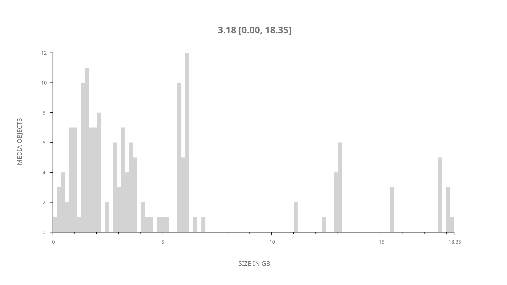
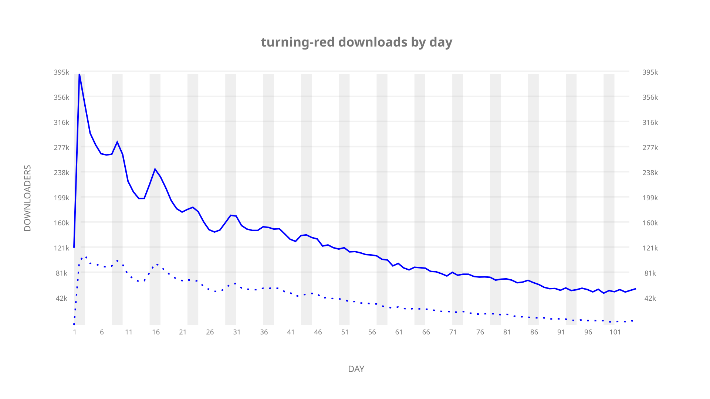
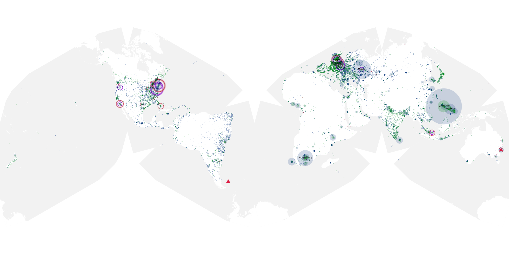
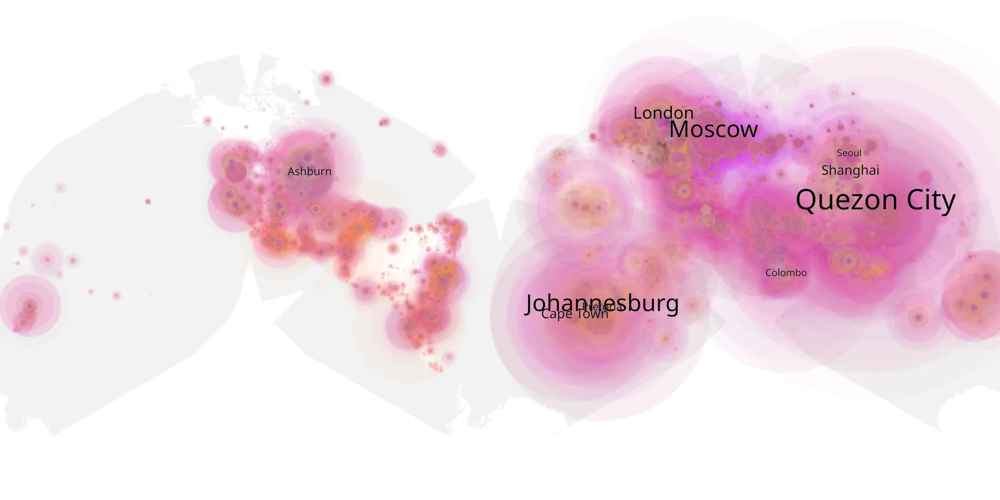
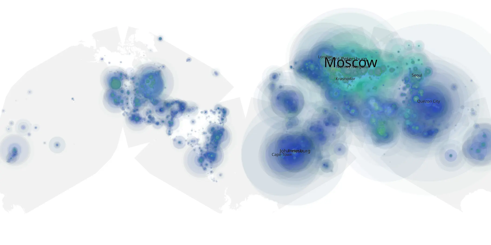

# turning-red sample cache audit

## 1. Media object

| Field | Value |
| --- | --- |
| Media object | Turning Red |
| Collection key | `turning-red` |
| imdb_id | [tt8097030](https://www.imdb.com/title/tt8097030/) |
| wikipedia_url | [Turning Red](https://en.wikipedia.org/wiki/Turning_Red) |
| Sample dates | 2022-03-11-to-2022-06-23 |
| Sample days | 105 |
| BTIH count | 186 |
| Unique BTIH count | 162 |
| Downloaders total | 13,768,112 |
| Uploaders total | 5,487,366 |
| Data version | `2026-08-05` |
| IP geolocation version | `6:1777968300` |

## 2. Sample coverage report

- Generated: 2026-09-02T04:14:21Z
- Sample archive directory: `/run/media/bkoz/gold/src/alpha60-samples-raw.gold/turning-red.xz`
- Hour directories: 2503
- Zero-length sample files: 0
- Other unparsable sample files: 0
- Hourly discontinuities: 1 (1 missing hours)
- Missing days: 0

### Sample archive discontinuities

- hourly gap: last `2022-03-27 01:06`, resumed `2022-03-27 03:06` — missing 1 hour(s)

## 3. Media objects file size histogram

## 4. Visualization pass — graphs

### Downloads by week cumulative (normalized start)



### Downloads by day, Saturday and Sunday in gray

## 5. Visualization pass — maps

### Cumulative geographic slices

| Africa | Americas | Asia | Europe | Oceania | Unknown |
| --- | --- | --- | --- | --- | --- |
| 12.09 | 14.13 | 32.00 | 31.46 | 2.17 | 0.51 |

### Cumulative network infrastructure

{:target="_blank" rel="noopener"}

### Cumulative data maps

**Cumulative >= 1080p**

{:target="_blank" rel="noopener"}

**Cumulative < 1080p**

{:target="_blank" rel="noopener"}
