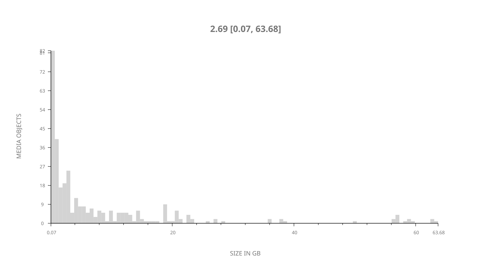
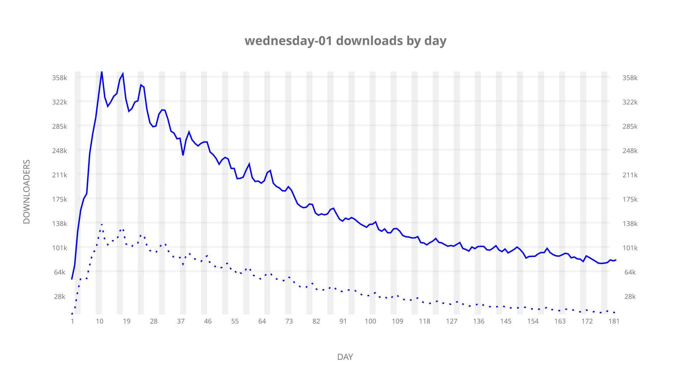
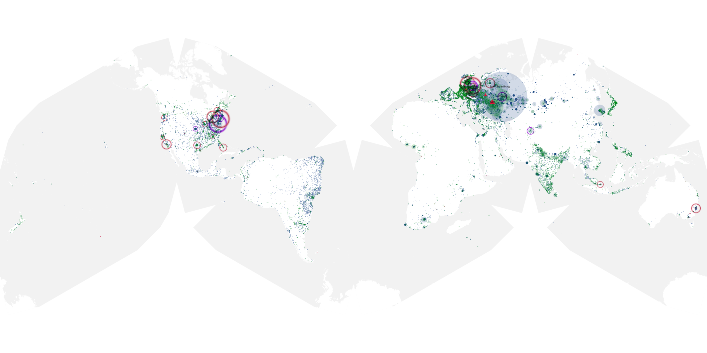
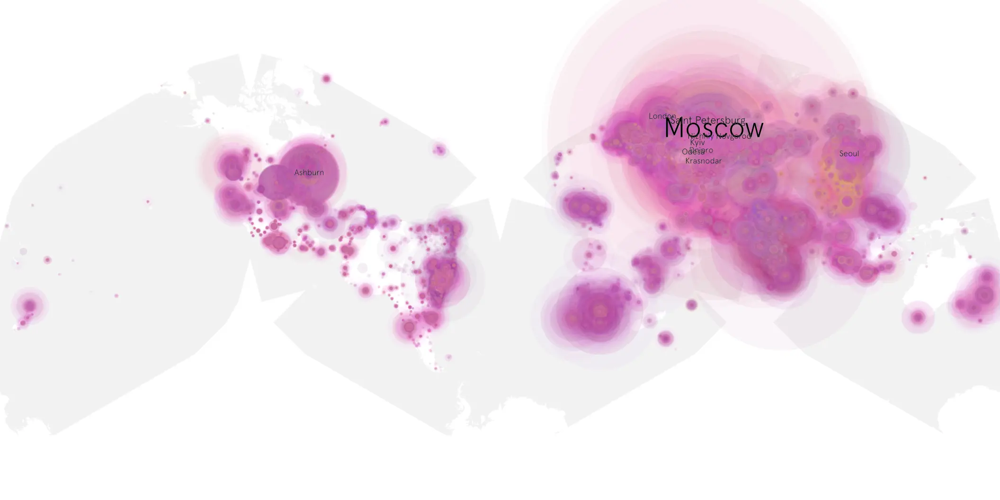
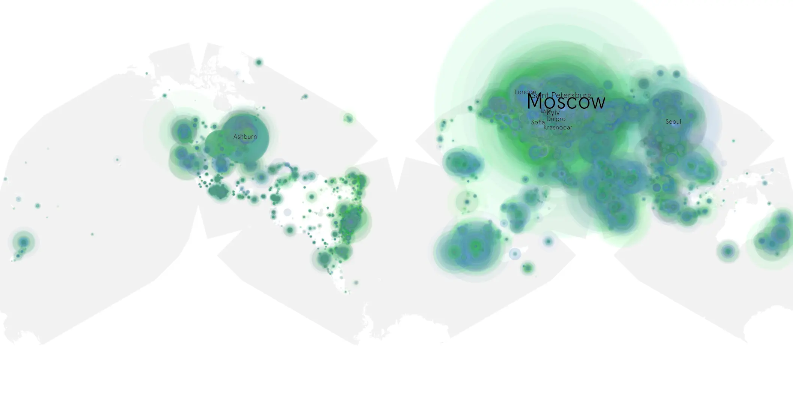

# wednesday-01 sample cache audit

## 1. Media object

| Field | Value |
| --- | --- |
| Media object | Wednesday |
| Collection key | `wednesday-01` |
| imdb_id | [tt13443470](https://www.imdb.com/title/tt13443470/) |
| wikipedia_url | [Wednesday (TV series)](https://en.wikipedia.org/wiki/Wednesday_(TV_series)) |
| Sample dates | 2022-11-24-to-2023-05-24 |
| Sample days | 182 |
| BTIH count | 374 |
| Unique BTIH count | 330 |
| Downloaders total | 20,063,937 |
| Uploaders total | 6,379,012 |
| Data version | `2026-08-05` |
| IP geolocation version | `6:1777968300` |

## 2. Sample coverage report

- Generated: 2026-09-02T04:14:22Z
- Sample archive directory: `/run/media/bkoz/gold/src/alpha60-samples-raw.gold/wednesday-01.xz`
- Hour directories: 4362
- Zero-length sample files: 0
- Other unparsable sample files: 0
- Hourly discontinuities: 1 (1 missing hours)
- Missing days: 0

### Sample archive discontinuities

- hourly gap: last `2023-03-26 01:03`, resumed `2023-03-26 03:03` — missing 1 hour(s)

## 3. Media objects file size histogram

## 4. Visualization pass — graphs

### Downloads by week cumulative (normalized start)



### Downloads by day, Saturday and Sunday in gray

## 5. Visualization pass — maps

### Cumulative geographic slices

| Africa | Americas | Asia | Europe | Oceania | Unknown |
| --- | --- | --- | --- | --- | --- |
| 4.23 | 10.64 | 21.38 | 57.30 | 0.86 | 0.52 |

### Cumulative network infrastructure

{:target="_blank" rel="noopener"}

### Cumulative data maps

**Cumulative >= 1080p**

{:target="_blank" rel="noopener"}

**Cumulative < 1080p**

{:target="_blank" rel="noopener"}
