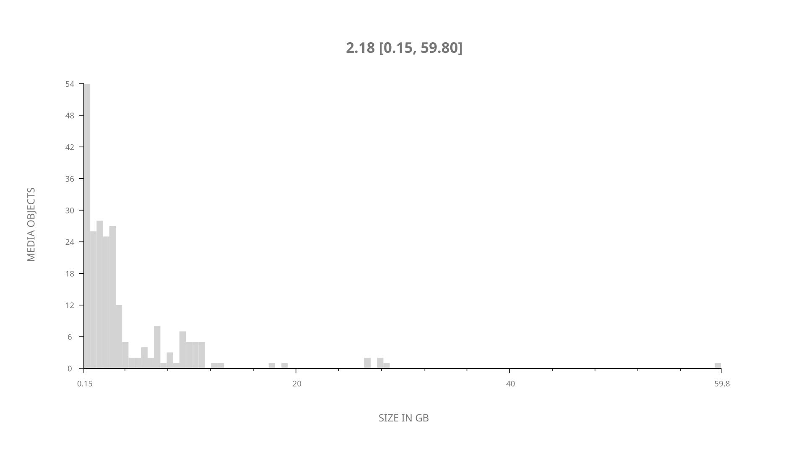
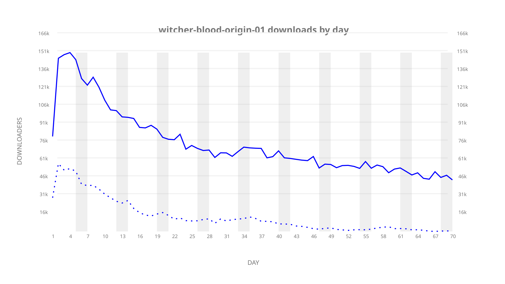
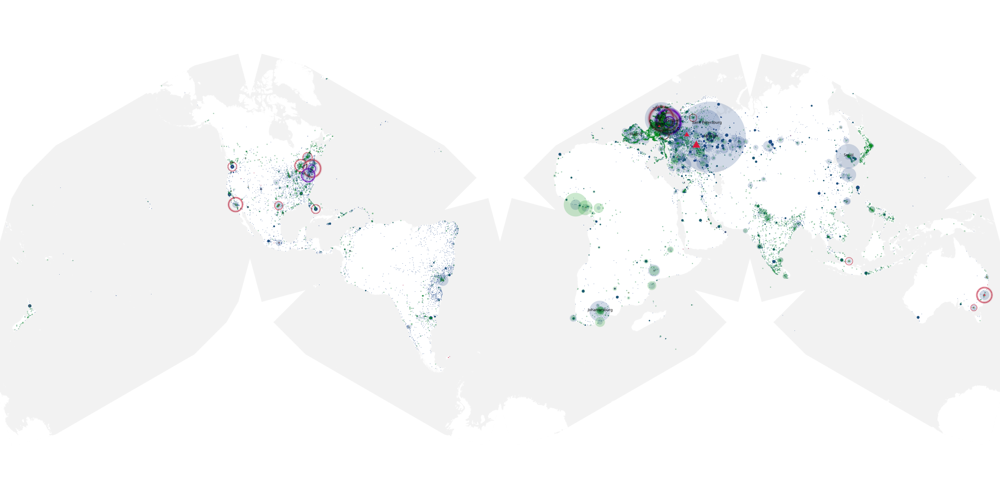
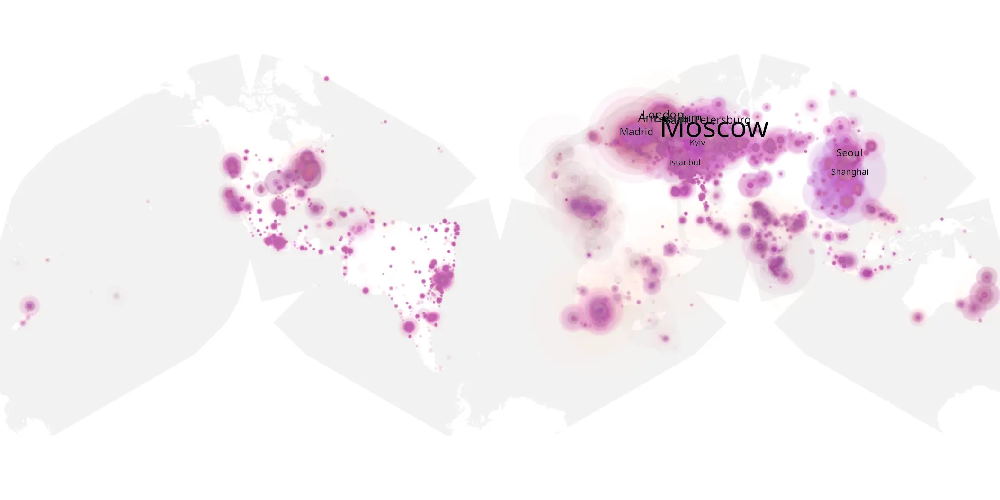
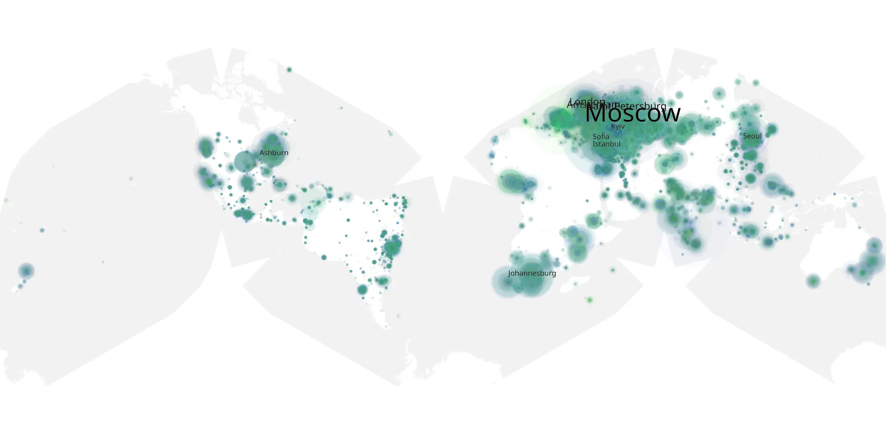

# witcher-blood-origin-01 sample cache audit

## 1. Media object

| Field | Value |
| --- | --- |
| Media object | The Witcher Blood Origin |
| Collection key | `witcher-blood-origin-01` |
| imdb_id | [tt12785720](https://www.imdb.com/title/tt12785720/) |
| wikipedia_url | [The Witcher: Blood Origin](https://en.wikipedia.org/wiki/The_Witcher:_Blood_Origin) |
| Sample dates | 2022-12-26-to-2023-03-05 |
| Sample days | 70 |
| BTIH count | 255 |
| Unique BTIH count | 232 |
| Downloaders total | 4,160,922 |
| Uploaders total | 1,034,880 |
| Data version | `2026-08-05` |
| IP geolocation version | `6:1777968300` |

## 2. Coverage report

- Generated: 2026-09-02T04:14:22Z
- Sample archive directory: `/run/media/bkoz/gold/src/alpha60-samples-raw.gold/witcher-blood-origin-01.xz`
- Hour directories: 1680
- Zero-length sample files: 0
- Other unparsable sample files: 0
- Hourly discontinuities: 0 (0 missing hours)
- Missing days: 0

### Sample archive discontinuities

None detected.

## 3. File sizes histogram *median[lowest, highest]*

## 4. Graphs

### Downloads by week cumulative (normalized start)



### Downloads by day, Saturday and Sunday in gray

## 5. Cumulative Maps

<!-- https://raw.githubusercontent.com/alpha60-devops/alpha60-results-2022/refs/heads/main/data/ -->

### <a href="https://raw.githubusercontent.com/alpha60-devops/alpha60-results-2022/refs/heads/main/data/geojson.cumulative/witcher-blood-origin-01-cumulative-aggregate.geojson.gz" data-map-title="The Witcher Blood Origin — witcher-blood-origin-01" onclick="leaflet_map_open_window(this.href, this.dataset.mapTitle); return false;" class="table-link" aria-label="Open The Witcher Blood Origin (witcher-blood-origin-01) cumulative data map in new window" title="Opens interactive map for The Witcher Blood Origin (witcher-blood-origin-01) data">Swarm Detail</a>

### Geographic Regions

| Africa | Americas | Asia | Europe | Oceania | Unknown |
| --- | --- | --- | --- | --- | --- |
| 6.45 | 14.06 | 19.00 | 52.51 | 1.36 | 0.53 |

### Network infrastructure

{:target="_blank" rel="noopener"}

### Resolution >= 1080p

{:target="_blank" rel="noopener"}

### Resolution < 1080p

{:target="_blank" rel="noopener"}
