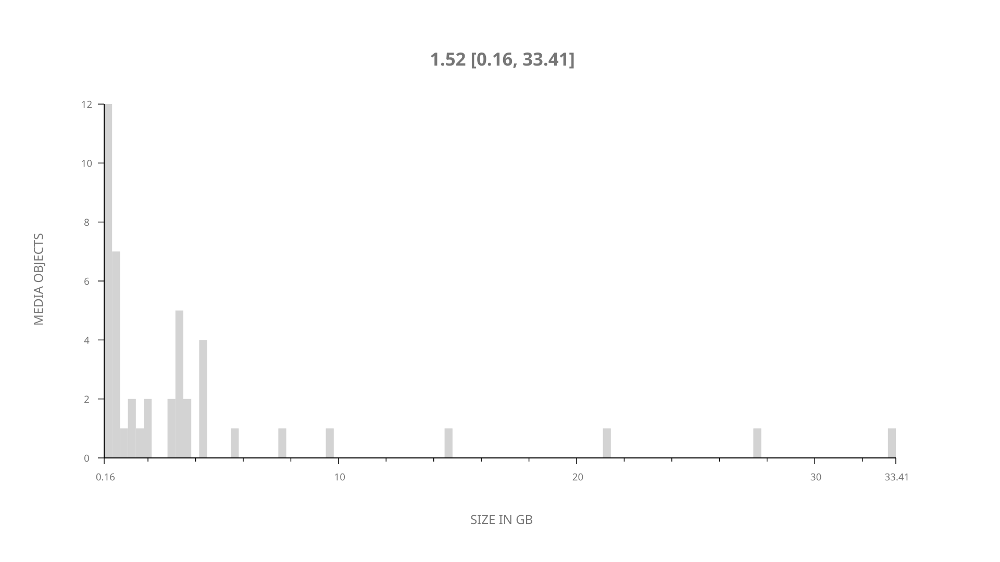
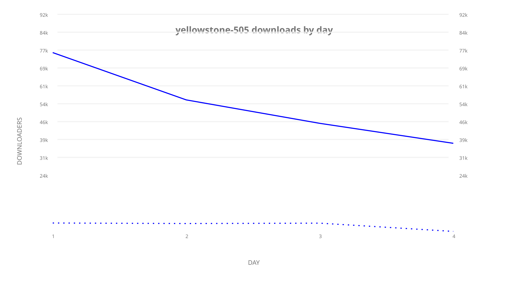
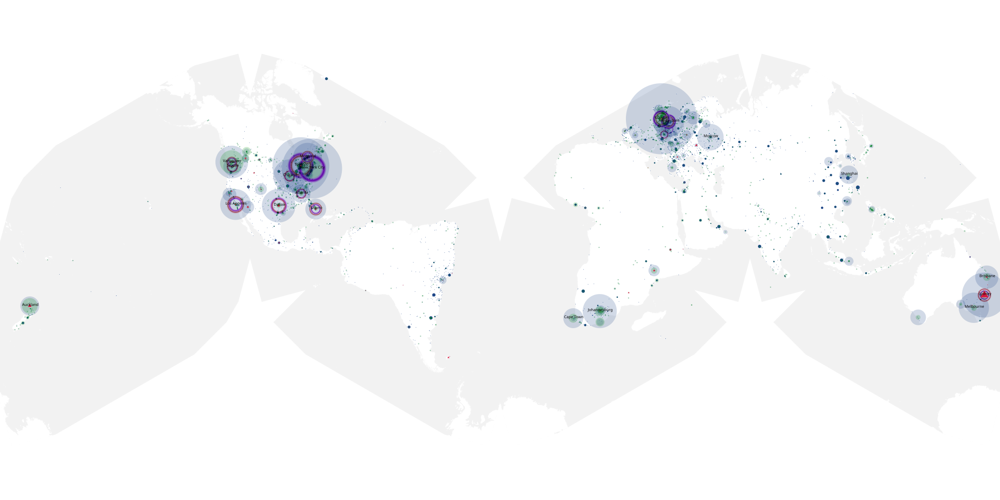
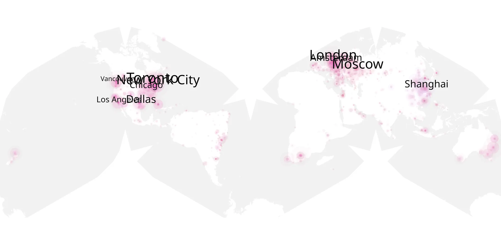
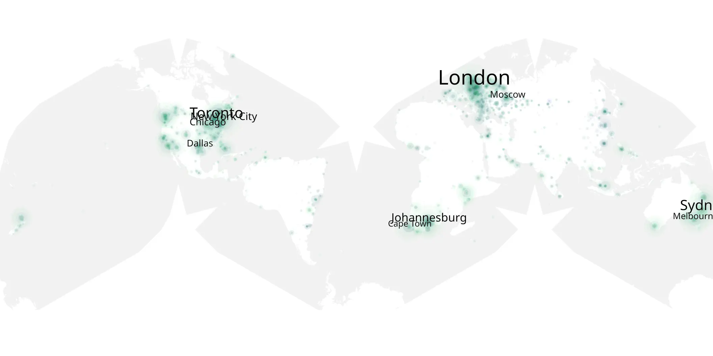

# yellowstone-505 sample cache audit

## 1. Media object

| Field | Value |
| --- | --- |
| Media object | Yellowstone |
| Collection key | `yellowstone-505` |
| imdb_id | [tt4236770](https://www.imdb.com/title/tt4236770/) |
| wikipedia_url | [Yellowstone (TV series)](https://en.wikipedia.org/wiki/Yellowstone_(TV_series)) |
| Sample dates | 2022-12-05-to-2022-12-08 |
| Sample days | 4 |
| BTIH count | 53 |
| Unique BTIH count | 45 |
| Downloaders total | 265,228 |
| Uploaders total | 87,115 |
| Data version | `2026-08-05` |
| IP geolocation version | `6:1777968300` |

## 2. Coverage report

- Generated: 2026-09-09T22:54:33Z
- Sample archive directory: `/mnt/gold/src/alpha60-samples-raw.gold/yellowstone-505.xz`
- Hour directories: 92
- Zero-length sample files: 0
- Other unparsable sample files: 0
- Hourly discontinuities: 0 (0 missing hours)
- Missing days: 0

### Sample archive discontinuities

None detected.

## 3. File sizes histogram *median[lowest, highest]*

## 4. Graphs

### Downloads by week cumulative (normalized start)



### Downloads by day, Saturday and Sunday in gray

## 5. Cumulative Maps

<!-- https://raw.githubusercontent.com/alpha60-devops/alpha60-results-2022/refs/heads/main/data/ -->

### <a href="https://raw.githubusercontent.com/alpha60-devops/alpha60-results-2022/refs/heads/main/data/geojson.cumulative/yellowstone-505-cumulative-aggregate.geojson.gz" data-map-title="Yellowstone — yellowstone-505" onclick="leaflet_map_open_window(this.href, this.dataset.mapTitle); return false;" class="table-link" aria-label="Open Yellowstone (yellowstone-505) cumulative data map in new window" title="Opens interactive map for Yellowstone (yellowstone-505) data">Swarm Detail</a>

### Geographic Regions

| Africa | Americas | Asia | Europe | Oceania | Unknown |
| --- | --- | --- | --- | --- | --- |
| 5.92 | 31.27 | 10.93 | 25.66 | 6.56 | 0.31 |

### Network infrastructure

{:target="_blank" rel="noopener"}

### Resolution >= 1080p

{:target="_blank" rel="noopener"}

### Resolution < 1080p

{:target="_blank" rel="noopener"}
